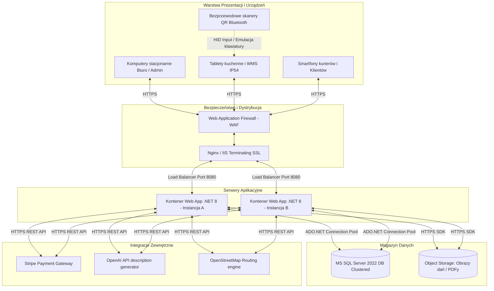
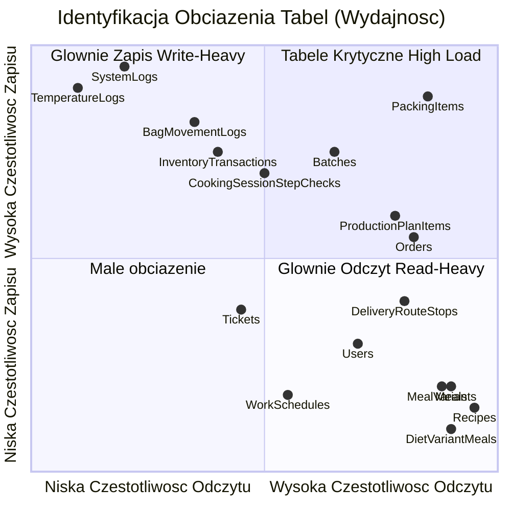
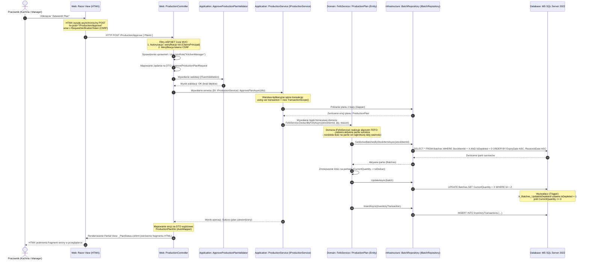

# Analiza Wymagań Niefunkcjonalnych, Architektura Sprzętowa i Opis Schematu Bazy Danych
**Projekt:** System Zarządzania Platformą Cateringową „Kuchnia u Cygana”  
**Wersja:** 2.0 (Rozszerzona Dokumentacja Techniczno-Analityczna)  
**Status:** Gotowy do prezentacji  
**Autorzy:** Zespół Deweloperski (Dawid Janczyło, Gabriel Ostaszewski, Maciej Cyuńczyk, Tomasz Golonko, Paweł Trochimczyk)  

---

## Spis Treści
1. [Wstęp i Podział Merytoryczny Zespołu](#1-wstęp-i-podział-merytoryczny-zespołu)
2. [Szczegółowe Wymagania Klienta i Zakres Merytoryczny Modułów](#2-szczegółowe-wymagania-klienta-i-zakres-merytoryczny-modułów)
3. [Wymagania Funkcjonalne i Niefunkcjonalne (NFR)](#3-wymagania-funkcjonalne-i-niefunkcjonalne-nfr)
4. [Infrastruktura i Architektura Sprzętowa](#4-infrastruktura-i-architektura-sprzętowa)
5. [Elementy Słownikowe (Lookup Tables)](#5-elementy-słownikowe-lookup-tables)
6. [Bezpieczeństwo, Ochrona Danych i Audytowalność](#6-bezpieczeństwo-ochrona-danych-i-audytowalność)
7. [Rozmiar Bazy Danych, Obciążenie i Przyrost Danych](#7-rozmiar-bazy-danych-obciążenie-i-przyrost-danych)
8. [Relacyjny Model Logiczny i Diagram Fizyczny (ERD)](#8-relacyjny-model-logiczny-i-diagram-fizyczny-erd)
9. [Logiczny Model Danych i Wymagania dotyczące przechowywania](#9-logiczny-model-danych-i-wymagania-dotyczące-przechowywania)
10. [Wymagania dotyczące przetwarzania danych](#10-wymagania-dotyczące-przetwarzania-danych)
11. [Przepływ Danych przy Zapytaniu (Request Data Flow Walkthrough)](#11-przepływ-danych-przy-zapytaniu-request-data-flow-walkthrough)
12. [Potencjalne Trudności i Ryzyka Projektowe](#12-potencjalne-trudności-i-ryzyka-projektowe)

---

## 1. Wstęp i Podział Merytoryczny Zespołu
Projekt **„Kuchnia u Cygana”** to zintegrowana platforma e-commerce sprzężona z systemem klasy ERP/WMS dedykowana dla cateringu dietetycznego. System został podzielony na **5 modułów domenowych** rozwijanych równolegle w oparciu o architekturę czystą (Clean Architecture) w technologii .NET 8.

```
┌─────────────────────────────────────────────────────────────────────────┐
│                          KUCHNIA U CYGANA (ERP)                         │
└────────────────────────────────────┬────────────────────────────────────┘
                                     │
     ┌──────────────────┬────────────┼────────────┬──────────────────┐
┌────▼─────┐       ┌────▼─────┐ ┌────▼─────┐ ┌────▼─────┐       ┌────▼─────┐
│ Moduł 1  │       │ Moduł 2  │ │ Moduł 3  │ │ Moduł 4  │       │ Moduł 5  │
│E-commerce│       │ Katalog  │ │Produkcja │ │Logistyka │       │Admin & HR│
│  Dawid   │       │ Gabriel  │ │  Maciej  │ │  Tomasz  │       │  Paweł   │
└──────────┘       └──────────┘ └──────────┘ └──────────┘       └──────────┘
```

Podział odpowiedzialności w zespole:
1.  **Dawid Janczyło (Moduł 1 — Portal Klienta i E-commerce)**: Rejestracja, profile klientów, proces zakupowy, koszyk, kalendarz zawieszeń dostaw, płatności Stripe.
2.  **Gabriel Ostaszewski (Moduł 2 — Katalog Diet i Receptur)**: Tworzenie oferty, struktura posiłków i makroskładników, receptury, słownik alergenów, OpenAI do automatycznych opisów dań.
3.  **Maciej Cyuńczyk (Moduł 3 — System Produkcyjny i Magazyn)**: Zarządzanie magazynem surowców (FEFO), kontrola temperatur HACCP, kompletacja posiłków (pudełek do toreb), QR kody, plany produkcyjne i karty PDF (QuestPDF).
4.  **Tomasz Golonko (Moduł 4 — Logistyka i Dostawy)**: Zarządzanie flotą i kurierami, wyznaczanie tras (routing OSM/Google), generowanie manifestów przewozowych, ewidencja i obieg toreb termicznych.
5.  **Paweł Trochimczyk (Moduł 5 — Administracja, HR i Obsługa Klienta)**: Grafik pracy personelu, wnioski urlopowe, system reklamacyjny (Helpdesk / Tickety) z załącznikami graficznymi, logi audytowe systemu.

---

## 2. Szczegółowe Wymagania Klienta i Zakres Merytoryczny Modułów

### Moduł 1 (E-commerce) — Dawid
*   **Kreator zamówień**: Klient konfiguruje długość trwania cateringu (wykluczenie weekendów), wybiera dietę oraz kaloryczność.
*   **Kalendarz zawieszeń**: Umożliwia wstrzymanie dostawy (np. na czas urlopu) z wyprzedzeniem min. 24h. Zawieszony dzień przesuwa czas trwania umowy na kolejny wolny dzień roboczy.
*   **Książka adresowa**: Zarządzanie wieloma adresami (np. dom, praca) z możliwością przypisywania ich do konkretnych dni dostaw.
*   **Integracja Stripe**: Przetwarzanie bezpiecznych płatności online bez przechowywania danych kart w bazie danych.

### Moduł 2 (Katalog) — Gabriel
*   **Dietetyka i receptury**: Danie składa się ze składników o określonej gramaturze. System automatycznie przelicza makroskładniki (białko, tłuszcz, węglowodany, błonnik) oraz kaloryczność posiłku na bazie receptury.
*   **Propagacja alergenów**: Alergeny przypisane do surowca magazynowego są automatycznie propagowane na powiązany posiłek i widoczne dla klienta oraz drukowane na etykiecie.
*   **AI Marketing Assistant**: Dietetyk klika "Generuj opis", a silnik OpenAI analizuje składniki i zwraca chwytliwy opis marketingowy dania.

### Moduł 3 (Produkcja & Magazyn) — Maciej
*   **Gospodarka FEFO (First Expired, First Out)**: Automatyczne rozchodowanie surowców według terminu ważności partii. Zapobiega to marnowaniu żywności.
*   **Stanowisko Kompletacji**: Pakowacze za pomocą ekranów dotykowych i skanerów kodów QR kompletują pudełka do toreb zbiorczych. Zeskanowanie kodu QR na pudełku przypisuje je do właściwej torby klienta.
*   **Dziennik HACCP**: Monitorowanie temperatur chłodni. Wprowadzenie temperatury spoza normy (np. powyżej 4°C dla chłodni mięsa) generuje krytyczny alert w systemie.

### Moduł 4 (Logistyka) — Tomasz
*   **Optymalizacja Tras**: Grupowanie adresów dostaw w trasy kurierskie w celu minimalizacji czasu i kosztu paliwa.
*   **Spedycja i Manifesty**: Kurier przed wyjazdem otrzymuje wydrukowany manifest załadunkowy (PDF z QuestPDF) zawierający podsumowanie toreb oraz trasę. Przy załadunku następuje weryfikacja ilościowa.
*   **Torby Termiczne (Thermal Bags)**: Torby termiczne są drogim zasobem zwrotnym. System ewidencjonuje każdą torbę (kod QR/kreskowy) i loguje jej ruch (Wydana kurierowi -> Pozostawiona u klienta -> Odebrana od klienta -> Zwrócona na magazyn).

### Moduł 5 (HR & Administracja) — Paweł
*   **Zarządzanie Personelem**: Ewidencja pracowników z podziałem na działy (Kuchnia, Magazyn, Kompletacja, Logistyka, Biuro).
*   **Wnioski Urlopowe i Grafiki**: Pracownicy wnioskują o urlopy. Po ich zatwierdzeniu przez managera, system blokuje możliwość przypisania pracownika do zmiany w grafiku (`WorkSchedules`).
*   **Obsługa Reklamacji (Helpdesk)**: Klient może zgłosić reklamację (np. uszkodzenie pudełka) i załączyć zdjęcie. System przesyła pliki na lokalny serwer lub do magazynu chmurowego, a w bazie zapisuje ścieżkę do pliku.

---

## 3. Wymagania Funkcjonalne i Niefunkcjonalne (NFR)

### Wymagania Funkcjonalne (Kluczowe)
*   **F1**: Rejestracja i logowanie klientów oraz pracowników (RBAC).
*   **F2**: Zakup diety cateringowej z płatnością Stripe.
*   **F3**: Konfiguracja kalendarza dostaw i adresów.
*   **F4**: Projektowanie dań i automatyczne wyliczanie wartości odżywczych dań.
*   **F5**: Automatyczna agregacja zamówień w plany produkcyjne.
*   **F6**: Obsługa wydań magazynowych według algorytmu FEFO.
*   **F7**: Panel kompletacji z obsługą skanowania QR/kodów kreskowych.
*   **F8**: Wyznaczanie tras kurierskich i generowanie manifestów PDF.
*   **F9**: Ewidencja obiegu toreb termicznych.
*   **F10**: Obsługa ticketów reklamacyjnych ze zdjęciami oraz grafików pracy.

### Wymagania Niefunkcjonalne (NFR)
*   **NF1 (Wydajność)**: Czas generowania zapotrzebowania na surowce dla 1000 zamówień nie może przekroczyć 3 sekund (dzięki optymalnym indeksom i lekkiemu micro-ORM Dapper).
*   **NF2 (Bezpieczeństwo)**: Hasła haszowane jednokierunkowo algorytmem o wysokiej odporności (np. BCrypt/Argon2). Dane wrażliwe (adresy, dane osobowe) chronione są na poziomie bazy danych (TDE - Transparent Data Encryption lub szyfrowanie kolumnowe).
*   **NF3 (HACCP i Audytowalność)**: Każda edycja rekordów finansowych, magazynowych oraz zmian uprawnień musi zapisać ślad audytowy w tabeli `SystemLogs` zawierający stary i nowy stan rekordu w formacie JSON (`OldValue`, `NewValue`).
*   **NF4 (Responsywność)**: Interfejs webowy musi być dostosowany do urządzeń mobilnych (kierowcy) oraz tabletów dotykowych (kucharze i pakowacze w środowisku o podwyższonej wilgotności).
*   **NF5 (Dostępność)**: System musi być odporny na awarie sieciowe. W przypadku utraty połączenia ze skanerami kodów QR na kompletacji, system musi umożliwiać ręczne odznaczanie pozycji w interfejsie webowym.

---

## 4. Infrastruktura i Architektura Sprzętowa



### Wymagania Infrastrukturalne (Produkcja)
1.  **Dystrybucja Ruchu**: Load balancer rozdzielający ruch pomiędzy dwie instancje kontenerów aplikacji w celu zapewnienia wysokiej dostępności (High Availability).
2.  **Baza Danych**: Klastrowany MS SQL Server 2022 działający w architekturze Active-Passive z replikacją logów transakcyjnych w czasie rzeczywistym.
3.  **Przechowywanie Plików (Object Storage)**: Wykorzystanie usługi chmurowej (np. AWS S3 lub Azure Blob Storage) do składowania plików o zmiennym rozmiarze (np. zdjęcia potraw z Modułu 2, zdjęcia uszkodzeń z Modułu 5, raporty PDF z Modułów 3 i 4). Zabezpiecza to bazę danych przed niekontrolowanym wzrostem rozmiaru pliku bazy (`.mdf`).

---

## 5. Elementy Słownikowe (Lookup Tables)
W celu optymalizacji struktury i uniknięcia redundancji danych, system posiada wydzielone tabele słownikowe (w tym specyficzne dla HACCP i gospodarki magazynowej):
*   `UnitsOfMeasure` (Jednostki miary): Przechowuje symbole (`kg`, `g`, `l`, `ml`, `szt.`, `porcja`) oraz pełne nazwy jednostek miar wykorzystywanych w przepisach i na magazynie.
*   `Categories` (Kategorie dań i surowców): Słownik kategoryzujący posiłki w jadłospisie (np. *Śniadanie*, *Drugie Śniadanie*, *Obiad*, *Podwieczorek*, *Kolacja*) oraz grupy surowców i produktów spożywczych (np. *Warzywa*, *Mięso*, *Nabiał*).
*   `Allergens` (Alergeny): Lista substancji uczulających według dyrektyw unijnych (np. *gluten*, *skorupiaki*, *orzechy*, *seler*). Każdy alergen posiada unikalny kod, nazwę oraz ikonę.
*   `DeliveryWindows` (Przedziały dostaw): Godziny, w których kurier może dostarczyć torbę (np. `04:00 - 06:00`, `06:00 - 08:00`).
*   `DiscountCodes` (Kody rabatowe): Słownik kodów promocyjnych wraz z wartościami procentowymi lub kwotowymi, datą ważności i ograniczeniami użycia.
*   `Departments` (Działy HR): Słownik organizacyjny przedsiębiorstwa (np. *Kuchnia*, *Magazyn*, *Logistyka*, *Administracja*).
*   `WarehouseCategories` (Kategorie magazynowe surowców): Klasyfikacja stref przechowywania produktów (np. *Suchy*, *Chłodnia*, *Zamrażalnik*).
*   `HaccpLocationCategories` (Typy lokalizacji HACCP): Rodzaje punktów pomiaru temperatury (np. *Chłodziarka surowców*, *Chłodziarka wyrobów gotowych*, *Sala produkcyjna*).
*   `HaccpLocations` (Lokalizacje HACCP): Konkretne urządzenia lub pomieszczenia podlegające reżimowi HACCP (np. *Chłodnia Mięsna nr 1*, *Szafa chłodnicza warzyw*).

---

## 6. Bezpieczeństwo, Ochrona Danych i Audytowalność
W celu ochrony danych wrażliwych i zapewnienia pełnej rozliczalności personelu, wdrożono zaawansowane mechanizmy zabezpieczeń oraz mechanizmy audytowe.

### 6.1. Ochrona danych wrażliwych (Szyfrowanie i Maskowanie)
*   **Haszowanie haseł**: Zastosowanie funkcji haszującej opartej na soli (np. BCrypt z kosztem obliczeniowym równym 11 lub Argon2id), co zabezpiecza hasła przed atakami metodą słownikową i siłową w przypadku wycieku bazy.
*   **Always Encrypted (SQL Server)**: Kolumny zawierające dane osobowe oraz adresowe klientów (`FirstName`, `LastName`, `Email`, `PhoneNumber`, `Street`, `HouseNumber`) w tabelach `Users`, `Addresses` i `Employees` są szyfrowane na poziomie bazy danych przy użyciu technologii *Always Encrypted*. Klucze deszyfrujące przechowywane są bezpiecznie w menedżerze certyfikatów serwera aplikacji (np. Azure Key Vault), co sprawia, że administrator bazy danych (DBA) nie ma wglądu do czystych danych tekstowych.
*   **Maskowanie danych wrażliwych w logach**: System automatycznie filtruje wartości zapisywane w tabeli `SystemLogs`. Pola takie jak hasła, tokeny sesji czy klucze Stripe są podmieniane na maskę `********` na poziomie warstwy aplikacyjnej (kod walidatorów i interceptorów).

### 6.2. Mechanizm historii zmian (Audit Trail)
System realizuje trójpoziomowe i wielokanałowe śledzenie historii operacji:
1.  **Auditable Entities (Miękkie Usuwanie i Historia Rekordu)**:
    Większość encji biznesowych dziedziczy po klasie bazowej `AuditableEntity`. Zawiera ona pola: `CreatedAt`, `CreatedBy`, `UpdatedAt`, `UpdatedBy`, `IsDeleted`, `DeletedAt`, `DeletedBy`. Usunięcie obiektu jest operacją logiczną (ustawienie flagi `IsDeleted = 1`), co zapobiega utracie powiązań historycznych w raportach finansowych i produkcyjnych.
2.  **Tabela `SystemLogs` (Logi Zdarzeń Systemowych) i archiwizacja**:
    Każda akcja modyfikująca dane (Insert, Update, Delete) wyzwala zapis w tabeli `SystemLogs`. Zapisywane są stany obiektów przed i po modyfikacji w formacie JSON (`OldValue` oraz `NewValue`), co umożliwia odtworzenie historii zmian dowolnego obiektu w czasie. W celu zachowania wydajności bazy operacyjnej wdrożono tabelę `SystemLogsArchive` oraz procedurę składowaną `usp_ArchiveSystemLogs` wywoływaną cyklicznie (np. raz na dobę), przenoszącą rekordy starsze niż 180 dni do tabeli archiwalnej z zachowaniem optymalnego batchowania.
3.  **Specjalistyczne Dzienniki Operacyjne**:
    *   `InventoryTransactions` (Śledzenie Ilościowe Magazynu): Każdy ruch surowca na magazynie (przyjęcie dostawy, zużycie do planu produkcji, rejestracja odpadu, korekta inwentaryzacyjna) musi posiadać referencję do partii (`BatchId`) oraz wpisaną ilość i powód. Gwarantuje to pełną rozliczalność stanów magazynowych.
    *   `BatchExpiryChangeLogs` (Zmiany Dat Ważności): Każda ręczna korekta daty ważności partii (`ExpiryDate` w tabeli `Batches`) wymusza zapis do tej tabeli, dokumentując przyczynę modyfikacji, poprzednią datę, nową datę i dane użytkownika wykonującego operację.
    *   `PackingStatusLogs` (Śledzenie Kompletacji): Loguje kolejne etapy pakowania pudełek (Generowanie etykiety -> Przypisanie do torby -> Skanowanie -> Załadunek na trasę).
    *   `HaccpTemperatureAlerts` (Logi Alertów): Rejestruje przekroczenia temperatur w chłodniach zarejestrowane przez `TemperatureLogs`, dokumentując czas trwania incydentu oraz podjęte działania korygujące.

### 6.3. Role i uprawnienia użytkowników (Role-Based Access Control - RBAC)
Dla zapewnienia bezpieczeństwa i separacji obowiązków (Separation of Duty), w systemie zaimplementowano model RBAC z następującymi rolami i przypisanymi do nich uprawnieniami:

| Nazwa Roli | Moduł | Typowy Użytkownik | Zakres Uprawnień i Dostęp do Widoków |
| :--- | :--- | :--- | :--- |
| `Client` | M1 | Klient cateringu | Widok menu, składanie zamówień, płatności Stripe, książka adresowa, zawieszanie dostaw, ticketowanie (BOK). Brak dostępu do paneli pracowników. |
| `Kitchen` | M3 | Kucharz / Personel kuchenny | Podgląd planu produkcji na dany dzień, rejestracja temperatur CCP, zaznaczanie dań jako ugotowane. |
| `KitchenManager` | M3 | Szef Kuchni / Dietetyk | Zatwierdzanie planów produkcji, zarządzanie recepturami i posiłkami, generowanie zapotrzebowania, nadzór nad HACCP. |
| `Warehouse` | M3 | Magazynier | Przyjmowanie dostaw, rejestracja partii (FEFO), kontrola stanów magazynowych, inwentaryzacja. |
| `WarehouseManager` | M3 | Kierownik Magazynu | Zatwierdzanie korekt inwentaryzacyjnych, edycja dat ważności partii (wymaga podania przyczyny), zatwierdzanie receptur i surowców. |
| `Packing` | M3 | Personel kompletacji | Obsługa stanowiska kompletacji, skanowanie QR pudełek, kompletowanie toreb, wydruk etykiet pudełkowym. |
| `PackingManager` | M3 | Kierownik kompletacji | Autoryzacja awarii kompletacji, ponowny wydruk etykiet, zarządzanie manifestami załadunkowymi. |
| `Driver` | M4 | Kurier / Dostawca | Mobilny podgląd trasy dostawy, skanowanie kodów toreb przy wydaniu i odbiorze, logowanie problemów na trasie. |
| `Logistics` / `LogisticsManager` | M4 | Spedytor / Kierownik logistyki | Przypisywanie pojazdów i kierowców, generowanie tras dostaw (OSM/Google), generowanie manifestów załadunkowych. |
| `HR` / `HRManager` | M5 | Kadrowy / Manager HR | Ewidencja pracowników, zarządzanie grafikami pracy (`WorkSchedules`), zatwierdzanie wniosków urlopowych (`LeaveRequests`). |
| `BOK` / `BOKManager` | M5 | Pracownik biura obsługi | Obsługa zgłoszeń reklamacyjnych i ticketów BOK (`Tickets`), kontakt z klientem. |
| `Admin` | Wszystkie | Administrator IT / Właściciel | Pełny dostęp do wszystkich modułów, edycja ról użytkowników, podgląd logów audytowych `SystemLogs`, zarządzanie ustawieniami globalnymi. |

---

## 7. Rozmiar Bazy Danych, Obciążenie i Przyrost Danych

### 7.1. Rozmiar początkowy (Initial Database Size)
Na podstawie obecnej implementacji i środowiska Docker (obraz `mssql/server:2022-latest`), rzeczywista wielkość bazy danych po wdrożeniu schematu i załadowaniu seedu wynosi:
*   **Plik danych (`KuchniaUCygana.mdf`):** **72.00 MB** (w tym ok. **19.35 MB** zajmują same dane tabel, **5.90 MB** to indeksy, **12.10 MB** to nieużywane zarezerwowane strony, a **35.28 MB** to nieprzydzielona przestrzeń wolna).
*   **Plik dziennika transakcji (`KuchniaUCygana_log.ldf`):** **200.00 MB** (rozmiar domyślny po załadowaniu seedu danych demonstracyjnych).
*   **Łączny rozmiar bazy w kontenerze:** **272.00 MB**.
*   **Liczba zdefiniowanych tabel:** **80** (79 tabel systemowych/domenowych + 1 tabela `VersionInfo` z FluentMigrator).

Te metryki odzwierciedlają stan bazy po uruchomieniu pełnego zestawu migracji i wczytaniu profilu danych demonstracyjnych (`DemoData` z klasy `DatabaseSeeder`).

### 7.2. Szacowany przyrost danych (dla średniej wielkości cateringu - 500 klientów aktywnych)
Rewizja na podstawie faktycznych rozmiarów wierszy w bazie danych w Dockerze. Wykryto dwa kluczowe czynniki o wysokiej zajętości pamięci (Hotspots):
1.  **`SystemLogs`**: Przechowuje JSON-owe różnice (`OldValue` i `NewValue`) zmodyfikowanych encji. Średni rzeczywisty rozmiar wiersza to aż **6.5 KB** (wcześniej szacowano 1 KB).
2.  **`DietMenuPlanItems`**: Przechowuje pełne zrzuty JSON wariantu posiłków (`PublishedSnapshotJson`), które mają średnio **18.2 KB** (łącznie z narzutem wiersza ok. **20 KB**).

Założenia do kalkulacji rocznej:
*   500 aktywnych klientów generuje średnio 9 000 zamówień rocznie (średni cykl diety 20 dni) i dostaje 5 posiłków dziennie = **2500 pudełek dziennie (900 000 pudełek rocznie)**.
*   Dostawy i kompletacja toreb realizowane są przez 360 dni w roku (**180 000 dostaw rocznie**).
*   Menu (publikacje planu diet) zawiera ok. 50 pozycji dziennie (`DietMenuPlanItems`) z dużymi snapshotami JSON.
*   Dla każdego pudełka generowane są etykiety z kodami QR i danymi JSON.
*   Częsta telemetria chłodni (`TemperatureLogs`) oraz ruchy magazynowe (FEFO) i logistyczne.

Poniższa tabela przedstawia szczegółowy roczny szacunek przyrostu bazy danych z podziałem na wszystkie moduły systemu:

| Moduł | Tabela / Typ Danych | Średni rozmiar wiersza | Liczba wierszy (Rocznie) | Przyrost danych (Rocznie) | Opis / Uwagi |
| :--- | :--- | :--- | :--- | :--- | :--- |
| **M5: Admin & HR** | `SystemLogs` / `Archive` | **~6.5 KB** | 720 000 | **4 680 MB (4.68 GB)** | Logi audytowe zmian (wysoka zajętość przez JSON). Wymaga ścisłej archiwizacji! |
| **M3: WMS & Prod.**| `BoxLabels` & `PackingLabels` | **~1.5 KB** | 900 000 | **1 350 MB (1.35 GB)** | Wydruki etykiet pudełek z kodami QR i danymi JSON (`LabelDataJson`). Wskazana retencja do 30 dni. |
| **M2: Katalog** | `DietMenuPlanItems` | **~20 KB** | 18 000 | **360 MB** | Snapshoty JSON opublikowanych diet (`PublishedSnapshotJson`). |
| **M3: WMS & Prod.**| `PackingStatusLogs` | ~80 B | 2 700 000 | **216 MB** | Logowanie przejść statusów pudełek (średnio 3 zmiany na pudełko). |
| **M3: WMS & Prod.**| `PackingItems` | ~150 B | 900 000 | **135 MB** | Zapis kompletacji pudełek (traceability) |
| **M3: WMS & Prod.**| `CookingSessionStepChecks` | ~120 B | 450 000 | **54 MB** | Logi kontrolne etapów gotowania dań (critical points) |
| **M4: Logistyka** | `BagMovementLogs` | ~80 B | 360 000 | **29 MB** | Rejestracja skanów i wydań toreb termicznych |
| **M3: WMS & Prod.**| `PackingSessions` | ~150 B | 180 000 | **27 MB** | Sesje pakowania toreb klientów (1 sesja na klienta na dzień dostawy). |
| **M3: WMS & Prod.**| `InventoryTransactions` | ~100 B | 250 000 | **25 MB** | Zapisy zmian ilościowych w partiach (FEFO) |
| **M1: E-commerce** | `DeliveryCalendar` | ~120 B | 180 000 | **21.6 MB** | Kalendarz dostaw klientów (500 klientów * 360 dni). |
| **M4: Logistyka** | `DeliveryRouteStops` | ~100 B | 180 000 | **18 MB** | Punkty na trasach kurierów. |
| **M3: WMS & Prod.**| `TemperatureLogs` | ~80 B | 175 200 | **14 MB** | Odczyt temperatur chłodni co 15 minut |
| **M1: E-commerce** | `Orders` & `OrderItems` | ~150 B | 45 000 | **6.8 MB** | 9 000 zamówień rocznie + 36 000 pozycji zamówień. |
| **M5: Admin & HR** | `UserNotifications` | ~100 B | 25 000 | **2.5 MB** | Powiadomienia klientów i pracowników. |
| **M5: Admin & HR** | `Tickets` (Helpdesk) | ~200 B | 12 000 | **2.4 MB** | Zgłoszenia reklamacyjne (bez załączników graficznych). |
| **M1: E-commerce** | `Payments` | ~150 B | 10 000 | **1.5 MB** | Transakcje płatnicze Stripe i statusy. |
| **M5: Admin & HR** | `WorkSchedules` | ~80 B | 16 000 | **1.3 MB** | Grafik pracy pracowników (30 pracowników * 360 dni * 1.5 zmiany). |
| **Wszystkie** | Pozostałe tabele (słowniki, konta) | - | - | **30 MB** | Statyczne i słownikowe tabele w bazie danych. |
| **Suma (Przed archiwizacją)**| | - | - | **ok. 7.30 GB / Rok** | Łączny roczny przyrost danych w bazie operacyjnej. |
| **Suma (Po archiwizacji/retencji)**| | - | - | **ok. 1.15 GB / Rok** | Zakładając przeniesienie 90% `SystemLogs` do archiwum oraz retencję `BoxLabels` i logów statusów do 30 dni. |

> [!IMPORTANT]
> Pliki załączników do zgłoszeń reklamacyjnych (zdjęcia JPG/PNG o rozmiarach ~2MB) oraz obrazy dań nie obciążają bazy SQL – są składowane w zewnętrznym Object Storage, a w bazie przechowywane są wyłącznie adresy URL. Pozwala to na oszczędność rzędu **720 GB** przestrzeni bazodanowej rocznie.

### 7.3. Identyfikacja tabel o największym obciążeniu (Hotspots)



1.  **Tabele Krytyczne (High Write / High Read)**:
    *   `PackingItems`: Podczas kompletacji wieczornej (okienko 4-godzinowe) następuje skanowanie 2500 pudełek. Generuje to intensywny ruch zapisu (Insert statusów) oraz odczytu (wyszukiwanie po kodzie kreskowym). Wymaga optymalnego indeksu na `BoxCode`.
    *   `Batches`: Intensywnie wykorzystywane przez algorytm FEFO (częste wyszukiwanie partii o najkrótszym terminie ważności oraz aktualizacja kolumny `CurrentQuantity` i flagi `IsDepleted`).
    *   `ProductionPlanItems`: Kucharze i dietetycy aktualizują planowane/ugotowane ilości, co wiąże się z częstymi odczytami planów oraz zapisem raportów z postępu prac.
2.  **Tabele typu Write-Heavy (Intensywny zapis, sporadyczny odczyt)**:
    *   `SystemLogs` oraz `TemperatureLogs`: Ciągły napływ logów telemetrii (temperatury z lodówek) i audytu operacji. Tabele te wymagają partycjonowania oraz cyklicznej archiwizacji procedurą `usp_ArchiveSystemLogs`.
    *   `BagMovementLogs`: Rejestruje każde zeskanowanie torby termicznej przez kierowcę przy wydaniu/odbiorze. Generuje dużą liczbę wierszy logu w krótkim czasie.
    *   `CookingSessionStepChecks`: Rejestruje odczyty temperatur i wartości pomiarowych dla kroków krytycznych (CCP) w sesjach gotowania.
3.  **Tabele typu Read-Heavy (Intensywny odczyt, rzadki zapis)**:
    *   `Recipes`, `RecipeComponentVersions`, `MealVariants` oraz `Meals`: Odczytywane przy każdym wyświetleniu menu przez klienta oraz podczas nocnego generowania planu produkcji i wyliczania kosztów surowców. Wymagają indeksowania i keszowania.
    *   `Orders` & `DeliveryRouteStops`: Informacje o zamówieniach i punktach dostaw są masowo czytane przez system logistyki przy generowaniu tras oraz przez kurierów na urządzeniach mobilnych podczas dostaw.
    *   `Users`: Tabele kont użytkowników, czytana przy każdym zapytaniu autoryzowanym (RBAC) w celu pobrania ról i danych sesyjnych. Rzadko aktualizowana.

---

## 8. Relacyjny Model Logiczny i Diagram Fizyczny (ERD)
Poniższy diagram ERD przedstawia główne encje systemu oraz kluczowe relacje między nimi (pominięto atrybuty niekluczowe dla czytelności). Diagram ten w zupełności wystarcza na etapie analizy wymagań – szczegółowa specyfikacja typów pól, indeksów i kluczy obcych zostanie zamieszczona w odrębnym dokumencie „Projekt bazy danych”.

Uwaga: Diagram wygenerowano na podstawie rzeczywistych encji z projektu (Entities.cs). Relacje oznaczono zgodnie z konwencją crow's foot (np. jeden-do-jednego, jeden-do-wielu, wiele-do-jednego).

---

```mermaid
erDiagram

    %% ==============================
    %% 1. MODUŁ ADMINISTRACJI I AUDYTU
    %% ==============================
    SystemLog {
        int Id PK
        int UserId FK
        string Action
        string TargetEntity
        string TargetId
        string OldValue
        string NewValue
        datetimeoffset Timestamp
        string IPAddress
    }

    SystemLogsArchive {
        int Id PK
        int UserId
        string Action
        string TargetEntity
        string TargetId
        string OldValue
        string NewValue
        datetimeoffset Timestamp
        string IPAddress
        datetimeoffset ArchivedAt
    }

    Notification {
        int Id PK
        string Title
        string Message
        string Type
        datetimeoffset CreatedAt
    }

    UserNotification {
        int Id PK
        int UserId FK
        int NotificationId FK
        bool IsRead
        datetimeoffset ReadAt
    }

    Ticket {
        int Id PK
        string Title
        string Description
        int ClientUserId FK
        int AssignedToUserId FK
        int Status
        int Priority
        datetimeoffset ClosedAt
    }

    TicketAttachment {
        int Id PK
        int TicketId FK
        string FileName
        string FilePath
        int UploadedByUserId
        datetimeoffset UploadedAt
    }

    WorkSchedule {
        int Id PK
        int UserId FK
        date ShiftDate
        int Shift
        string RoleAtShift
    }

    %% ==============================
    %% 2. MODUŁ AUTORYZACJI I KLIENCI
    %% ==============================
    User {
        int Id PK
        string Email
        string PasswordHash
        string FirstName
        string LastName
        string Role
    }

    CustomerProfile {
        int Id PK
        int UserId FK
        string Phone
        string DietaryNotes
        int DefaultAddressId FK
    }

    Address {
        int Id PK
        int UserId FK
        string Label
        string Street
        string BuildingNumber
        string ApartmentNumber
        string City
        string PostalCode
        bool IsDefault
        string DeliveryNotes
        double Latitude
        double Longitude
    }

    %% ==============================
    %% 3. MODUŁ HR (PRACOWNICY)
    %% ==============================
    Department {
        int Id PK
        string Name
        string Description
        int HeadEmployeeId FK
    }

    Employee {
        int Id PK
        int UserId FK
        string FirstName
        string LastName
        string Email
        string PhoneNumber
        date HireDate
        date TerminationDate
        int DepartmentId FK
        string Position
        bool IsActive
    }

    LeaveRequest {
        int Id PK
        int EmployeeId FK
        int LeaveType
        date StartDate
        date EndDate
        int Status
        int ApprovedByEmployeeId FK
        string RejectionReason
    }

    %% ==============================
    %% 4. MODUŁ ZAMÓWIEŃ (E-COMMERCE)
    %% ==============================
    DiscountCode {
        int Id PK
        string Code
        int DiscountType
        decimal DiscountValue
        bool IsActive
        datetimeoffset ValidFrom
        datetimeoffset ValidTo
        int MaxUsageCount
        int UsedCount
        decimal MinimumOrderValue
    }

    DeliveryWindow {
        int Id PK
        string Name
        string StartTime
        string EndTime
        bool IsActive
        int SortOrder
    }

    Order {
        int Id PK
        int CustomerId FK
        string OrderNumber
        int Status
        decimal TotalPrice
        decimal DiscountAmount
        decimal FinalPrice
        int DiscountCodeId FK
        string Notes
        datetime StartDate
        datetime EndDate
    }

    OrderItem {
        int Id PK
        int OrderId FK
        int DietId FK
        int DietVariantId FK
        string DietName
        string VariantName
        int CaloriesPerDay
        decimal PricePerDay
        int TotalDays
        decimal TotalPrice
    }

    DeliveryCalendar {
        int Id PK
        int OrderId FK
        int AddressId FK
        int DeliveryWindowId FK
        datetime DeliveryDate
        int Status
        bool IsSkipped
        string SkipReason
        datetimeoffset CutoffTime
    }

    Payment {
        int Id PK
        int OrderId FK
        string StripePaymentIntentId
        string StripeClientSecret
        decimal Amount
        string Currency
        int Status
        int AttemptCount
        datetimeoffset LastAttemptAt
        string ErrorMessage
        datetimeoffset PaidAt
    }

    %% ==============================
    %% 5. MODUŁ KATALOGU (DIETY, POSIŁKI)
    %% ==============================
    Category {
        int Id PK
        string Name
        string Description
        int SortOrder
    }

    Allergen {
        int Id PK
        string Name
        string Code
        string IconUrl
    }

    Ingredient {
        int Id PK
        string Name
        string Unit
        decimal CostPerUnit
        string Notes
        bool IsActive
        string ResourceType
        int FoodCategoryId FK
        string Description
        string ImageUrl
        string ProductComposition
        bool WarehouseCategoryFefoApproved
    }

    IngredientAllergen {
        int Id PK
        int IngredientId FK
        int AllergenId FK
        bool TraceAmount
    }

    RecipeComponent {
        int Id PK
        string Name
        int CategoryId FK
        string ImageUrl
        int PreparationTimeMinutes
        bool IsActive
    }

    RecipeComponentVersion {
        int Id PK
        int RecipeComponentId FK
        int VersionNumber
        int Status
        string RecipeText
        decimal RawWeightGrams
        decimal CookedWeightGrams
        string NutritionSource
        string NutritionOverrideReason
        bool AllergensApproved
        string AllergenOverrideReason
        datetimeoffset AllergensApprovedAt
        string AllergensApprovedBy
    }

    RecipeComponentIngredient {
        int Id PK
        int RecipeComponentVersionId FK
        int IngredientId FK
        decimal WeightInGrams
        bool IsOptional
        string Notes
    }

    RecipeComponentInstructionSection {
        int Id PK
        int RecipeComponentVersionId FK
        string Title
        int SortOrder
    }

    RecipeComponentInstructionStep {
        int Id PK
        int RecipeComponentInstructionSectionId FK
        string StepText
        int SortOrder
        bool RequiresControl
        string ControlType
        decimal ExpectedValue
        string ExpectedUnit
        bool IsCritical
    }

    Meal {
        int Id PK
        int CategoryId FK
        string Name
        string Description
        string MarketingDescription
        int Status
        int PreparationTimeMinutes
        bool IsActive
    }

    MealAllergen {
        int Id PK
        int MealId FK
        int AllergenId FK
        bool IsTrace
    }

    MealVariant {
        int Id PK
        int MealId FK
        string Name
        string VariantType
        string Status
        string Description
        bool IsDefault
        decimal RawWeightGrams
        decimal CookedWeightGrams
        decimal CaloriesPer100g
        decimal ProteinPer100g
        decimal CarbohydratesPer100g
        decimal FatPer100g
        decimal FiberPer100g
        string NutritionSource
        string NutritionOverrideReason
        bool AllergensApproved
        string AllergenOverrideReason
        datetimeoffset PublishedAt
        string PublishedBy
    }

    MealVariantComponent {
        int Id PK
        int MealVariantId FK
        int RecipeComponentVersionId FK
        string Role
        decimal QuantityPerServing
        string Unit
        int SortOrder
        bool IsOptional
    }

    MealVariantAllergen {
        int Id PK
        int MealVariantId FK
        int AllergenId FK
        bool IsTrace
        string SourceType
    }

    Diet {
        int Id PK
        string Name
        string Description
        string MarketingDescription
        int Status
        bool IsActive
        string ThumbnailUrl
    }

    DietVariant {
        int Id PK
        int DietId FK
        string Name
        int TargetCalories
        decimal PriceMultiplier
        bool IsDefault
    }

    DietVariantMeal {
        int Id PK
        int DietVariantId FK
        int MealId FK
        int MealVariantId FK
        decimal ServingSizeMultiplier
        int SortOrder
    }

    DietMenuPlan {
        int Id PK
        date PlanDate
        string Status
        string Notes
        datetimeoffset PublishedAt
        string PublishedBy
        string PublishedSnapshotHash
        int PublishedSnapshotItemCount
    }

    DietMenuPlanItem {
        int Id PK
        int DietMenuPlanId FK
        int DietVariantId FK
        int MealId FK
        string MealSlot
        decimal ServingSizeMultiplier
        int SortOrder
        bool IsActive
        int MealVariantId FK
        string PublishedSnapshotJson
        string PublishedSnapshotHash
        datetimeoffset PublishedSnapshotCreatedAt
    }

    PackagingRequirement {
        int Id PK
        string OwnerType
        int MealId FK
        int RecipeComponentVersionId FK
        int StockItemId FK
        int WarehouseCategoryId FK
        string ResourceName
        decimal Quantity
        string Unit
        string ContainerRole
        bool IsCustomerFacing
        int MealVariantId FK
    }

    MealRecipeComponent {
        int Id PK
        int MealId FK
        int RecipeComponentVersionId FK
        string Role
        decimal QuantityPerServing
        string Unit
        int SortOrder
        bool IsOptional
    }

    Recipe {
        int Id PK
        int MealId FK
        int IngredientId FK
        decimal WeightInGrams
        bool IsOptional
        string Notes
        bool IsDeleted
    }

    NutritionFact {
        int Id PK
        int MealId FK
        int IngredientId FK
        decimal CaloriesPer100g
        decimal ProteinPer100g
        decimal CarbohydratesPer100g
        decimal FatPer100g
        decimal FiberPer100g
    }

    MealImage {
        int Id PK
        int MealId FK
        string Url
        string FileName
        bool IsMain
        long FileSizeBytes
    }

    PlanChangeAlert {
        int Id PK
        date PlanDate
        int DietMenuPlanId FK
        int DietMenuPlanItemId FK
        int MealId FK
        int RecipeComponentVersionId FK
        string AlertType
        string Severity
        string Message
        string Reason
        bool RequiresAcknowledgement
        datetimeoffset CreatedAt
        string CreatedBy
        datetimeoffset AcknowledgedAt
        string AcknowledgedBy
    }

    %% ==============================
    %% 6. MODUŁ MAGAZYNU (WMS) I HACCP
    %% ==============================
    UnitOfMeasure {
        int Id PK
        string Symbol
        string Name
        string Description
    }

    WarehouseCategory {
        int Id PK
        string Name
        string Code
        string Description
    }

    StockItem {
        int Id PK
        string Name
        int BaseIngredientId FK
        int DefaultUnitOfMeasureId FK
        decimal MinimumLevel
        int LeadTimeDays
        int WarehouseCategoryId FK
    }

    Batch {
        int Id PK
        int StockItemId FK
        string SupplierBatchNumber
        decimal CurrentQuantity
        datetimeoffset ExpiryDate
        datetimeoffset ReceivedDate
        bool IsDepleted
    }

    BatchExpiryChangeLog {
        int Id PK
        int BatchId FK
        datetimeoffset OldExpiryDate
        datetimeoffset NewExpiryDate
        string Reason
        string ChangedBy
        datetimeoffset ChangedAt
    }

    InventoryTransaction {
        bigint Id PK
        int BatchId FK
        int StockItemId FK
        int TransactionType
        decimal QuantityChanged
        string Reason
        string ReferenceDocument
    }

    InventoryAdjustment {
        int Id PK
        int StockItemId FK
        decimal QuantityBefore
        decimal QuantityAfter
        decimal Difference
        string Reason
        string AdjustedBy
    }

    HaccpLocationCategory {
        int Id PK
        string Name
        string Code
        string Description
    }

    HaccpLocation {
        int Id PK
        string Name
        string Code
        int CategoryId FK
        decimal MinTargetTemperatureCelsius
        decimal MaxTargetTemperatureCelsius
        bool IsActive
    }

    HaccpTemperatureAlert {
        int Id PK
        int HaccpLocationId FK
        decimal RecordedValueCelsius
        string Severity
        string Status
        string ActionTaken
        string ActionTakenBy
        datetimeoffset ActionTakenAt
    }

    TemperatureLog {
        bigint Id PK
        string DeviceNameOrLocation
        int HaccpLocationId FK
        decimal RecordedTemperatureCelsius
        datetimeoffset RecordedAt
        string Remarks
    }

    %% ==============================
    %% 7. MODUŁ PRODUKCJI
    %% ==============================
    ProductionPlan {
        int Id PK
        date ProductionDate
        int Status
        bool IsSharedWithLogistics
        datetimeoffset SharedAt
        string Notes
    }

    ProductionPlanItem {
        int Id PK
        int ProductionPlanId FK
        int MealId FK
        string MealName
        int DietVariantId FK
        int PlannedQuantity
        int CookedQuantity
        int Status
        int ProductionGroup
        time EstimatedReadyTime
        time ActualReadyTime
    }

    ProductionBatch {
        int Id PK
        int ProductionPlanId FK
        int MealId FK
        string Name
        decimal PlannedQuantity
        decimal ProducedQuantity
    }

    CookingSession {
        int Id PK
        int RecipeComponentVersionId FK
        date ProductionDate
        int ProductionPlanItemId FK
        string Status
        datetimeoffset StartedAt
        string StartedBy
        datetimeoffset CompletedAt
        string CompletedBy
    }

    CookingSessionStepCheck {
        int Id PK
        int CookingSessionId FK
        int RecipeComponentInstructionStepId FK
        string Status
        datetimeoffset CheckedAt
        string CheckedBy
        decimal ActualValue
        string ActualUnit
        string Notes
    }

    ProductionAdjustmentApproval {
        int Id PK
        int ProductionPlanItemId FK
        string AdjustmentType
        string Status
        decimal PlannedValue
        decimal RequestedValue
        string Unit
        string Reason
        string RequestedBy
        datetimeoffset RequestedAt
        string ApprovedBy
        datetimeoffset ApprovedAt
        string ApprovalNote
        datetimeoffset AppliedAt
        datetimeoffset CreatedAt
        datetimeoffset UpdatedAt
        string CreatedBy
        string UpdatedBy
        bool IsDeleted
        datetimeoffset DeletedAt
        string DeletedBy
    }

    %% ==============================
    %% 8. MODUŁ KOMPLETACJI (PACKING)
    %% ==============================
    PackingSession {
        int Id PK
        date PackingDate
        int OrderId FK
        string ClientName
        string PackedBy
        int Status
        int RouteId FK
        int StopNumber
        string ClientPublicId
    }

    PackingItem {
        int Id PK
        int PackingSessionId FK
        int MealId FK
        string MealName
        int DietVariantId FK
        int BatchId FK
        string BoxCode
        int Status
        datetimeoffset ExpiryDate
        datetimeoffset FoilPrintedAt
        datetimeoffset PackedAt
        string PackedBy
        bool IsDamaged
        string Remarks
    }

    PackingLabel {
        int Id PK
        int PackingItemId FK
        int PackingSessionId FK
        int LabelType
        string QrCode
        string DishName
        string Allergens
        int Kcal
        string ClientName
        string RouteInfo
        string DeliveryWindow
        bool IsReprinted
        string ReprintReason
        datetimeoffset ReprintedAt
        string ReprintedBy
    }

    BoxLabel {
        int Id PK
        int PackingItemId FK
        string QrCode
        string LabelDataJson
        int PrintNumber
        string ReprintReason
        datetimeoffset PrintedAt
        string PrintedBy
    }

    PackingManifest {
        int Id PK
        date PackingDate
        string ManifestNumber
        int RouteId FK
        string RouteName
        int VehicleId FK
        string VehicleRegistration
        int RouteCount
        int BagCount
        datetimeoffset GeneratedAt
        string GeneratedBy
        bool IsVerified
        datetimeoffset VerifiedAt
        string VerifiedBy
        string PayloadJson
        string DriverSignaturePath
        string DispatcherApprovedBy
    }

    PackingManifestIssue {
        int Id PK
        int PackingManifestId FK
        string IssueType
        string Description
        string ReportedBy
        datetimeoffset ReportedAt
        string Resolution
    }

    PackingBag {
        int Id PK
        int PackingSessionId FK
        string BagBarcode
        int Status
        datetimeoffset PackedAt
    }

    PackingIncident {
        int Id PK
        int PackingSessionId FK
        int PackingItemId FK
        string IncidentType
        string Description
        string ReportedBy
        datetimeoffset ReportedAt
        string ResolutionStatus
    }

    PackingStatusLog {
        int Id PK
        int PackingItemId FK
        int FromStatus
        int ToStatus
        string ChangedBy
        datetimeoffset ChangedAt
    }

    %% ==============================
    %% 9. MODUŁ LOGISTYKI
    %% ==============================
    Vehicle {
        int Id PK
        string RegistrationNumber
        string Model
        decimal MaxLoadKg
        int Status
    }

    Driver {
        int Id PK
        int UserId FK
        string LicenseNumber
        bool IsActive
    }

    Dispatcher {
        int Id PK
        int UserId FK
        string DeskPhoneNumber
        bool IsOnDuty
    }

    DriverVehicleAssignment {
        int Id PK
        int DriverId FK
        int VehicleId FK
        datetimeoffset AssignedAt
        bool IsActive
    }

    DeliveryRoute {
        int Id PK
        datetimeoffset RouteDate
        string Name
        double TotalDistanceKm
        int Status
        int VehicleId FK
        int DriverId FK
    }

    DeliveryRouteStop {
        int Id PK
        int RouteId FK
        int DeliveryCalendarId FK
        int SequenceNumber
        datetimeoffset PlannedArrivalTime
        datetimeoffset ActualArrivalTime
        int Status
    }

    ThermalBag {
        int Id PK
        string SerialNumber
        int Status
        int LastCustomerId FK
    }

    BagMovementLog {
        int Id PK
        int ThermalBagId FK
        int FromStatus
        int ToStatus
        int DriverId FK
        int RouteStopId FK
    }

    DeliveryIssue {
        int Id PK
        int DeliveryRouteStopId FK
        string IssueType
        string Description
        datetimeoffset ReportedAt
        string Status
    }

    %% ============================================
    %% RELACJE MIĘDZY MODUŁAMI
    %% ============================================
    User ||--o{ CustomerProfile : has
    User ||--o{ Address : has
    User ||--o{ Order : places
    User ||--o{ Employee : is_employee
    User ||--o{ Driver : is_driver
    User ||--o{ Dispatcher : is_dispatcher
    User ||--o{ WorkSchedule : scheduled_for
    User ||--o{ SystemLog : triggers
    User ||--o{ UserNotification : receives

    Notification ||--o{ UserNotification : maps

    CustomerProfile ||--o{ Address : has
    CustomerProfile ||--|| Address : default_address

    Order ||--|{ OrderItem : contains
    Order ||--|{ DeliveryCalendar : scheduled
    Order ||--|| Payment : billing
    Order ||--o{ PackingSession : packed_into

    DeliveryCalendar ||--|| Address : delivers_to
    DeliveryCalendar ||--|| DeliveryWindow : within
    DeliveryCalendar ||--o{ DeliveryRouteStop : assigned_to

    DeliveryRoute ||--|{ DeliveryRouteStop : has_stops
    DeliveryRoute ||--|| Vehicle : assigned_vehicle
    DeliveryRoute ||--|| Driver : assigned_driver

    ThermalBag ||--|{ BagMovementLog : tracks
    Driver ||--o{ BagMovementLog : performs
    DeliveryRouteStop ||--o{ BagMovementLog : logs_at
    DeliveryRouteStop ||--o{ DeliveryIssue : logs_issue

    Driver ||--o{ DriverVehicleAssignment : assigned_to
    Vehicle ||--o{ DriverVehicleAssignment : assigned_to

    Department ||--o{ Employee : employs
    Employee ||--o{ LeaveRequest : requests
    Employee ||--o{ Department : manages

    Ticket ||--|{ TicketAttachment : has
    Ticket ||--|| User : opened_by
    Ticket ||--|| User : assigned_to

    %% Relacje katalogu
    Diet ||--|{ DietVariant : has
    DietVariant ||--|{ DietVariantMeal : contains
    Meal ||--o{ DietVariantMeal : appears_in
    MealVariant ||--o{ DietVariantMeal : variant_used_in
    Category ||--o{ Meal : categorizes
    Category ||--o{ RecipeComponent : categorizes
    Category ||--o{ Ingredient : categorizes
    Allergen ||--o{ IngredientAllergen : associated_with_ingredient
    Ingredient ||--o{ IngredientAllergen : has
    Allergen ||--o{ MealAllergen : associated_with_meal
    Meal ||--o{ MealAllergen : has
    Meal ||--o{ MealImage : displays
    Meal ||--o{ NutritionFact : nutrition_data
    Ingredient ||--o{ NutritionFact : nutrition_data

    RecipeComponent ||--|{ RecipeComponentVersion : versions
    RecipeComponentVersion ||--|{ RecipeComponentIngredient : ingredients
    Ingredient ||--o{ RecipeComponentIngredient : used_in_component
    RecipeComponentVersion ||--|{ RecipeComponentInstructionSection : instructions
    RecipeComponentInstructionSection ||--|{ RecipeComponentInstructionStep : steps

    Meal ||--|{ MealVariant : variants
    MealVariant ||--|{ MealVariantComponent : components
    RecipeComponentVersion ||--o{ MealVariantComponent : uses_version
    MealVariant ||--o{ MealVariantAllergen : has
    Allergen ||--o{ MealVariantAllergen : maps

    DietMenuPlan ||--|{ DietMenuPlanItem : contains
    DietVariant ||--o{ DietMenuPlanItem : scheduled_in
    Meal ||--o{ DietMenuPlanItem : meal_in_menu
    MealVariant ||--o{ DietMenuPlanItem : variant_in_menu

    Meal ||--o{ PackagingRequirement : has
    MealVariant ||--o{ PackagingRequirement : has
    RecipeComponentVersion ||--o{ PackagingRequirement : has
    StockItem ||--o{ PackagingRequirement : uses_as_packaging
    WarehouseCategory ||--o{ PackagingRequirement : stored_in_category

    Meal ||--|{ MealRecipeComponent : has_components
    RecipeComponentVersion ||--o{ MealRecipeComponent : uses_version

    DietMenuPlan ||--o{ PlanChangeAlert : triggers
    DietMenuPlanItem ||--o{ PlanChangeAlert : triggers
    Meal ||--o{ PlanChangeAlert : triggers
    RecipeComponentVersion ||--o{ PlanChangeAlert : triggers

    %% Relacje magazynu i HACCP
    WarehouseCategory ||--o{ StockItem : categorizes
    StockItem ||--|{ Batch : stocks
    Batch ||--|{ InventoryTransaction : transact
    StockItem ||--o{ InventoryAdjustment : adjusts
    UnitOfMeasure ||--o{ StockItem : measures
    Batch ||--o{ BatchExpiryChangeLog : logs_expiry_change

    HaccpLocationCategory ||--o{ HaccpLocation : categorizes
    HaccpLocation ||--o{ HaccpTemperatureAlert : alerts
    HaccpLocation ||--o{ TemperatureLog : logs

    %% Relacje produkcji i packingu
    ProductionPlan ||--|{ ProductionPlanItem : contains
    ProductionPlan ||--o{ ProductionBatch : prepares
    ProductionPlanItem ||--o{ CookingSession : schedules
    RecipeComponentVersion ||--o{ CookingSession : cooked_in
    CookingSession ||--|{ CookingSessionStepCheck : steps_validation
    RecipeComponentInstructionStep ||--o{ CookingSessionStepCheck : validated_step
    ProductionPlanItem ||--o{ ProductionAdjustmentApproval : has_approvals

    PackingSession ||--|{ PackingItem : contains
    PackingItem ||--|| Batch : haccp_trace
    PackingItem ||--o{ PackingLabel : prints
    PackingSession ||--o{ PackingLabel : prints
    PackingSession ||--|| Order : belongs_to
    PackingSession ||--|| DeliveryRoute : loaded_on
    PackingSession ||--o{ PackingBag : bags
    PackingSession ||--o{ PackingIncident : logs_session_incident
    PackingItem ||--o{ PackingIncident : logs_item_incident
    PackingItem ||--o{ PackingStatusLog : status_changes
    PackingItem ||--o{ BoxLabel : prints

    PackingManifest ||--|| DeliveryRoute : references_route
    PackingManifest ||--|| Vehicle : references_vehicle
    PackingManifest ||--o{ PackingManifestIssue : logs_manifest_issue
```
---

## 9. Logiczny Model Danych i Wymagania dotyczące przechowywania

### 9.1. Główne grupy danych

| Grupa | Zawartość | Wynika z wymagań (ID) |
|-------|-----------|------------------------|
| **Administracja i audyt** | Logi operacji (`SystemLog`), archiwum logów (`SystemLogsArchive`), powiadomienia (`Notification`), statusy powiadomień (`UserNotification`), zgłoszenia (`Ticket`), załączniki (`TicketAttachment`), grafiki pracy (`WorkSchedule`) | F10, NF3 |
| **Konta i klienci** | Użytkownicy (`User`), profile klientów (`CustomerProfile`), adresy (`Address`) | F1, F3 |
| **HR i kadry** | Pracownicy (`Employee`), działy (`Department`), wnioski urlopowe (`LeaveRequest`) | (zakres modułu 5) |
| **Zamówienia i płatności** | Zamówienia (`Order`), pozycje (`OrderItem`), kalendarz dostaw (`DeliveryCalendar`), kody rabatowe (`DiscountCode`), płatności Stripe (`Payment`), przedziały dostaw (`DeliveryWindow`) | F1–F3 |
| **Katalog diet i posiłków** | Diety (`Diet`), warianty diet (`DietVariant`), posiłki (`Meal`), warianty posiłków (`MealVariant`), warianty dań w menu (`DietVariantMeal`), składniki (`Ingredient`), alergeny surowców i posiłków (`IngredientAllergen`, `MealVariantAllergen`), obrazy (`MealImage`), wartości odżywcze (`NutritionFact`), przepisy historyczne (`Recipe`), komponenty receptur (`RecipeComponent`), wersje komponentów (`RecipeComponentVersion`), składniki komponentu (`RecipeComponentIngredient`), sekcje instrukcji (`RecipeComponentInstructionSection`), kroki instrukcji (`RecipeComponentInstructionStep`), plany menu (`DietMenuPlan`/`DietMenuPlans`), pozycje planu menu (`DietMenuPlanItem`/`DietMenuPlanItems`), wymagania opakowaniowe (`PackagingRequirement`/`PackagingRequirements`), komponenty recepturowe posiłków (`MealRecipeComponent`/`MealRecipeComponents`), alerty zmian w planach (`PlanChangeAlert`/`PlanChangeAlerts`) | F4 |
| **Magazyn i WMS** | Składniki magazynowe (`StockItem`), kategorie magazynowe (`WarehouseCategory`), partie (FEFO) surowców (`Batch`), korekty dat ważności (`BatchExpiryChangeLog`), transakcje magazynowe (`InventoryTransaction`), korekty inwentaryzacyjne (`InventoryAdjustment`), jednostki miar (`UnitOfMeasure`) | F5–F6, NF3 |
| **HACCP** | Lokalizacje HACCP (`HaccpLocation`), kategorie lokalizacji (`HaccpLocationCategory`), odczyty lodówek (`TemperatureLog`), alerty temperatur (`HaccpTemperatureAlert`) | NF3, F6 |
| **Produkcja** | Plany produkcyjne (`ProductionPlan`), pozycje planu (`ProductionPlanItem`), partie gotowania (`ProductionBatch`), sesje gotowania (`CookingSession`), weryfikacje punktów krytycznych gotowania (`CookingSessionStepCheck`), etykiety pudełek (`BoxLabel`), akceptacje korekt produkcyjnych (`ProductionAdjustmentApproval`/`ProductionAdjustmentApprovals`) | F5 |
| **Kompletacja (packing)** | Sesje pakowania (`PackingSession`), pudełka (`PackingItem`), etykiety (`PackingLabel`), etykiety pudełek (`BoxLabel`/`BoxLabels`), manifesty załadunkowe (`PackingManifest`), błędy w manifestach (`PackingManifestIssue`), torby kompletacyjne (`PackingBag`), incydenty kompletacji (`PackingIncident`), logi statusów kompletacji (`PackingStatusLog`) | F7 |
| **Logistyka** | Pojazdy (`Vehicle`), kierowcy (`Driver`), przypisania pojazdów (`DriverVehicleAssignment`), dyspozytorzy (`Dispatcher`), trasy dostaw (`DeliveryRoute`), przystanki (`DeliveryRouteStop`), torby termiczne (`ThermalBag`), logi ruchu toreb (`BagMovementLog`), problemy z dostawami (`DeliveryIssue`) | F8–F9 |

### 9.2. Kluczowe założenia dotyczące przechowywania danych

1. **Audytowalność (NF3)** – Większość encji biznesowych dziedziczy po `AuditableEntity`, co oznacza, że każda zmiana jest rejestrowana z datą, autorem i flagą miękkiego usunięcia (`IsDeleted`). Tabela `SystemLog` przechowuje pełne historie zmian (stare i nowe wartości w formacie JSON) dla kluczowych operacji. W przypadku archiwizacji dane trafiają do `SystemLogsArchive`.
2. **Wersjonowanie przepisów i komponentów** – Zamiast modyfikować istniejące receptury bezpośrednio (co zepsułoby historię gotowania dla starych planów), każda modyfikacja komponentu generuje nową wersję w tabeli `RecipeComponentVersions`. Plany produkcji oraz sesje gotowania (`CookingSessions`) są trwale powiązane z konkretnym identyfikatorem wersji komponentu (`RecipeComponentVersionId`).
3. **Śledzenie partii (FEFO, HACCP)** – Każdy składnik magazynowy (`StockItem`) składa się z wielu partii (`Batch`) z datą ważności. Każde wydanie jest rejestrowane jako `InventoryTransaction` z referencją do partii, co zapewnia pełną identyfikowalność od dostawcy do gotowego pudełka.
4. **Traceability posiłku (Kompletacja)** – Każde spakowane pudełko (`PackingItem`) zawiera `BatchId` surowców/półproduktów, co pozwala odtworzyć, z jakich partii surowców pochodzi dany posiłek (wymóg HACCP).
5. **Denormalizacja dla wydajności** – Wybrane pola (np. `MealName` w `ProductionPlanItem`, `ClientName` w `PackingSession`) są denormalizowane, aby uniknąć kosztownych złączeń w krytycznych ścieżkach.
6. **Pliki (załączniki, obrazy)** – Nie są przechowywane w bazie danych, lecz w zewnętrznym magazynie obiektów (np. AWS S3 / Azure Blob Storage). Baza przechowuje jedynie odnośniki URL.

### 9.3. Zasady integralności i wydajności

- **Klucze główne**: `Id` (int) z autoinkrementacją (Identity w SQL Server) lub `bigint` dla tabel logów (`SystemLogs`, `TemperatureLogs`, `InventoryTransactions`).
- **Klucze obce**: Zaimplementowane z więzami spójności referencyjnej na poziomie bazy danych tam, gdzie operacje zachodzą w ramach jednej domeny. Dla powiązań między modułami (np. `PackingSession.OrderId` wskazujący na moduł E-commerce) stosowane są powiązania logiczne na poziomie aplikacji (bridge), a fizyczne klucze obce w bazie są pomijane w celu unikania ścisłego sprzężenia między modułami.
- **Indeksy**: Wymagane na wszystkich kluczach obcych, a także dla kolumn wykorzystywanych do sortowania (FEFO: `ExpiryDate`), wyszukiwania statusów, dat (`DeliveryDate`, `PackingDate`) oraz skanowania kodów QR (`BoxCode`, `QrCode`, `SerialNumber`, `BagBarcode`).

---

## 10. Wymagania dotyczące przetwarzania danych

### 10.1. Reguły biznesowe wymuszane na poziomie bazy danych

| Reguła | Uzasadnienie i mechanizm |
|--------|--------------------------|
| Partia jest automatycznie oznaczana jako wyczerpana (`IsDepleted = 1`), gdy `CurrentQuantity <= 0`. | Wyzwalacz (Trigger) `tr_Batches_UpdateIsDepleted` automatycznie przestawia flagę. Zapobiega to uwzględnianiu pustych partii w algorytmie FEFO. |
| Unikalność powiązań alergenów w wariantach dań (`MealVariantAllergens`). | Indeks unikalny złożony `IX_MealVariantAllergens_Unique` na kolumnach (`MealVariantId`, `AllergenId`). |
| Unikalność wpisów w grafiku pracy (`WorkSchedules`). | Unikalny klucz złożony zapobiega planowaniu pracownika na tę samą zmianę (`UserId`, `ShiftDate`, `Shift`). |
| Blokada usunięcia zamówienia w toku. | Nie można usunąć zamówienia o statusie `Paid`, `InProduction` lub `Completed` (więzy spójności i walidatory aplikacyjne). |
| Walidacja logiczna daty ważności partii. | `ExpiryDate` >= `ReceivedDate` (wymuszane na poziomie FluentValidation oraz CHECK constraint). |
| Unikalność kodu QR etykiet kompletacyjnych. | Indeks unikalny na `PackingLabels.QrCode`. |

### 10.2. Obszary wymagające zoptymalizowanego przetwarzania po stronie bazy danych

W celu spełnienia wymagań niefunkcjonalnych wydajności i bezpieczeństwa zaimplementowano dedykowane obiekty bazodanowe oraz plany indeksowania:

#### 1. Wyzwalacze (Triggers)
*   `tr_Batches_UpdateIsDepleted`: Działa na tabeli `Batches` po operacjach INSERT i UPDATE. Automatycznie aktualizuje flagę `IsDepleted` na podstawie stanu ilościowego:
    ```sql
    CREATE TRIGGER [dbo].[tr_Batches_UpdateIsDepleted] ON [dbo].[Batches] AFTER INSERT, UPDATE AS ...
    ```

#### 2. Procedury Składowane (Stored Procedures)
*   `usp_ArchiveSystemLogs`: Służy do przenoszenia starych logów audytowych z tabeli operacyjnej `SystemLogs` do tabeli `SystemLogsArchive`. Umożliwia cykliczne czyszczenie bazy. Przyjmuje parametry `@OlderThanDays` (domyślnie 180) oraz `@BatchSize` (domyślnie 1000) i działa w bezpiecznej transakcji z poziomem blokowania `READPAST` i `UPDLOCK`, eliminując ryzyko zakleszczeń (deadlocks).

#### 3. Funkcje Bazodanowe (User-Defined Functions)
*   `fn_MealNutritionCost`: Funkcja tabelaryczna inline, która dla zadanego `@MealId` oblicza dynamicznie szacowany koszt składników dań (food-cost) oraz sumaryczne wartości odżywcze (makro składniki i kaloryczność) na podstawie gramatur z przepisów:
    ```sql
    CREATE FUNCTION [dbo].[fn_MealNutritionCost] (@MealId int) RETURNS TABLE AS ...
    ```

#### 4. Widoki Bazodanowe (Database Views)
W celu uproszczenia zapytań raportowych oraz odizolowania warstwy prezentacji od złożonych złączeń tabel zaimplementowano/przewidziano następujące widoki:
*   `v_ActiveProductionPlans`: Agreguje aktywne plany produkcji na dany dzień (`ProductionPlans` + `ProductionPlanItems` + `Meals` + `DietVariants`), wyświetlając zsumowane liczby posiłków do ugotowania z podziałem na grupy produkcyjne.
*   `v_DeliveryManifests`: Łączy dane tras dostaw, kierowców, przypisanych pojazdów, przystanków oraz adresów klientów (`DeliveryRoutes` + `DeliveryRouteStops` + `Addresses` + `CustomerProfiles`), służąc jako źródło danych do generowania PDF manifestów spedycyjnych.
*   `v_HaccpTemperatureAlertsActive`: Łączy odczyty temperatur lodówek z lokalizacjami i alertami HACCP (`TemperatureLogs` + `HaccpLocations` + `HaccpTemperatureAlerts`), wyświetlając wyłącznie aktywne przekroczenia norm, które nie zostały jeszcze zamknięte przez personel (brak wpisu w `ActionTaken`).

#### 5. Krytyczne Indeksy Wydajnościowe (Zrealizowane w migracjach)
*   `IX_Batches_StockItem_Active_Expiry` na tabeli `Batches` (kolumny: `StockItemId`, `IsDeleted`, `IsDepleted`, `CurrentQuantity`, `ExpiryDate`): Kluczowy dla wydajnego działania algorytmu FEFO.
*   `IX_SystemLogs_Timestamp_Action_TargetEntity_UserId` na tabeli `SystemLogs`: Pozwala na błyskawiczne filtrowanie i generowanie raportów audytowych.
*   `IX_Meals_Category_Status_Name` na tabeli `Meals` oraz `IX_RecipeComponentVersions_Status_Component` na wersjach przepisów: Optymalizują odczyty podczas pobierania menu dla klientów i generowania zapotrzebowania.
*   `IX_DeliveryCalendar_Date_Status_Skipped_IsDeleted` na tabeli `DeliveryCalendar`: Zabezpiecza proces nocnego pobierania zamówień do planów produkcyjnych.
*   `UX_Payments_StripePaymentIntentId` na tabeli `Payments`: Zapewnia unikalność transakcji płatniczych (indeks unikalny).

### 10.3. Zapewnienie integralności danych

- Spójność transakcyjna: Wszystkie operacje magazynowe modyfikujące stan partii (`Batches.CurrentQuantity`) oraz dodające transakcję (`InventoryTransactions`) są owinięte w transakcję bazodanową (`TransactionScope` w C#).
- Ręczna korekta daty ważności partii wymusza logowanie zdarzenia w `BatchExpiryChangeLogs` z podaniem przyczyny tekstowej (`Reason`).
- Zmiany stanów kompletacji w bazie są logowane chronologicznie w `PackingStatusLogs`.

---

## 11. Przepływ Danych przy Zapytaniu (Request Data Flow Walkthrough)

Architektura Clean Architecture odcina odpowiedzialności poszczególnych warstw. Poniżej przedstawiono szczegółowy przepływ danych zapytania zatwierdzenia planu produkcji i automatycznego wydania surowców (FEFO).

### 11.1. Schemat Sekwencyjny Przepływu (Mermaid)



### 11.2. Opis Warstwowy i Rola Komponentów

1.  **Warstwa Prezentacji (Web Layer - Razor + HTMX 2.x)**: Użytkownik wysyła żądanie asynchronicznie poprzez HTMX, wstrzykując token CSRF w nagłówku HTTP.
2.  **Warstwa Kontrolera (Web Layer - Controllers)**: Kontroler `ProductionController` weryfikuje rolę użytkownika (Claims: `KitchenManager` lub `Admin`). Mapuje dane na obiekt żądania (DTO).
3.  **Warstwa Walidacji (Application Layer - FluentValidation)**: Sprawdza formalne kryteria poprawności danych wejściowych, rzucając wyjątek `ValidationException` w przypadku niezgodności.
4.  **Serwis Aplikacyjny (Application Layer - Services)**: Klasa koordynująca przepływ, otwierająca transakcję bazodanową (`TransactionScope`) i spajająca repozytoria oraz logikę domenową.
5.  **Domena (Domain Layer - Entities & Domain Services)**: Klasa `FefoService` zawiera czystą logikę biznesową wydawania surowców metodą FEFO. Jest całkowicie uniezależniona od bazy danych.
6.  **Infrastruktura i Dostęp do Danych (Infrastructure Layer - Repositories)**: Klasa `BatchRepository` realizuje faktyczne zapytania SQL do MS SQL Server przy użyciu Dapper.

---

## 12. Potencjalne Trudności i Ryzyka Projektowe

### 12.1. Wyzwania techniczne i plany ich rozwiązania

1.  **Zakleszczenia (Deadlocks) podczas testów integracyjnych w xUnit**:
    *   *Opis*: Równoległe testy integracyjne wykonujące operacje zapisu na współdzielonych tabelach słownikowych i transakcyjnych mogą wywołać deadlocki na bazie MS SQL Server.
    *   *Rozwiązanie*: Zastosowanie izolacji transakcji w testach integracyjnych przy użyciu xUnit Collection Fixtures w celu unikania współbieżnego modyfikowania tych samych zasobów testowych oraz wymuszenie sekwencyjnego uruchamiania określonych zestawów testów.
2.  **Stan wyścigu (Race Condition) w algorytmie FEFO**:
    *   *Opis*: Jednoczesne zatwierdzanie gotowania lub pakowania przez dwóch pracowników może doprowadzić do przypisania tej samej partii ponad stan (ujemna ilość w `CurrentQuantity`).
    *   *Rozwiązanie*: Narzucenie poziomu izolacji transakcji `Repeatable Read` lub zastosowanie blokad pesymistycznych (`WITH (UPDLOCK)`) podczas pobierania partii surowców do alokacji FEFO w repozytorium.
3.  **Czasowe zawieszenie diety w trakcie nocy produkcyjnej**:
    *   *Opis*: Klient anuluje lub przesuwa dostawę o godzinie 22:00, podczas gdy kucharze od 20:00 przygotowują jedzenie na rano na podstawie planu z godziny 18:00.
    *   *Rozwiązanie*: Określenie „punktu bez powrotu” (Lock Hour) na godzinę 18:00. Po tej godzinie kalendarz dostaw na dzień następny zostaje zamrożony dla klienta w panelu e-commerce.
4.  **Szybki przyrost tabel logów (SystemLogs, TemperatureLogs)**:
    *   *Opis*: Tabele te generują setki tysięcy rekordów rocznie, spowalniając zapytania analityczne i raportowe.
    *   *Rozwiązanie*: Wdrożenie procedury `usp_ArchiveSystemLogs` i automatyczne przenoszenie danych do `SystemLogsArchive` oraz partycjonowanie tabeli `TemperatureLogs` po dacie.
5.  **Złożoność relacji wersjonowanych przepisów**:
    *   *Opis*: Konieczność śledzenia, która dokładnie wersja receptury (`RecipeComponentVersion`) została użyta w danym planie produkcji, komplikuje zapytania raportujące (np. food-cost).
    *   *Rozwiązanie*: Wykorzystanie zoptymalizowanej funkcji tabelarycznej `fn_MealNutritionCost` oraz agregowanie makroskładników na poziomie wariantów posiłków (`MealVariants`) podczas publikacji menu.

### 12.2. Elementy wymagające uszczegółowienia (Status: Do Opracowania)

Niektóre obszary integracji są w trakcie ustaleń. Poniższa tabela przedstawia brakujące informacje i termin ich uzupełnienia:

| Obszar Brakujący | Kto Odpowiada | Kiedy Zostanie Uzupełniony | Dlaczego Teraz Tego Nie Ma |
| :--- | :--- | :--- | :--- |
| **Dokładne stawki podatkowe VAT dla diet** | Dawid (M1) | Faza 5 (Integracja) | Wymaga decyzji biznesowej klienta odnośnie stawek (np. catering z dowozem 8% vs 23% VAT). Obecnie zamodelowane jako jedna stawka. |
| **Integracja Geokodowania OSRM** | Tomasz (M4) | Faza 4 (Logistyka) | Wybór pomiędzy darmowym serwerem OSRM (OpenSource Routing Machine) a płatnym API Google Maps. Trwa analiza kosztów zapytania. |
| **Mechanizm podpisu biometrycznego kuriera** | Tomasz (M4) | Faza 6 (Frontend) | Weryfikacja załadunku w manifestach. Czekamy na decyzję, czy podpis będzie realizowany przez rysowanie na ekranie, czy kod PIN kuriera. |
| **Obsługa załączników wideo w reklamacjach** | Paweł (M5) | Faza 5 (Integracja) | Ustalenie limitów rozmiaru plików (np. max 10MB) w celu ochrony przepustowości sieciowej serwera. |
