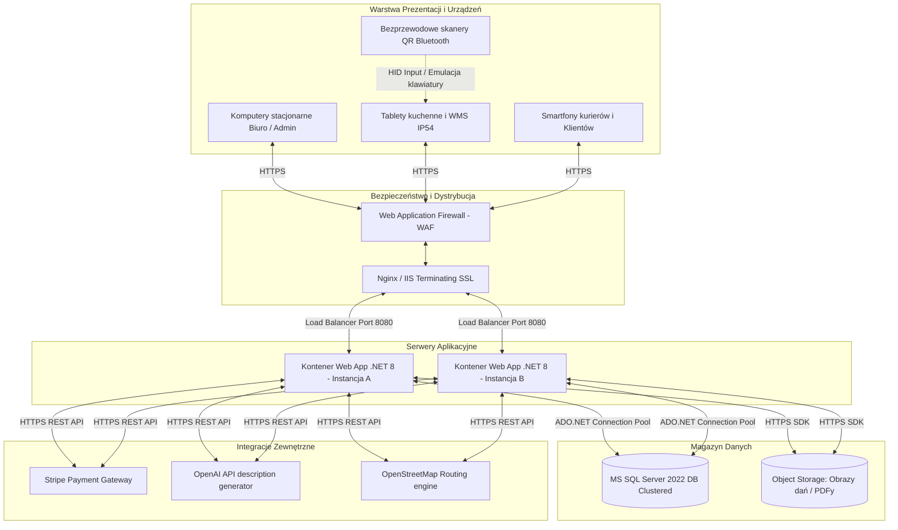
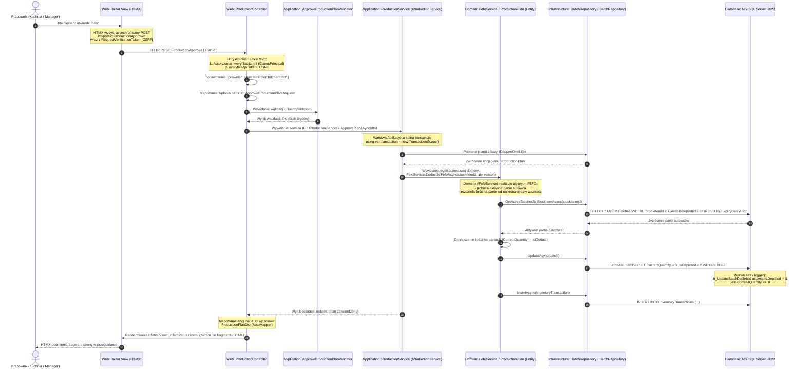

# Analiza Wymagań Niefunkcjonalnych, Architektura Sprzętowa i Opis Schematu Bazy Danych
**Projekt:** System Zarządzania Platformą Cateringową „Kuchnia u Cygana”  
**Wersja:** 2.0 (Rozszerzona Dokumentacja Techniczno-Analityczna)  
**Status:** Gotowy do prezentacji  
**Autorzy:** Zespół Deweloperski (Dawid Janczyło, Gabriel Ostaszewski, Maciej Cyuńczyk, Tomasz Golonko, Paweł Trochimczyk)  

---

## Spis Treści
1. [Wstęp i Podział Merytoryczny Zespołu](#1-wstęp-i-podział-merytoryczny-zespołu)
2. [Szczegółowe Wymagania Klienta i Zakres Merytoryczny Modułów](#2-szczegółowe-wymagania-klienta-i-zakres-merytoryczny-modułów)
3. [Wymagania Funkcjonalne i Niefunkcjonalne (NFR)](#3-wymagania-funkcjonalne-i-niefunkcjonalne-nfr)
4. [Infrastruktura i Architektura Sprzętowa](#4-infrastruktura-i-architektura-sprzętowa)
5. [Elementy Słownikowe (Lookup Tables)](#5-elementy-słownikowe-lookup-tables)
6. [Bezpieczeństwo, Ochrona Danych i Audytowalność](#6-bezpieczeństwo-ochrona-danych-i-audytowalność)
7. [Rozmiar Bazy Danych, Obciążenie i Przyrost Danych](#7-rozmiar-bazy-danych-obciążenie-i-przyrost-danych)
8. [Relacyjny Model Logiczny i Diagram Fizyczny (ERD)](#8-relacyjny-model-logiczny-i-diagram-fizyczny-erd)
9. [Specyfikacja Fizyczna Tabel Bazodanowych (M1–M5)](#9-specyfikacja-fizyczna-tabel-bazodanowych-m1m5)
10. [Procedury Składowane, Widoki, Wyzwalacze (Database Objects)](#10-procedury-składowane-widoki-wyzwalacze-database-objects)
11. [Przepływ Danych przy Zapytaniu (Request Data Flow Walkthrough)](#11-przepływ-danych-przy-zapytaniu-request-data-flow-walkthrough)
12. [Potencjalne Trudności i Ryzyka Projektowe](#12-potencjalne-trudności-i-ryzyka-projektowe)

---

## 1. Wstęp i Podział Merytoryczny Zespołu
Projekt **„Kuchnia u Cygana”** to zintegrowana platforma e-commerce sprzężona z systemem klasy ERP/WMS dedykowana dla cateringu dietetycznego. System został podzielony na **5 modułów domenowych** rozwijanych równolegle w oparciu o architekturę czystą (Clean Architecture) w technologii .NET 8.

```
┌─────────────────────────────────────────────────────────────────────────┐
│                          KUCHNIA U CYGANA (ERP)                         │
└────────────────────────────────────┬────────────────────────────────────┘
                                     │
     ┌──────────────────┬────────────┼────────────┬──────────────────┐
┌────▼─────┐       ┌────▼─────┐ ┌────▼─────┐ ┌────▼─────┐       ┌────▼─────┐
│ Moduł 1  │       │ Moduł 2  │ │ Moduł 3  │ │ Moduł 4  │       │ Moduł 5  │
│E-commerce│       │ Katalog  │ │Produkcja │ │Logistyka │       │Admin & HR│
│  Dawid   │       │ Gabriel  │ │  Maciej  │ │  Tomasz  │       │  Paweł   │
└──────────┘       └──────────┘ └──────────┘ └──────────┘       └──────────┘
```

Podział odpowiedzialności w zespole:
1.  **Dawid Janczyło (Moduł 1 — Portal Klienta i E-commerce)**: Rejestracja, profile klientów, proces zakupowy, koszyk, kalendarz zawieszeń dostaw, płatności Stripe.
2.  **Gabriel Ostaszewski (Moduł 2 — Katalog Diet i Receptur)**: Tworzenie oferty, struktura posiłków i makroskładników, receptury, słownik alergenów, OpenAI do automatycznych opisów dań.
3.  **Maciej Cyuńczyk (Moduł 3 — System Produkcyjny i Magazyn)**: Zarządzanie magazynem surowców (FEFO), kontrola temperatur HACCP, kompletacja posiłków (pudełek do toreb), QR kody, plany produkcyjne i karty PDF (QuestPDF).
4.  **Tomasz Golonko (Moduł 4 — Logistyka i Dostawy)**: Zarządzanie flotą i kurierami, wyznaczanie tras (routing OSM/Google), generowanie manifestów przewozowych, ewidencja i obieg toreb termicznych.
5.  **Paweł Trochimczyk (Moduł 5 — Administracja, HR i Obsługa Klienta)**: Grafik pracy personelu, wnioski urlopowe, system reklamacyjny (Helpdesk / Tickety) z załącznikami graficznymi, logi audytowe systemu.

---

## 2. Szczegółowe Wymagania Klienta i Zakres Merytoryczny Modułów

### Moduł 1 (E-commerce) — Dawid
*   **Kreator zamówień**: Klient konfiguruje długość trwania cateringu (wykluczenie weekendów), wybiera dietę oraz kaloryczność.
*   **Kalendarz zawieszeń**: Umożliwia wstrzymanie dostawy (np. na czas urlopu) z wyprzedzeniem min. 24h. Zawieszony dzień przesuwa czas trwania umowy na kolejny wolny dzień roboczy.
*   **Książka adresowa**: Zarządzanie wieloma adresami (np. dom, praca) z możliwością przypisywania ich do konkretnych dni dostaw.
*   **Integracja Stripe**: Przetwarzanie bezpiecznych płatności online bez przechowywania danych kart w bazie danych.

### Moduł 2 (Katalog) — Gabriel
*   **Dietetyka i receptury**: Danie składa się ze składników o określonej gramaturze. System automatycznie przelicza makroskładniki (białko, tłuszcz, węglowodany, błonnik) oraz kaloryczność posiłku na bazie receptury.
*   **Propagacja alergenów**: Alergeny przypisane do surowca magazynowego są automatycznie propagowane na powiązany posiłek i widoczne dla klienta oraz drukowane na etykiecie.
*   **AI Marketing Assistant**: Dietetyk klika "Generuj opis", a silnik OpenAI analizuje składniki i zwraca chwytliwy opis marketingowy dania.

### Moduł 3 (Produkcja & Magazyn) — Maciej
*   **Gospodarka FEFO (First Expired, First Out)**: Automatyczne rozchodowanie surowców według terminu ważności partii. Zapobiega to marnowaniu żywności.
*   **Stanowisko Kompletacji**: Pakowacze za pomocą ekranów dotykowych i skanerów kodów QR kompletują pudełka do toreb zbiorczych. Zeskanowanie kodu QR na pudełku przypisuje je do właściwej torby klienta.
*   **Dziennik HACCP**: Monitorowanie temperatur chłodni. Wprowadzenie temperatury spoza normy (np. powyżej 4°C dla chłodni mięsa) generuje krytyczny alert w systemie.

### Moduł 4 (Logistyka) — Tomasz
*   **Optymalizacja Tras**: Grupowanie adresów dostaw w trasy kurierskie w celu minimalizacji czasu i kosztu paliwa.
*   **Spedycja i Manifesty**: Kurier przed wyjazdem otrzymuje wydrukowany manifest załadunkowy (PDF z QuestPDF) zawierający podsumowanie toreb oraz trasę. Przy załadunku następuje weryfikacja ilościowa.
*   **Torby Termiczne (Thermal Bags)**: Torby termiczne są drogim zasobem zwrotnym. System ewidencjonuje każdą torbę (kod QR/kreskowy) i loguje jej ruch (Wydana kurierowi -> Pozostawiona u klienta -> Odebrana od klienta -> Zwrócona na magazyn).

### Moduł 5 (HR & Administracja) — Paweł
*   **Zarządzanie Personelem**: Ewidencja pracowników z podziałem na działy (Kuchnia, Magazyn, Kompletacja, Logistyka, Biuro).
*   **Wnioski Urlopowe i Grafiki**: Pracownicy wnioskują o urlopy. Po ich zatwierdzeniu przez managera, system blokuje możliwość przypisania pracownika do zmiany w grafiku (`WorkSchedules`).
*   **Obsługa Reklamacji (Helpdesk)**: Klient może zgłosić reklamację (np. uszkodzenie pudełka) i załączyć zdjęcie. System przesyła pliki na lokalny serwer lub do magazynu chmurowego, a w bazie zapisuje ścieżkę do pliku.

---

## 3. Wymagania Funkcjonalne i Niefunkcjonalne (NFR)

### Wymagania Funkcjonalne (Kluczowe)
*   **F1**: Rejestracja i logowanie klientów oraz pracowników (RBAC).
*   **F2**: Zakup diety cateringowej z płatnością Stripe.
*   **F3**: Konfiguracja kalendarza dostaw i adresów.
*   **F4**: Projektowanie dań i automatyczne wyliczanie wartości odżywczych dań.
*   **F5**: Automatyczna agregacja zamówień w plany produkcyjne.
*   **F6**: Obsługa wydań magazynowych według algorytmu FEFO.
*   **F7**: Panel kompletacji z obsługą skanowania QR/kodów kreskowych.
*   **F8**: Wyznaczanie tras kurierskich i generowanie manifestów PDF.
*   **F9**: Ewidencja obiegu toreb termicznych.
*   **F10**: Obsługa ticketów reklamacyjnych ze zdjęciami oraz grafików pracy.

### Wymagania Niefunkcjonalne (NFR)
*   **NF1 (Wydajność)**: Czas generowania zapotrzebowania na surowce dla 1000 zamówień nie może przekroczyć 3 sekund (dzięki optymalnym indeksom i lekkiemu micro-ORM OrmLite).
*   **NF2 (Bezpieczeństwo)**: Hasła haszowane jednokierunkowo algorytmem o wysokiej odporności (np. BCrypt/Argon2). Dane wrażliwe (adresy, dane osobowe) chronione są na poziomie bazy danych (TDE - Transparent Data Encryption lub szyfrowanie kolumnowe).
*   **NF3 (HACCP i Audytowalność)**: Każda edycja rekordów finansowych, magazynowych oraz zmian uprawnień musi zapisać ślad audytowy w tabeli `SystemLogs` zawierający stary i nowy stan rekordu w formacie JSON (`OldValue`, `NewValue`).
*   **NF4 (Responsywność)**: Interfejs webowy musi być dostosowany do urządzeń mobilnych (kierowcy) oraz tabletów dotykowych (kucharze i pakowacze w środowisku o podwyższonej wilgotności).
*   **NF5 (Dostępność)**: System musi być odporny na awarie sieciowe. W przypadku utraty połączenia ze skanerami kodów QR na kompletacji, system musi umożliwiać ręczne odznaczanie pozycji w interfejsie webowym.

---

## 4. Infrastruktura i Architektura Sprzętowa



### Wymagania Infrastrukturalne (Produkcja)
1.  **Dystrybucja Ruchu**: Load balancer rozdzielający ruch pomiędzy dwie instancje kontenerów aplikacji w celu zapewnienia wysokiej dostępności (High Availability).
2.  **Baza Danych**: Klastrowany MS SQL Server 2022 działający w architekturze Active-Passive z replikacją logów transakcyjnych w czasie rzeczywistym.
3.  **Przechowywanie Plików (Object Storage)**: Wykorzystanie usługi chmurowej (np. AWS S3 lub Azure Blob Storage) do składowania plików o zmiennym rozmiarze (np. zdjęcia potraw z Modułu 2, zdjęcia uszkodzeń z Modułu 5, raporty PDF z Modułów 3 i 4). Zabezpiecza to bazę danych przed niekontrolowanym wzrostem rozmiaru pliku bazy (`.mdf`).

---

## 5. Elementy Słownikowe (Lookup Tables)
W celu optymalizacji struktury i uniknięcia redundancji danych, system posiada wydzielone tabele słownikowe:
*   `UnitsOfMeasure` (Jednostki miary): Przechowuje symbole (`kg`, `g`, `l`, `ml`, `szt.`) oraz pełne nazwy jednostek miar wykorzystywanych w przepisach i na magazynie.
*   `Categories` (Kategorie dań): Słownik kategoryzujący posiłki w jadłospisie (np. *Śniadanie*, *Drugie Śniadanie*, *Obiad*, *Podwieczorek*, *Kolacja*).
*   `Allergens` (Alergeny): Lista substancji uczulających według dyrektyw unijnych (np. *gluten*, *skorupiaki*, *orzechy*, *seler*). Każdy alergen posiada unikalny kod oraz ikonę.
*   `DeliveryWindows` (Przedziały dostaw): Godziny, w których kurier może dostarczyć torbę (np. `04:00 - 06:00`, `06:00 - 08:00`).
*   `DiscountCodes` (Kody rabatowe): Słownik kodów promocyjnych wraz z wartościami procentowymi lub kwotowymi i datą ważności.
*   `Departments` (Działy HR): Słownik organizacyjny przedsiębiorstwa (np. *Kuchnia*, *Magazyn*, *Logistyka*, *Administracja*).

---

## 6. Bezpieczeństwo, Ochrona Danych i Audytowalność
W celu ochrony danych wrażliwych i zapewnienia pełnej rozliczalności personelu, wdrożono zaawansowane mechanizmy zabezpieczeń.

### 6.1. Ochrona danych wrażliwych (Szyfrowanie i Maskowanie)
*   **Haszowanie haseł**: Zastosowanie funkcji haszującej opartej na soli (np. BCrypt z kosztem obliczeniowym równym 11 lub Argon2id), co zabezpiecza hasła przed atakami metodą słownikową i siłową w przypadku wycieku bazy.
*   **Always Encrypted (SQL Server)**: Kolumny zawierające dane osobowe oraz adresowe klientów (`FirstName`, `LastName`, `Email`, `PhoneNumber`, `Street`, `HouseNumber`) w tabelach `Users`, `Addresses` i `Employees` są szyfrowane na poziomie bazy danych przy użyciu technologii *Always Encrypted*. Klucze deszyfrujące przechowywane są bezpiecznie w menedżerze certyfikatów serwera aplikacji (np. Azure Key Vault), co sprawia, że administrator bazy danych (DBA) nie ma wglądu do czystych danych tekstowych.
*   **Maskowanie danych wrażliwych w logach**: System automatycznie filtruje wartości zapisywane w tabeli `SystemLogs`. Pola takie jak hasła, tokeny sesji czy klucze Stripe są podmieniane na maskę `********` na poziomie warstwy aplikacyjnej (kod walidatorów i interceptorów).

### 6.2. Mechanizm historii zmian (Audit Trail)
System realizuje trójpoziomowe śledzenie historii operacji:
1.  **Auditable Entities (Miękkie Usuwanie i Historia Rekordu)**:
    Większość encji biznesowych dziedziczy po klasie bazowej `AuditableEntity`. Zawiera ona pola: `CreatedAt`, `CreatedBy`, `UpdatedAt`, `UpdatedBy`, `IsDeleted`, `DeletedAt`, `DeletedBy`. Usunięcie obiektu jest operacją logiczną (ustawienie flagi `IsDeleted = 1`), co zapobiega utracie powiązań historycznych w raportach finansowych.
2.  **Tabela `SystemLogs` (Logi Zdarzeń Systemowych)**:
    Każda akcja modyfikująca dane (Insert, Update, Delete) wyzwala zapis w tabeli `SystemLogs`. Zapisywane są stany obiektów przed i po modyfikacji w formacie JSON (`OldValue` oraz `NewValue`), co umożliwia odtworzenie historii zmian dowolnego obiektu w czasie.
3.  **Tabela `InventoryTransactions` (Śledzenie Ilościowe Magazynu)**:
    Każdy ruch surowca na magazynie (przyjęcie dostawy, zużycie do planu produkcji, korekta inwentaryzacyjna) musi posiadać referencję do partii (`BatchId`) oraz wpisaną ilość i powód. Gwarantuje to pełną rozliczalność stanów magazynowych.

---

## 7. Rozmiar Bazy Danych, Obciążenie i Przyrost Danych

### 7.1. Rozmiar początkowy (Initial Database Size)
*   Rozmiar pustej bazy danych z migracjami: ok. **8 MB**.
*   Rozmiar po załadowaniu danych słownikowych i seedu testowego (DemoData): ok. **15 MB**.

### 7.2. Szacowany przyrost danych (dla średniej wielkości cateringu - 500 klientów aktywnych)
Założenia:
*   500 aktywnych klientów dostaje 5 posiłków dziennie = **2500 pudełek dziennie**.
*   Dostawy realizowane są przez 360 dni w roku.
*   Każde pudełko generuje rekord kompletacji (`PackingItems`).

| Tabela / Typ Danych | Średni rozmiar wiersza | Liczba wierszy (Rocznie) | Przyrost danych (Rocznie) | Opis |
| :--- | :--- | :--- | :--- | :--- |
| `PackingItems` | ~150 B | 900 000 | **135 MB** | Zapis kompletacji pudełek (traceability) |
| `SystemLogs` | ~1000 B | 720 000 | **720 MB** | Logi audytowe zmian w systemie |
| `TemperatureLogs` | ~80 B | 175 200 | **14 MB** | Odczyt z 5 lodówek co 15 minut |
| `InventoryTransactions`| ~100 B | 250 000 | **25 MB** | Zapisy zmian ilościowych w partiach |
| `Orders` & `OrderItems`| ~120 B | 36 000 | **4.3 MB** | Zamówienia i pozycje zamówień |
| Pozostałe tabele | - | - | **15 MB** | Słowniki, diety, konta użytkowników |
| **Suma (Dane + Indeksy)**| - | - | **ok. 1.1 GB / Rok** | Łączny przyrost przestrzeni dyskowej |

> [!IMPORTANT]
> Pliki załączników do zgłoszeń reklamacyjnych (np. zdjęcia JPG/PNG o średnim rozmiarze 2MB) nie są przechowywane w bazie danych SQL. Baza przechowuje jedynie URL (np. `NVARCHAR(1000)`) wskazujący na Object Storage. Pozwala to zaoszczędzić około **720 GB** przestrzeni bazodanowej rocznie przy założeniu 1000 reklamacji ze zdjęciami miesięcznie.

### 7.3. Identyfikacja tabel o największym obciążeniu (Hotspots)

```mermaid
quadrantChart
    title Identyfikacja Obciążenia Tabel (Wydajność)
    x-axis Niska Częstotliwość Odczytu --> Wysoka Częstotliwość Odczytu
    y-axis Niska Częstotliwość Zapisu --> Wysoka Częstotliwość Zapisu
    quadrant-1 Tabele Krytyczne (High Load)
    quadrant-2 Głównie Zapis (Write-Heavy)
    quadrant-3 Małe obciążenie
    quadrant-4 Głównie Odczyt (Read-Heavy)
    "PackingItems" : [0.85, 0.88]
    "SystemLogs" : [0.2, 0.95]
    "TemperatureLogs" : [0.1, 0.9]
    "InventoryTransactions" : [0.4, 0.75]
    "Meals" : [0.9, 0.2]
    "Recipes" : [0.95, 0.15]
    "DietVariantMeals" : [0.9, 0.1]
    "DeliveryRouteStops" : [0.8, 0.4]
    "Users" : [0.7, 0.3]
```

1.  **Tabele Krytyczne (High Write / High Read)**:
    *   `PackingItems`: Podczas kompletacji wieczornej (okienko 4-godzinowe) następuje skanowanie 2500 pudełek. Generuje to intensywny ruch zapisu (Insert statusów) oraz odczytu (wyszukiwanie po kodzie kreskowym). Wymaga optymalnego indeksu na `BoxCode`.
2.  **Tabele typu Write-Heavy (Intensywny zapis, sporadyczny odczyt)**:
    *   `SystemLogs` oraz `TemperatureLogs`: Ciągły napływ logów telemetrii i audytu. Tabele te wymagają partycjonowania oraz cyklicznej archiwizacji w celu ochrony przed degradacją wydajności zapytań.
3.  **Tabele typu Read-Heavy (Intensywny odczyt, rzadki zapis)**:
    *   `Recipes`, `DietVariantMeals` oraz `Meals`: Odczytywane przy każdym wyświetleniu menu przez klienta oraz podczas nocnego generowania planu produkcji i wyliczania food-costu. Wymagają agresywnego indeksowania i keszowania po stronie aplikacji.

---

## 8. Relacyjny Model Logiczny i Diagram Fizyczny (ERD)
Poniższy diagram fizyczny przedstawia strukturę bazy danych z uwzględnieniem wszystkich 5 modułów (M1–M5), typów danych dla MS SQL Server oraz kluczy głównych (PK) i obcych (FK).

```mermaid
erDiagram
    %% Moduł 5: Administracja i HR (Paweł)
    DEPARTMENTS {
        int Id PK
        string Name
        string Description
        int HeadEmployeeId FK "nullable"
    }
    EMPLOYEES {
        int Id PK
        int UserId FK "unique"
        string FirstName
        string LastName
        string Email
        string PhoneNumber
        date HireDate
        date TerminationDate "nullable"
        int DepartmentId FK
        string Position
        boolean IsActive
        datetimeoffset CreatedAt
        datetimeoffset UpdatedAt
    }
    WORKSCHEDULES {
        int Id PK
        int UserId FK
        date ShiftDate
        int Shift
        string RoleAtShift
        datetimeoffset CreatedAt
    }
    LEAVEREQUESTS {
        int Id PK
        int EmployeeId FK
        int LeaveType
        date StartDate
        date EndDate
        int Status
        int ApprovedByEmployeeId FK "nullable"
        string RejectionReason "nullable"
        datetimeoffset CreatedAt
    }
    TICKETS {
        int Id PK
        string Title
        string Description
        int ClientUserId FK
        int AssignedToUserId FK "nullable"
        int Status
        int Priority
        datetimeoffset ClosedAt "nullable"
        datetimeoffset CreatedAt
    }
    TICKETATTACHMENTS {
        int Id PK
        int TicketId FK
        string FileUrl
        string FileName
        bigint FileSizeBytes
        datetimeoffset CreatedAt
    }
    SYSTEMLOGS {
        int Id PK
        int UserId FK
        string Action
        string TargetEntity
        string TargetId
        string OldValue "NVARCHAR_MAX"
        string NewValue "NVARCHAR_MAX"
        datetimeoffset Timestamp
        string IPAddress
    }

    %% Moduł 1: E-commerce (Dawid)
    USERS {
        int Id PK
        string Email UK
        string PasswordHash
        string FirstName
        string LastName
        string Role
        datetimeoffset CreatedAt
        datetimeoffset UpdatedAt
    }
    CUSTOMERPROFILES {
        int Id PK
        int UserId FK "unique"
        string PhoneNumber
        string CompanyName "nullable"
        string Nip "nullable"
    }
    ADDRESSES {
        int Id PK
        int CustomerProfileId FK
        string Street
        string HouseNumber
        string ApartmentNumber "nullable"
        string City
        string PostalCode
        boolean IsDefault
    }
    DISCOUNTCODES {
        int Id PK
        string Code UK
        decimal DiscountValue
        int Type
        datetime ValidFrom
        datetime ValidTo
    }
    DELIVERYWINDOWS {
        int Id PK
        string Name
        time StartTime
        time EndTime
    }
    ORDERS {
        int Id PK
        int CustomerId FK "Users"
        string OrderNumber UK
        int Status
        decimal TotalPrice
        decimal DiscountAmount
        decimal FinalPrice
        int DiscountCodeId FK "nullable"
        string Notes "nullable"
        datetime StartDate
        datetime EndDate
        datetime CreatedAt
    }
    ORDERITEMS {
        int Id PK
        int OrderId FK
        int DietId
        int DietVariantId
        string DietName
        string VariantName
        int CaloriesPerDay
        decimal PricePerDay
        int TotalDays
        decimal TotalPrice
    }
    DELIVERYCALENDAR {
        int Id PK
        int OrderItemId FK
        date DeliveryDate
        int AddressId FK
        int DeliveryWindowId FK
        int Status
        string ExcludeReason "nullable"
    }
    PAYMENTS {
        int Id PK
        int OrderId FK
        string StripeSessionId
        decimal Amount
        int Status
        datetime CreatedAt
    }

    %% Moduł 2: Katalog Diet i Receptur (Gabriel)
    CATEGORIES {
        int Id PK
        string Name
        string Description "nullable"
        int SortOrder
    }
    ALLERGENS {
        int Id PK
        string Name
        string Code UK
        string IconUrl "nullable"
    }
    INGREDIENTS {
        int Id PK
        string Name
        string Unit
        decimal CostPerUnit
        boolean IsActive
    }
    INGREDIENTALLERGENS {
        int Id PK
        int IngredientId FK
        int AllergenId FK
        boolean TraceAmount
    }
    RECIPES {
        int Id PK
        int MealId FK
        int IngredientId FK
        decimal WeightInGrams
        boolean IsOptional
    }
    MEALS {
        int Id PK
        int CategoryId FK
        string Name
        string Description "nullable"
        string MarketingDescription "nullable"
        string Status
        int PreparationTimeMinutes
    }
    MEALALLERGENS {
        int Id PK
        int MealId FK
        int AllergenId FK
        boolean IsTrace
    }
    DIETS {
        int Id PK
        string Name
        string Description "nullable"
        string Status
        boolean IsActive
    }
    DIETVARIANTS {
        int Id PK
        int DietId FK
        string Name
        int TargetCalories
        decimal PriceMultiplier
    }
    DIETVARIANTMEALS {
        int Id PK
        int DietVariantId FK
        int MealId FK
        decimal ServingSizeMultiplier
        int SortOrder
    }
    NUTRITIONFACTS {
        int Id PK
        int MealId FK "nullable"
        int IngredientId FK "nullable"
        decimal CaloriesPer100g
        decimal ProteinPer100g
        decimal CarbohydratesPer100g
        decimal FatPer100g
    }
    MEALIMAGES {
        int Id PK
        int MealId FK
        string Url
        boolean IsMain
    }

    %% Moduł 3: Produkcja i Magazyn (Maciej)
    UNITSOFMEASURE {
        int Id PK
        string Symbol
        string Name
    }
    STOCKITEMS {
        int Id PK
        string Name
        int BaseIngredientId FK "bridge_nullable"
        int DefaultUnitOfMeasureId FK
        decimal MinimumLevel
        int LeadTimeDays
        boolean IsDeleted
    }
    BATCHES {
        int Id PK
        int StockItemId FK
        string SupplierBatchNumber
        decimal CurrentQuantity
        datetimeoffset ExpiryDate "nullable"
        datetimeoffset ReceivedDate
        boolean IsDepleted
        boolean IsDeleted
    }
    INVENTORYTRANSACTIONS {
        bigint Id PK
        int BatchId FK
        int TransactionType
        decimal QuantityChanged
        string Reason "nullable"
        string ReferenceDocument "nullable"
    }
    TEMPERATURELOGS {
        bigint Id PK
        string DeviceNameOrLocation
        decimal RecordedTemperatureCelsius
        datetimeoffset RecordedAt
    }
    INVENTORYADJUSTMENTS {
        int Id PK
        int StockItemId FK
        decimal QuantityBefore
        decimal QuantityAfter
        decimal Difference
        string Reason
        string AdjustedBy
    }
    PRODUCTIONPLANS {
        int Id PK
        date ProductionDate
        int Status
        boolean IsSharedWithLogistics
    }
    PRODUCTIONPLANITEMS {
        int Id PK
        int ProductionPlanId FK
        int MealId FK "bridge"
        string MealName
        int DietVariantId FK "bridge"
        int PlannedQuantity
        int CookedQuantity
        int Status
    }
    PRODUCTIONBATCHES {
        int Id PK
        int ProductionPlanId FK
        int MealId FK "bridge"
        string Name
        decimal PlannedQuantity
        decimal ProducedQuantity
    }
    PACKINGSESSIONS {
        int Id PK
        date PackingDate
        int OrderId FK "bridge"
        string ClientName
        int Status
        int RouteId FK "bridge"
        int StopNumber
    }
    PACKINGITEMS {
        int Id PK
        int PackingSessionId FK
        int MealId FK "bridge"
        int DietVariantId FK "bridge"
        int BatchId FK "HACCP"
        boolean IsDamaged
        string BoxCode
        int Status
        datetime FoilPrintedAt "nullable"
        datetime PackedAt "nullable"
    }
    PACKINGLABELS {
        int Id PK
        int PackingItemId FK "nullable"
        int PackingSessionId FK "nullable"
        int LabelType
        string QrCode UK
        string DishName "nullable"
        string Allergens "nullable"
        int Kcal "nullable"
    }
    PACKINGMANIFESTS {
        int Id PK
        date PackingDate
        string ManifestNumber
        int RouteCount
        int BagCount
        string PayloadJson "NVARCHAR_MAX"
        int RouteId FK "bridge"
        boolean IsVerified
    }

    %% Moduł 4: Logistyka i Dostawy (Tomasz)
    VEHICLES {
        int Id PK
        string RegistrationNumber
        string Model
        decimal MaxLoadKg
        int Status
    }
    DRIVERS {
        int Id PK
        int UserId FK
        string LicenseNumber
        boolean IsActive
    }
    DISPATCHERS {
        int Id PK
        int UserId FK
        string DeskPhoneNumber
        boolean IsOnDuty
    }
    DELIVERYROUTES {
        int Id PK
        datetimeoffset RouteDate
        string Name
        double TotalDistanceKm
        int Status
        int VehicleId FK "nullable"
        int DriverId FK "nullable"
    }
    DELIVERYROUTESTOPS {
        int Id PK
        int RouteId FK
        int DeliveryCalendarId FK "bridge"
        int SequenceNumber
        datetimeoffset PlannedArrivalTime "nullable"
        datetimeoffset ActualArrivalTime "nullable"
        int Status
    }
    THERMALBAGS {
        int Id PK
        string SerialNumber
        int Status
        int LastCustomerId FK "nullable"
    }
    BAGMOVEMENTLOGS {
        int Id PK
        int ThermalBagId FK
        int FromStatus
        int ToStatus
        int DriverId FK "nullable"
        int RouteStopId FK "nullable"
        datetimeoffset CreatedAt
    }

    %% Relacje między modułami (M1-M5)
    USERS ||--o{ CUSTOMERPROFILES : has
    CUSTOMERPROFILES ||--o{ ADDRESSES : has
    USERS ||--o{ ORDERS : places
    ORDERS ||--|{ ORDERITEMS : contains
    ORDERITEMS ||--o{ DELIVERYCALENDAR : schedules
    ORDERS ||--o{ PAYMENTS : billing
    DELIVERYCALENDAR ||--o{ DELIVERYROUTESTOPS : "assigned to"
    EMPLOYEES ||--o{ LEAVEREQUESTS : requests
    USERS ||--o{ TICKETS : opens
    TICKETS ||--o{ TICKETATTACHMENTS : has
    USERS ||--o{ SYSTEMLOGS : triggers
    DEPARTMENTS ||--o{ EMPLOYEES : employs
    EMPLOYEES ||--o{ DEPARTMENTS : manages
    USERS ||--o{ EMPLOYEES : "has account"
    USERS ||--o{ WORKSCHEDULES : scheduled_for
    DRIVERS ||--o{ DELIVERYROUTES : drives
    VEHICLES ||--o{ DELIVERYROUTES : assigned
    DELIVERYROUTES ||--|{ DELIVERYROUTESTOPS : routes
    THERMALBAGS ||--o{ BAGMOVEMENTLOGS : tracks
    DRIVERS ||--o{ BAGMOVEMENTLOGS : moves
    DELIVERYROUTESTOPS ||--o{ BAGMOVEMENTLOGS : logs

    %% Relacje w menu i przepisach (M2)
    CATEGORIES ||--o{ MEALS : contains
    INGREDIENTS ||--o{ INGREDIENTALLERGENS : has
    ALLERGENS ||--o{ INGREDIENTALLERGENS : categorizes
    INGREDIENTS ||--o{ RECIPES : used_in
    MEALS ||--o{ RECIPES : uses
    ALLERGENS ||--o{ MEALALLERGENS : has
    MEALS ||--o{ MEALALLERGENS : contains
    DIETS ||--|{ DIETVARIANTS : has
    DIETVARIANTS ||--|{ DIETVARIANTMEALS : schedules
    MEALS ||--o{ DIETVARIANTMEALS : serves
    MEALS ||--o{ NUTRITIONFACTS : analysis
    INGREDIENTS ||--o{ NUTRITIONFACTS : analysis
    MEALS ||--o{ MEALIMAGES : displays

    %% Relacje WMS (M3)
    UNITSOFMEASURE ||--o{ STOCKITEMS : measures
    STOCKITEMS ||--o{ BATCHES : stocks
    BATCHES ||--o{ INVENTORYTRANSACTIONS : transact
    STOCKITEMS ||--o{ INVENTORYADJUSTMENTS : adjusts
    PRODUCTIONPLANS ||--|{ PRODUCTIONPLANITEMS : contains
    PRODUCTIONPLANS ||--o{ PRODUCTIONBATCHES : prepares
    PACKINGSESSIONS ||--|{ PACKINGITEMS : contains
    PACKINGITEMS }o--|| BATCHES : "HACCP trace"
    PACKINGSESSIONS ||--o{ PACKINGLABELS : prints
    PACKINGITEMS ||--o{ PACKINGLABELS : prints
```



---

## 9. Specyfikacja Fizyczna Tabel Bazodanowych (M1–M5)
Poniżej znajduje się opis tabel bazodanowych z branchów programistów, które nie były ujęte w podstawowej wersji dokumentu.

### 9.1. Moduł 4: Logistyka i Dostawy — Tomasz (Branch `Tomasz`)

#### Tabela `Vehicles` (Pojazdy)
| Kolumna | Typ Danych (SQL Server) | Null | PK/FK | Opis / Więzy |
| :--- | :--- | :---: | :---: | :--- |
| `Id` | `INT` | NIE | PK | Autoinkrementacja (Identity) |
| `RegistrationNumber`| `VARCHAR(50)` | NIE | - | Numer rejestracyjny (np. `BI 12345`) |
| `Model` | `NVARCHAR(100)` | NIE | - | Marka i model (np. `Renault Kangoo`) |
| `MaxLoadKg` | `DECIMAL(18,2)` | NIE | - | Maksymalna ładowność w kg |
| `Status` | `INT` | NIE | - | Status pojazdu (Enum: Active, Service, Inactive) |

#### Tabela `Drivers` (Kierowcy)
| Kolumna | Typ Danych (SQL Server) | Null | PK/FK | Opis / Więzy |
| :--- | :--- | :---: | :---: | :--- |
| `Id` | `INT` | NIE | PK | Autoinkrementacja |
| `UserId` | `INT` | NIE | FK | Referencja do konta użytkownika (`Users.Id`) |
| `LicenseNumber` | `VARCHAR(50)` | NIE | - | Numer prawa jazdy |
| `IsActive` | `BIT` | NIE | - | Czy kierowca jest aktywny zawodowo |

#### Tabela `DeliveryRoutes` (Trasy Dostaw)
| Kolumna | Typ Danych (SQL Server) | Null | PK/FK | Opis / Więzy |
| :--- | :--- | :---: | :---: | :--- |
| `Id` | `INT` | NIE | PK | Autoinkrementacja |
| `RouteDate` | `DATETIMEOFFSET(0)` | NIE | - | Data realizacji dostawy |
| `Name` | `NVARCHAR(100)` | NIE | - | Nazwa trasy (np. `Trasa Śródmieście A`) |
| `TotalDistanceKm` | `DOUBLE PRECISION` | NIE | - | Szacowany dystans trasy w km |
| `Status` | `INT` | NIE | - | Status (Enum: Created, InProgress, Completed) |
| `VehicleId` | `INT` | TAK | FK | Przypisany pojazd (`Vehicles.Id`) |
| `DriverId` | `INT` | TAK | FK | Przypisany kurier (`Drivers.Id`) |

#### Tabela `DeliveryRouteStops` (Przystanki na Trasie)
| Kolumna | Typ Danych (SQL Server) | Null | PK/FK | Opis / Więzy |
| :--- | :--- | :---: | :---: | :--- |
| `Id` | `INT` | NIE | PK | Autoinkrementacja |
| `RouteId` | `INT` | NIE | FK | Referencja do trasy (`DeliveryRoutes.Id`) |
| `DeliveryCalendarId`| `INT` | NIE | - | Referencja do kalendarza dostaw (Bridge) |
| `SequenceNumber` | `INT` | NIE | - | Kolejność przystanku na trasie |
| `PlannedArrivalTime`| `DATETIMEOFFSET(0)` | TAK | - | Szacowana godzina dojazdu |
| `ActualArrivalTime` | `DATETIMEOFFSET(0)` | TAK | - | Rzeczywista godzina dojazdu |
| `Status` | `INT` | NIE | - | Status (Enum: Planned, Delivered, Failed) |

#### Tabela `ThermalBags` (Torby Termiczne - Inwentarz Zwrotny)
| Kolumna | Typ Danych (SQL Server) | Null | PK/FK | Opis / Więzy |
| :--- | :--- | :---: | :---: | :--- |
| `Id` | `INT` | NIE | PK | Autoinkrementacja |
| `SerialNumber` | `VARCHAR(50)` | NIE | UK | Numer seryjny torby (kod QR) |
| `Status` | `INT` | NIE | - | Status torby (Enum: Available, InTransit, Lost) |
| `LastCustomerId` | `INT` | TAK | - | U którego klienta torba aktualnie się znajduje |

#### Tabela `BagMovementLogs` (Historia Obiegu Torby)
| Kolumna | Typ Danych (SQL Server) | Null | PK/FK | Opis / Więzy |
| :--- | :--- | :---: | :---: | :--- |
| `Id` | `INT` | NIE | PK | Autoinkrementacja |
| `ThermalBagId` | `INT` | NIE | FK | Identyfikator torby (`ThermalBags.Id`) |
| `FromStatus` | `INT` | NIE | - | Status poprzedni |
| `ToStatus` | `INT` | NIE | - | Status nowy |
| `DriverId` | `INT` | TAK | FK | Kurier dokonujący skanowania (`Drivers.Id`) |
| `RouteStopId` | `INT` | TAK | FK | Przystanek, na którym dokonano operacji |
| `CreatedAt` | `DATETIMEOFFSET(0)` | NIE | - | Data i godzina rejestracji zdarzenia |

---

### 9.2. Moduł 5: Administracja, HR i Komunikacja — Paweł (Branch `Pawciot`)

#### Tabela `Employees` (Pracownicy)
Tabela połączona relacją 1:1 z tabelą `Users` w celu rozszerzenia danych o aspekty kadrowe.
| Kolumna | Typ Danych (SQL Server) | Null | PK/FK | Opis / Więzy |
| :--- | :--- | :---: | :---: | :--- |
| `Id` | `INT` | NIE | PK | Autoinkrementacja |
| `UserId` | `INT` | NIE | FK | Logiczne konto użytkownika (Unique, FK do `Users.Id` ) |
| `FirstName` | `NVARCHAR(50)` | NIE | - | Imię |
| `LastName` | `NVARCHAR(50)` | NIE | - | Nazwisko |
| `Email` | `VARCHAR(100)` | NIE | - | Służbowy adres e-mail |
| `PhoneNumber` | `VARCHAR(15)` | TAK | - | Służbowy telefon kontaktowy |
| `HireDate` | `DATE` | NIE | - | Data zatrudnienia |
| `TerminationDate` | `DATE` | TAK | - | Data rozwiązania umowy |
| `DepartmentId` | `INT` | NIE | FK | Przynależność organizacyjna (`Departments.Id`) |
| `Position` | `NVARCHAR(100)` | NIE | - | Stanowisko pracy (np. `Kucharz`, `Pakowacz`) |
| `IsActive` | `BIT` | NIE | - | Status zatrudnienia |

#### Tabela `WorkSchedules` (Grafiki Pracy)
| Kolumna | Typ Danych (SQL Server) | Null | PK/FK | Opis / Więzy |
| :--- | :--- | :---: | :---: | :--- |
| `Id` | `INT` | NIE | PK | Identyfikator wiersza |
| `UserId` | `INT` | NIE | FK | Identyfikator konta pracownika (`Users.Id`) |
| `ShiftDate` | `DATE` | NIE | - | Dzień roboczy |
| `Shift` | `INT` | NIE | - | Zmiana (Enum: `1` - Poranna, `2` - Popołudniowa, `3` - Nocna) |
| `RoleAtShift` | `NVARCHAR(50)` | TAK | - | Opcjonalna rola na zmianie (np. `Kierownik Kuchni`) |

> [!NOTE]
> Na tabeli `WorkSchedules` nałożono unikalny klucz złożony `UQ_WorkSchedules_User_Date_Shift` na kolumny (`UserId`, `ShiftDate`, `Shift`), co zapobiega dublowaniu planu pracy pracownika w tym samym czasie.

#### Tabela `LeaveRequests` (Wnioski Urlopowe)
| Kolumna | Typ Danych (SQL Server) | Null | PK/FK | Opis / Więzy |
| :--- | :--- | :---: | :---: | :--- |
| `Id` | `INT` | NIE | PK | Identyfikator wniosku |
| `EmployeeId` | `INT` | NIE | FK | Pracownik wnioskujący (`Employees.Id`) |
| `LeaveType` | `INT` | NIE | - | Typ urlopu (Enum: Wypoczynkowy, Chorobowy, Bezpłatny) |
| `StartDate` | `DATE` | NIE | - | Początek urlopu |
| `EndDate` | `DATE` | NIE | - | Koniec urlopu |
| `Status` | `INT` | NIE | - | Status (Enum: `0` - Oczekuje, `1` - Zatwierdzony, `2` - Odrzucony) |
| `ApprovedByEmployeeId`| `INT`| TAK | FK | Manager rozpatrujący wniosek (`Employees.Id`) |
| `RejectionReason` | `NVARCHAR(500)`| TAK | - | Powód ewentualnego odrzucenia |

#### Tabela `Tickets` (Zgłoszenia Pomocy / Reklamacje)
| Kolumna | Typ Danych (SQL Server) | Null | PK/FK | Opis / Więzy |
| :--- | :--- | :---: | :---: | :--- |
| `Id` | `INT` | NIE | PK | Identyfikator zgłoszenia |
| `Title` | `NVARCHAR(200)`| NIE | - | Temat reklamacji (np. `Uszkodzone opakowanie`) |
| `Description` | `NVARCHAR(MAX)`| NIE | - | Treść zgłoszenia klienta |
| `ClientUserId` | `INT` | NIE | FK | Klient zgłaszający (`Users.Id`) |
| `AssignedToUserId`| `INT` | TAK | FK | Pracownik obsługi przypisany do zgłoszenia (`Users.Id` ) |
| `Status` | `INT` | NIE | - | Status zgłoszenia (Enum: Open, InProgress, Resolved, Closed) |
| `Priority` | `INT` | NIE | - | Priorytet (Enum: Low, Medium, High) |
| `ClosedAt` | `DATETIMEOFFSET(0)`| TAK | - | Data zamknięcia zgłoszenia |

#### Tabela `TicketAttachments` (Załączniki Zgłoszeń)
| Kolumna | Typ Danych (SQL Server) | Null | PK/FK | Opis / Więzy |
| :--- | :--- | :---: | :---: | :--- |
| `Id` | `INT` | NIE | PK | Identyfikator załącznika |
| `TicketId` | `INT` | NIE | FK | Powiązane zgłoszenie (`Tickets.Id`) |
| `FileUrl` | `NVARCHAR(1000)`| NIE | - | Ścieżka URL do pliku w Object Storage |
| `FileName` | `NVARCHAR(500)`| NIE | - | Nazwa oryginalna pliku |
| `FileSizeBytes` | `BIGINT` | NIE | - | Rozmiar pliku w bajtach |

#### Tabela `SystemLogs` (Audyt Logów Transakcyjnych)
| Kolumna | Typ Danych (SQL Server) | Null | PK/FK | Opis / Więzy |
| :--- | :--- | :---: | :---: | :--- |
| `Id` | `INT` | NIE | PK | Autoinkrementacja |
| `UserId` | `INT` | NIE | FK | Osoba dokonująca operacji (`Users.Id`) |
| `Action` | `VARCHAR(100)` | NIE | - | Typ operacji (np. `INSERT`, `UPDATE ROLE`, `DELETE`) |
| `TargetEntity` | `VARCHAR(50)` | NIE | - | Zmodyfikowana tabela (np. `Users`, `Batches`) |
| `TargetId` | `VARCHAR(100)` | NIE | - | Identyfikator rekordu zmienionego (PK) |
| `OldValue` | `NVARCHAR(MAX)`| TAK | - | Zrzut danych przed zmianą (JSON) |
| `NewValue` | `NVARCHAR(MAX)`| TAK | - | Zrzut danych po zmianie (JSON) |
| `Timestamp` | `DATETIMEOFFSET(0)`| NIE | - | Dokładny czas transakcji |
| `IPAddress` | `VARCHAR(45)` | TAK | - | Adres IP użytkownika |

---

## 10. Procedury Składowane, Widoki, Wyzwalacze (Database Objects)
W celu zoptymalizowania wydajności operacji oraz zabezpieczenia logiki biznesowej, na poziomie bazy MS SQL Server zaprojektowano i wdrożono dedykowane obiekty bazodanowe.

### 10.1. Widoki Bazodanowe (Database Views)

#### 1. `v_ActiveProductionDemand` (Zapotrzebowanie Produkcyjne)
Widok agreguje aktywne dostawy na dany dzień z kalendarza dostaw i łączy je ze strukturą diet, wariantów, posiłków oraz recepturami. Zwalnia to aplikację z wykonywania kosztownych operacji łączenia tabel (7-way JOIN) po stronie C#.
```sql
CREATE VIEW dbo.v_ActiveProductionDemand AS
SELECT 
    c.DeliveryDate,
    m.Id AS MealId,
    m.Name AS MealName,
    dv.Id AS DietVariantId,
    dv.Name AS VariantName,
    COUNT(c.Id) AS PlannedQuantity,
    SUM(r.WeightInGrams * dvm.ServingSizeMultiplier) AS TotalRequiredIngredientWeightGrams,
    i.Id AS IngredientId,
    i.Name AS IngredientName
FROM dbo.DeliveryCalendar c
INNER JOIN dbo.OrderItems oi ON c.OrderItemId = oi.Id
INNER JOIN dbo.DietVariants dv ON oi.DietVariantId = dv.Id
INNER JOIN dbo.DietVariantMeals dvm ON dv.Id = dvm.DietVariantId
INNER JOIN dbo.Meals m ON dvm.MealId = m.Id
LEFT JOIN dbo.Recipes r ON m.Id = r.MealId
LEFT JOIN dbo.Ingredients i ON r.IngredientId = i.Id
WHERE c.Status = 1 -- Status: Opłacone/Do realizacji
GROUP BY c.DeliveryDate, m.Id, m.Name, dv.Id, dv.Name, i.Id, i.Name;
```

#### 2. `v_TraceabilityAudit` (Ślad Sanitarny - HACCP)
Widok konsoliduje ścieżkę audytową w łańcuchu pokarmowym: od dostawcy surowca, przez ugotowane posiłki, po klienta końcowego. Pozwala to na natychmiastowe wyszukiwanie w przypadku zatruć.
```sql
CREATE VIEW dbo.v_TraceabilityAudit AS
SELECT 
    pi.BoxCode,
    pi.PackedAt,
    b.SupplierBatchNumber,
    b.ExpiryDate AS BatchExpiryDate,
    si.Name AS StockItemName,
    o.OrderNumber,
    u.Email AS ClientEmail,
    u.FirstName + ' ' + u.LastName AS ClientName,
    adr.City + ', ' + adr.Street + ' ' + adr.HouseNumber AS DeliveryAddress
FROM dbo.PackingItems pi
INNER JOIN dbo.Batches b ON pi.BatchId = b.Id
INNER JOIN dbo.StockItems si ON b.StockItemId = si.Id
INNER JOIN dbo.PackingSessions ps ON pi.PackingSessionId = ps.Id
INNER JOIN dbo.Orders o ON ps.OrderId = o.Id
INNER JOIN dbo.Users u ON o.CustomerId = u.Id
LEFT JOIN dbo.CustomerProfiles cp ON cp.UserId = u.Id
LEFT JOIN dbo.Addresses adr ON adr.CustomerProfileId = cp.Id;
```

### 10.2. Wyzwalacze (Triggers)

#### 1. `tr_AuditUserChanges` (Audyt Zmiany Ról)
Bezpieczeństwo dostępu (RBAC) jest kluczowe. Każda modyfikacja roli użytkownika w tabeli `Users` musi automatycznie generować wpis w logu audytowym, uniemożliwiając cichą zmianę uprawnień.
```sql
CREATE TRIGGER dbo.tr_AuditUserChanges
ON dbo.Users
AFTER UPDATE
AS
BEGIN
    SET NOCOUNT ON;
    IF UPDATE(Role)
    BEGIN
        INSERT INTO dbo.SystemLogs (UserId, Action, TargetEntity, TargetId, OldValue, NewValue, Timestamp, IPAddress)
        SELECT 
            i.Id,
            'ROLE_CHANGE',
            'Users',
            CAST(i.Id AS VARCHAR(100)),
            (SELECT d.Role FOR JSON PATH, WITHOUT_ARRAY_WRAPPER),
            (SELECT i.Role FOR JSON PATH, WITHOUT_ARRAY_WRAPPER),
            SYSDATETIMEOFFSET(),
            'SYSTEM_TRIGGER'
        FROM inserted i
        INNER JOIN deleted d ON i.Id = d.Id;
    END
END;
```

#### 2. `tr_UpdateBatchDepleted` (Automatyczne Wygaszanie Partii)
Zarządza optymalizacją zapytań magazynowych. Gdy ilość w partii spada do 0, partia automatycznie oznaczana jest jako wyczerpana (`IsDepleted = 1`), co natychmiast wyklucza ją z kolejnych wywołań algorytmu FEFO.
```sql
CREATE TRIGGER dbo.tr_UpdateBatchDepleted
ON dbo.Batches
AFTER UPDATE
AS
BEGIN
    SET NOCOUNT ON;
    IF UPDATE(CurrentQuantity)
    BEGIN
        UPDATE dbo.Batches
        SET IsDepleted = 1
        FROM dbo.Batches b
        INNER JOIN inserted i ON b.Id = i.Id
        WHERE i.CurrentQuantity <= 0 AND b.IsDepleted = 0;
    END
END;
```

### 10.3. Procedury Składowane (Stored Procedures)

#### 1. `sp_ArchiveSystemLogs` (Optymalizacja Rozmiaru Bazy)
Procedura uruchamiana automatycznie w nocy (jako Job SQL Server Agent), przenosząca logi starsze niż 6 miesięcy do tabeli archiwalnej w celu utrzymania wysokiej wydajności zapytań produkcyjnych.
```sql
CREATE PROCEDURE dbo.sp_ArchiveSystemLogs
    @RetentionMonths INT = 6
AS
BEGIN
    SET NOCOUNT ON;
    DECLARE @CutoffDate DATETIMEOFFSET = DATEADD(MONTH, -@RetentionMonths, SYSDATETIMEOFFSET());
    
    BEGIN TRANSACTION;
    BEGIN TRY
        -- Kopiowanie do zimnego magazynu (Cold Storage / Archiwum)
        -- Zakładamy istnienie tabeli SystemLogsArchive o identycznej strukturze
        INSERT INTO dbo.SystemLogsArchive
        SELECT * FROM dbo.SystemLogs
        WHERE Timestamp < @CutoffDate;
        
        -- Usunięcie z tabeli produkcyjnej
        DELETE FROM dbo.SystemLogs
        WHERE Timestamp < @CutoffDate;
        
        COMMIT TRANSACTION;
    END TRY
    BEGIN CATCH
        ROLLBACK TRANSACTION;
        THROW;
    END CATCH
END;
```

---

## 11. Przepływ Danych przy Zapytaniu (Request Data Flow Walkthrough)
Architektura Clean Architecture odcina odpowiedzialności poszczególnych warstw. Aby to zilustrować, poniżej opisano szczegółowy przepływ danych przykładowego zapytania: **Zatwierdzenie planu produkcji i automatyczne wydanie surowców według algorytmu FEFO**.

### 11.1. Schemat Sekwencyjny Przepływu (Mermaid)



### 11.2. Opis Warstwowy i Rola Komponentów

#### 1. Warstwa Prezentacji (Web Layer - Razor + HTMX)
*   **Żądanie**: Użytkownik w przeglądarce wyzwala akcję (kliknięcie przycisku "Zatwierdź Plan"). Interfejs korzysta z atrybutów HTMX (`hx-post="/Production/Approve"`, `hx-target="#plan-status-container"`).
*   **Bezpieczeństwo CSRF**: Zabezpieczenie przed atakami CSRF realizowane jest automatycznie poprzez wstrzykiwanie nagłówka `__RequestVerificationToken` generowanego przez silnik Razor, a HTMX przesyła go w nagłówkach HTTP (obsługa w globalnej konfiguracji `htmx-config.js`).

#### 2. Warstwa Kontrolera (Web Layer - Controllers)
*   **Autoryzacja (RBAC)**: Kontroler `ProductionController` posiada atrybut `[Authorize(Roles = "KitchenStaff,SuperAdmin")]`. Filtr autoryzacji sprawdza tożsamość użytkownika (`ClaimsPrincipal`) zapisaną w ciasteczku sesyjnym (`Cookie Authentication`). Jeśli rola się zgadza, żądanie przechodzi dalej.
*   **Model Binding & DTO**: Kontroler przyjmuje parametry żądania i automatycznie binduje je do obiektu DTO (np. `ApproveProductionPlanRequest`). Kontroler nie zna encji domenowych – komunikuje się z warstwą aplikacyjną wyłącznie za pomocą interfejsów i obiektów DTO.

#### 3. Warstwa Walidacji (Application Layer - FluentValidation)
*   **Walidacja wejściowa**: Zanim zostanie uruchomiony serwis aplikacyjny, wywoływany jest walidator (np. `ApproveProductionPlanRequestValidator`). FluentValidation sprawdza poprawność formalną danych (np. czy `PlanId` jest większy od zera, czy planowana data nie jest wsteczna). W przypadku błędów walidacji rzucany jest wyjątek `ValidationException`, a filtr globalny w aplikacji automatycznie mapuje go na odpowiedni fragment HTML z komunikatami o błędach (zwracany do HTMX).

#### 4. Serwis Aplikacyjny (Application Layer - Services)
*   **Zależności i DI**: Kontroler wstrzykuje interfejs `IProductionService` (właściwa implementacja `ProductionService` żyje w warstwie aplikacyjnej). Serwis ten koordynuje cały proces.
*   **Zarządzanie Transakcjami**: Serwis aplikacyjny odpowiada za otwarcie transakcji bazodanowej (`TransactionScope` lub transakcja OrmLite). Jeśli jakakolwiek operacja w bazie (np. update partii surowca) nie powiedzie się, cała transakcja jest wycofywana (Rollback), chroniąc dane przed niespójnością.
*   **Mapowanie obiektów**: Serwis pobiera encje z bazy danych przez wstrzyknięte interfejsy repozytoriów, wywołuje na nich logikę biznesową, a na koniec mapuje encje na DTO wyjściowe przy użyciu biblioteki AutoMapper.

#### 5. Domena (Domain Layer - Entities & Domain Services)
*   **Brak Zależności Infrastrukturalnych**: Encja `ProductionPlan` oraz serwis domenowy `FefoService` reprezentują czystą logikę biznesową. Nie wiedzą one nic o bazach danych, SQL Serverze ani OrmLite. Zależności są wstrzykiwane w postaci interfejsów (np. `IBatchRepository`).
*   **Algorytm FEFO**: `FefoService` realizuje algorytm ściśle w pamięci operacyjnej: pobiera kolekcję aktywnych partii (posortowanych już po dacie ważności), dokonuje kalkulacji odejmowania ilości i rejestruje wiersze transakcji magazynowych.

#### 6. Infrastruktura i Dostęp do Danych (Infrastructure Layer - DAL)
*   **Implementacja Repozytoriów**: Klasa `BatchRepository` implementuje interfejs `IBatchRepository` należący do domeny. Do komunikacji wykorzystuje fabrykę połączeń `IDbConnectionFactory` oraz micro-ORM OrmLite.
*   **Wykonanie na SQL Server**: OrmLite tłumaczy polecenia na zapytanie SQL, otwiera połączenie i wykonuje transakcję na bazie danych MS SQL Server. Zmiany są zatwierdzane i zwracane w górę łańcucha wywołań.

---

## 12. Potencjalne Trudności i Ryzyka Projektowe
Prace nad integracją modułów niosą za sobą wyzwania architektoniczno-bazodanowe.

### 12.2. Wyzwania techniczne i plany ich rozwiązania

1.  **Deadlocki i kolizje transakcyjne na bazie SQL Server podczas testów integracyjnych**:
    *   *Opis*: Równoległe uruchamianie testów integracyjnych w xUnit korzystających z tej samej instancji bazy danych MS SQL Server (np. w kontenerze Docker) może prowadzić do blokad (deadlocks) i wyścigów przy jednoczesnych zapytaniach modyfikujących te same tabele słownikowe i transakcyjne.
    *   *Rozwiązanie*: Zastosowanie izolacji transakcji w testach przy użyciu `TransactionScope` (z automatycznym rollbackiem po każdym teście) lub wydzielenie niezależnych baz danych dla poszczególnych kolekcji testowych (xUnit Collection Fixtures) oraz optymalne sterowanie współbieżnością po stronie bazy danych.
2.  **Wyścig (Race Condition) przy FEFO**:
    *   *Opis*: Dwu pakowaczy jednocześnie skanuje kompletację lub dwóch kucharzy zatwierdza wydanie składnika do produkcji. Może to doprowadzić do pobrania tej samej partii magazynowej ponad stan (wartości ujemne).
    *   *Rozwiązanie*: Wdrożenie transakcji o poziomie izolacji `Repeatable Read` przy pobieraniu partii lub wykorzystanie blokad pesymistycznych (`SELECT ... WITH (UPDLOCK)` w zapytaniach SQL do bazy SQL Server).
3.  **Czasowe zawieszenie diety w trakcie nocy produkcyjnej**:
    *   *Opis*: Klient anuluje lub przesuwa dostawę o godzinie 22:00, podczas gdy kucharze od 20:00 przygotowują jedzenie na rano na podstawie planu z godziny 18:00.
    *   *Rozwiązanie*: Określenie „punktu bez powrotu” (Lock Hour) na godzinę 18:00. Po tej godzinie kalendarz dostaw na dzień następny zostaje zamrożony dla klienta w panelu e-commerce.

### 11.2. Elementy wymagające uszczegółowienia (Status: Do Opracowania)
Niektóre obszary integracji są w trakcie ustaleń. Poniższa tabela przedstawia brakujące informacje i termin ich uzupełnienia:

| Obszar Brakujący | Kto Odpowiada | Kiedy Zostanie Uzupełniony | Dlaczego Teraz Tego Nie Ma |
| :--- | :--- | :--- | :--- |
| **Dokładne stawki podatkowe VAT dla diet** | Dawid (M1) | Faza 5 (Integracja) | Wymaga decyzji biznesowej klienta odnośnie stawek (np. catering z dowozem 8% vs 23% VAT). Obecnie zamodelowane jako jedna stawka. |
| **Integracja Geokodowania OSRM** | Tomasz (M4) | Faza 4 (Logistyka) | Wybór pomiędzy darmowym serwerem OSRM (OpenSource Routing Machine) a płatnym API Google Maps. Trwa analiza kosztów zapytania. |
| **Mechanizm podpisu biometrycznego kuriera** | Tomasz (M4) | Faza 6 (Frontend) | Weryfikacja załadunku w manifestach. Czekamy na decyzję, czy podpis będzie realizowany przez rysowanie na ekranie, czy kod PIN kuriera. |
| **Obsługa załączników wideo w reklamacjach**| Paweł (M5) | Faza 5 (Integracja) | Ustalenie limitów rozmiaru plików (np. max 10MB) w celu ochrony przepustowości sieciowej serwera. |
