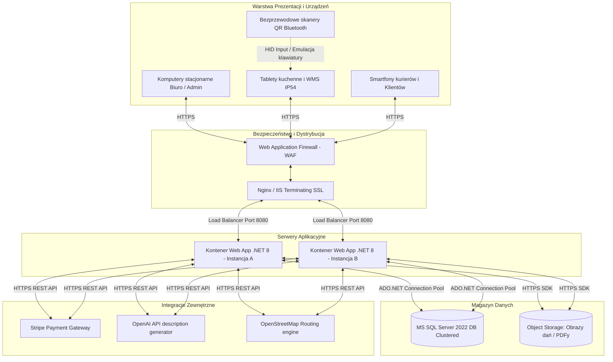
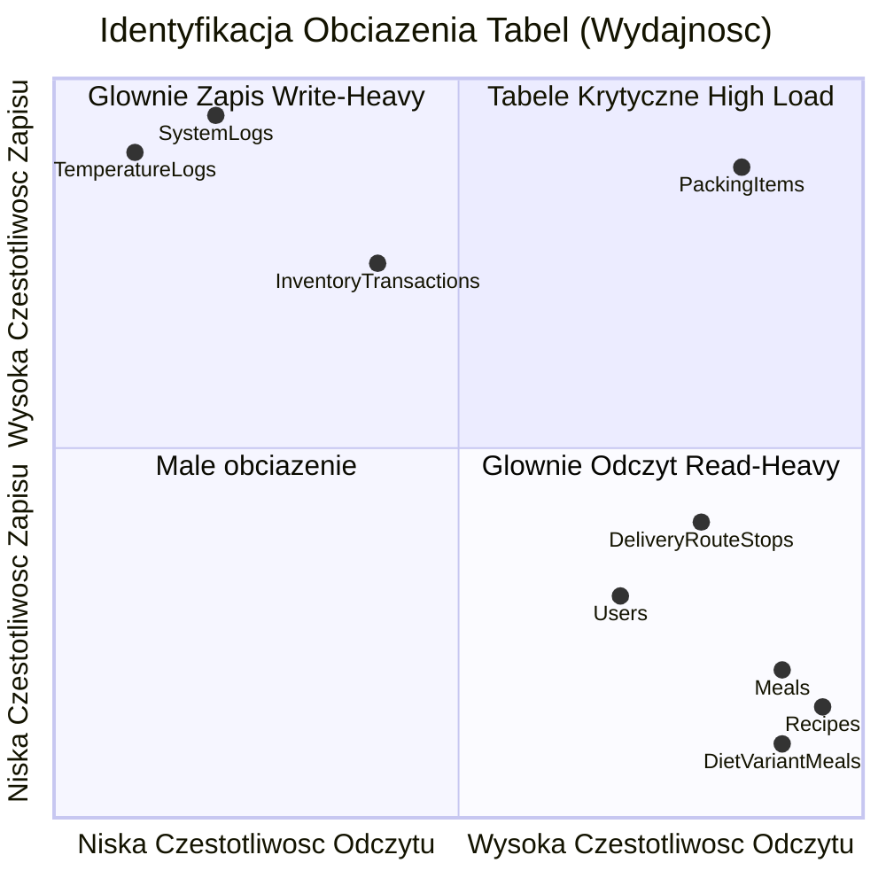
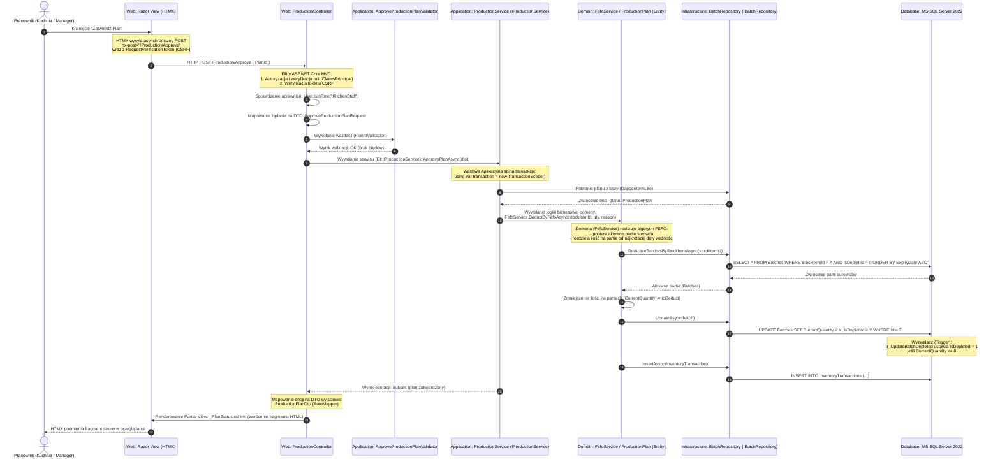

# Analiza Wymagań Niefunkcjonalnych, Architektura Sprzętowa i Opis Schematu Bazy Danych
**Projekt:** System Zarządzania Platformą Cateringową „Kuchnia u Cygana”  
**Wersja:** 2.0 (Rozszerzona Dokumentacja Techniczno-Analityczna)  
**Status:** Gotowy do prezentacji  
**Autorzy:** Zespół Deweloperski (Dawid Janczyło, Gabriel Ostaszewski, Maciej Cyuńczyk, Tomasz Golonko, Paweł Trochimczyk)  

---

## Spis Treści
1. [Wstęp i Podział Merytoryczny Zespołu](#1-wstęp-i-podział-merytoryczny-zespołu)
2. [Szczegółowe Wymagania Klienta i Zakres Merytoryczny Modułów](#2-szczegółowe-wymagania-klienta-i-zakres-merytoryczny-modułów)
3. [Wymagania Funkcjonalne i Niefunkcjonalne (NFR)](#3-wymagania-funkcjonalne-i-niefunkcjonalne-nfr)
4. [Infrastruktura i Architektura Sprzętowa](#4-infrastruktura-i-architektura-sprzętowa)
5. [Elementy Słownikowe (Lookup Tables)](#5-elementy-słownikowe-lookup-tables)
6. [Bezpieczeństwo, Ochrona Danych i Audytowalność](#6-bezpieczeństwo-ochrona-danych-i-audytowalność)
7. [Rozmiar Bazy Danych, Obciążenie i Przyrost Danych](#7-rozmiar-bazy-danych-obciążenie-i-przyrost-danych)
8. [Relacyjny Model Logiczny i Diagram Fizyczny (ERD)](#8-relacyjny-model-logiczny-i-diagram-fizyczny-erd)
9. [Specyfikacja Fizyczna Tabel Bazodanowych (M1–M5)](#9-specyfikacja-fizyczna-tabel-bazodanowych-m1m5)
10. [Procedury Składowane, Widoki, Wyzwalacze (Database Objects)](#10-procedury-składowane-widoki-wyzwalacze-database-objects)
11. [Przepływ Danych przy Zapytaniu (Request Data Flow Walkthrough)](#11-przepływ-danych-przy-zapytaniu-request-data-flow-walkthrough)
12. [Potencjalne Trudności i Ryzyka Projektowe](#12-potencjalne-trudności-i-ryzyka-projektowe)

---

## 1. Wstęp i Podział Merytoryczny Zespołu
Projekt **„Kuchnia u Cygana”** to zintegrowana platforma e-commerce sprzężona z systemem klasy ERP/WMS dedykowana dla cateringu dietetycznego. System został podzielony na **5 modułów domenowych** rozwijanych równolegle w oparciu o architekturę czystą (Clean Architecture) w technologii .NET 8.

```
┌─────────────────────────────────────────────────────────────────────────┐
│                          KUCHNIA U CYGANA (ERP)                         │
└────────────────────────────────────┬────────────────────────────────────┘
                                     │
     ┌──────────────────┬────────────┼────────────┬──────────────────┐
┌────▼─────┐       ┌────▼─────┐ ┌────▼─────┐ ┌────▼─────┐       ┌────▼─────┐
│ Moduł 1  │       │ Moduł 2  │ │ Moduł 3  │ │ Moduł 4  │       │ Moduł 5  │
│E-commerce│       │ Katalog  │ │Produkcja │ │Logistyka │       │Admin & HR│
│  Dawid   │       │ Gabriel  │ │  Maciej  │ │  Tomasz  │       │  Paweł   │
└──────────┘       └──────────┘ └──────────┘ └──────────┘       └──────────┘
```

Podział odpowiedzialności w zespole:
1.  **Dawid Janczyło (Moduł 1 — Portal Klienta i E-commerce)**: Rejestracja, profile klientów, proces zakupowy, koszyk, kalendarz zawieszeń dostaw, płatności Stripe.
2.  **Gabriel Ostaszewski (Moduł 2 — Katalog Diet i Receptur)**: Tworzenie oferty, struktura posiłków i makroskładników, receptury, słownik alergenów, OpenAI do automatycznych opisów dań.
3.  **Maciej Cyuńczyk (Moduł 3 — System Produkcyjny i Magazyn)**: Zarządzanie magazynem surowców (FEFO), kontrola temperatur HACCP, kompletacja posiłków (pudełek do toreb), QR kody, plany produkcyjne i karty PDF (QuestPDF).
4.  **Tomasz Golonko (Moduł 4 — Logistyka i Dostawy)**: Zarządzanie flotą i kurierami, wyznaczanie tras (routing OSM/Google), generowanie manifestów przewozowych, ewidencja i obieg toreb termicznych.
5.  **Paweł Trochimczyk (Moduł 5 — Administracja, HR i Obsługa Klienta)**: Grafik pracy personelu, wnioski urlopowe, system reklamacyjny (Helpdesk / Tickety) z załącznikami graficznymi, logi audytowe systemu.

---

## 2. Szczegółowe Wymagania Klienta i Zakres Merytoryczny Modułów

### Moduł 1 (E-commerce) — Dawid
*   **Kreator zamówień**: Klient konfiguruje długość trwania cateringu (wykluczenie weekendów), wybiera dietę oraz kaloryczność.
*   **Kalendarz zawieszeń**: Umożliwia wstrzymanie dostawy (np. na czas urlopu) z wyprzedzeniem min. 24h. Zawieszony dzień przesuwa czas trwania umowy na kolejny wolny dzień roboczy.
*   **Książka adresowa**: Zarządzanie wieloma adresami (np. dom, praca) z możliwością przypisywania ich do konkretnych dni dostaw.
*   **Integracja Stripe**: Przetwarzanie bezpiecznych płatności online bez przechowywania danych kart w bazie danych.

### Moduł 2 (Katalog) — Gabriel
*   **Dietetyka i receptury**: Danie składa się ze składników o określonej gramaturze. System automatycznie przelicza makroskładniki (białko, tłuszcz, węglowodany, błonnik) oraz kaloryczność posiłku na bazie receptury.
*   **Propagacja alergenów**: Alergeny przypisane do surowca magazynowego są automatycznie propagowane na powiązany posiłek i widoczne dla klienta oraz drukowane na etykiecie.
*   **AI Marketing Assistant**: Dietetyk klika "Generuj opis", a silnik OpenAI analizuje składniki i zwraca chwytliwy opis marketingowy dania.

### Moduł 3 (Produkcja & Magazyn) — Maciej
*   **Gospodarka FEFO (First Expired, First Out)**: Automatyczne rozchodowanie surowców według terminu ważności partii. Zapobiega to marnowaniu żywności.
*   **Stanowisko Kompletacji**: Pakowacze za pomocą ekranów dotykowych i skanerów kodów QR kompletują pudełka do toreb zbiorczych. Zeskanowanie kodu QR na pudełku przypisuje je do właściwej torby klienta.
*   **Dziennik HACCP**: Monitorowanie temperatur chłodni. Wprowadzenie temperatury spoza normy (np. powyżej 4°C dla chłodni mięsa) generuje krytyczny alert w systemie.

### Moduł 4 (Logistyka) — Tomasz
*   **Optymalizacja Tras**: Grupowanie adresów dostaw w trasy kurierskie w celu minimalizacji czasu i kosztu paliwa.
*   **Spedycja i Manifesty**: Kurier przed wyjazdem otrzymuje wydrukowany manifest załadunkowy (PDF z QuestPDF) zawierający podsumowanie toreb oraz trasę. Przy załadunku następuje weryfikacja ilościowa.
*   **Torby Termiczne (Thermal Bags)**: Torby termiczne są drogim zasobem zwrotnym. System ewidencjonuje każdą torbę (kod QR/kreskowy) i loguje jej ruch (Wydana kurierowi -> Pozostawiona u klienta -> Odebrana od klienta -> Zwrócona na magazyn).

### Moduł 5 (HR & Administracja) — Paweł
*   **Zarządzanie Personelem**: Ewidencja pracowników z podziałem na działy (Kuchnia, Magazyn, Kompletacja, Logistyka, Biuro).
*   **Wnioski Urlopowe i Grafiki**: Pracownicy wnioskują o urlopy. Po ich zatwierdzeniu przez managera, system blokuje możliwość przypisania pracownika do zmiany w grafiku (`WorkSchedules`).
*   **Obsługa Reklamacji (Helpdesk)**: Klient może zgłosić reklamację (np. uszkodzenie pudełka) i załączyć zdjęcie. System przesyła pliki na lokalny serwer lub do magazynu chmurowego, a w bazie zapisuje ścieżkę do pliku.

---

## 3. Wymagania Funkcjonalne i Niefunkcjonalne (NFR)

### Wymagania Funkcjonalne (Kluczowe)
*   **F1**: Rejestracja i logowanie klientów oraz pracowników (RBAC).
*   **F2**: Zakup diety cateringowej z płatnością Stripe.
*   **F3**: Konfiguracja kalendarza dostaw i adresów.
*   **F4**: Projektowanie dań i automatyczne wyliczanie wartości odżywczych dań.
*   **F5**: Automatyczna agregacja zamówień w plany produkcyjne.
*   **F6**: Obsługa wydań magazynowych według algorytmu FEFO.
*   **F7**: Panel kompletacji z obsługą skanowania QR/kodów kreskowych.
*   **F8**: Wyznaczanie tras kurierskich i generowanie manifestów PDF.
*   **F9**: Ewidencja obiegu toreb termicznych.
*   **F10**: Obsługa ticketów reklamacyjnych ze zdjęciami oraz grafików pracy.

### Wymagania Niefunkcjonalne (NFR)
*   **NF1 (Wydajność)**: Czas generowania zapotrzebowania na surowce dla 1000 zamówień nie może przekroczyć 3 sekund (dzięki optymalnym indeksom i lekkiemu micro-ORM OrmLite).
*   **NF2 (Bezpieczeństwo)**: Hasła haszowane jednokierunkowo algorytmem o wysokiej odporności (np. BCrypt/Argon2). Dane wrażliwe (adresy, dane osobowe) chronione są na poziomie bazy danych (TDE - Transparent Data Encryption lub szyfrowanie kolumnowe).
*   **NF3 (HACCP i Audytowalność)**: Każda edycja rekordów finansowych, magazynowych oraz zmian uprawnień musi zapisać ślad audytowy w tabeli `SystemLogs` zawierający stary i nowy stan rekordu w formacie JSON (`OldValue`, `NewValue`).
*   **NF4 (Responsywność)**: Interfejs webowy musi być dostosowany do urządzeń mobilnych (kierowcy) oraz tabletów dotykowych (kucharze i pakowacze w środowisku o podwyższonej wilgotności).
*   **NF5 (Dostępność)**: System musi być odporny na awarie sieciowe. W przypadku utraty połączenia ze skanerami kodów QR na kompletacji, system musi umożliwiać ręczne odznaczanie pozycji w interfejsie webowym.

---

## 4. Infrastruktura i Architektura Sprzętowa



### Wymagania Infrastrukturalne (Produkcja)
1.  **Dystrybucja Ruchu**: Load balancer rozdzielający ruch pomiędzy dwie instancje kontenerów aplikacji w celu zapewnienia wysokiej dostępności (High Availability).
2.  **Baza Danych**: Klastrowany MS SQL Server 2022 działający w architekturze Active-Passive z replikacją logów transakcyjnych w czasie rzeczywistym.
3.  **Przechowywanie Plików (Object Storage)**: Wykorzystanie usługi chmurowej (np. AWS S3 lub Azure Blob Storage) do składowania plików o zmiennym rozmiarze (np. zdjęcia potraw z Modułu 2, zdjęcia uszkodzeń z Modułu 5, raporty PDF z Modułów 3 i 4). Zabezpiecza to bazę danych przed niekontrolowanym wzrostem rozmiaru pliku bazy (`.mdf`).

---

## 5. Elementy Słownikowe (Lookup Tables)
W celu optymalizacji struktury i uniknięcia redundancji danych, system posiada wydzielone tabele słownikowe:
*   `UnitsOfMeasure` (Jednostki miary): Przechowuje symbole (`kg`, `g`, `l`, `ml`, `szt.`) oraz pełne nazwy jednostek miar wykorzystywanych w przepisach i na magazynie.
*   `Categories` (Kategorie dań): Słownik kategoryzujący posiłki w jadłospisie (np. *Śniadanie*, *Drugie Śniadanie*, *Obiad*, *Podwieczorek*, *Kolacja*).
*   `Allergens` (Alergeny): Lista substancji uczulających według dyrektyw unijnych (np. *gluten*, *skorupiaki*, *orzechy*, *seler*). Każdy alergen posiada unikalny kod oraz ikonę.
*   `DeliveryWindows` (Przedziały dostaw): Godziny, w których kurier może dostarczyć torbę (np. `04:00 - 06:00`, `06:00 - 08:00`).
*   `DiscountCodes` (Kody rabatowe): Słownik kodów promocyjnych wraz z wartościami procentowymi lub kwotowymi i datą ważności.
*   `Departments` (Działy HR): Słownik organizacyjny przedsiębiorstwa (np. *Kuchnia*, *Magazyn*, *Logistyka*, *Administracja*).

---

## 6. Bezpieczeństwo, Ochrona Danych i Audytowalność
W celu ochrony danych wrażliwych i zapewnienia pełnej rozliczalności personelu, wdrożono zaawansowane mechanizmy zabezpieczeń.

### 6.1. Ochrona danych wrażliwych (Szyfrowanie i Maskowanie)
*   **Haszowanie haseł**: Zastosowanie funkcji haszującej opartej na soli (np. BCrypt z kosztem obliczeniowym równym 11 lub Argon2id), co zabezpiecza hasła przed atakami metodą słownikową i siłową w przypadku wycieku bazy.
*   **Always Encrypted (SQL Server)**: Kolumny zawierające dane osobowe oraz adresowe klientów (`FirstName`, `LastName`, `Email`, `PhoneNumber`, `Street`, `HouseNumber`) w tabelach `Users`, `Addresses` i `Employees` są szyfrowane na poziomie bazy danych przy użyciu technologii *Always Encrypted*. Klucze deszyfrujące przechowywane są bezpiecznie w menedżerze certyfikatów serwera aplikacji (np. Azure Key Vault), co sprawia, że administrator bazy danych (DBA) nie ma wglądu do czystych danych tekstowych.
*   **Maskowanie danych wrażliwych w logach**: System automatycznie filtruje wartości zapisywane w tabeli `SystemLogs`. Pola takie jak hasła, tokeny sesji czy klucze Stripe są podmieniane na maskę `********` na poziomie warstwy aplikacyjnej (kod walidatorów i interceptorów).

### 6.2. Mechanizm historii zmian (Audit Trail)
System realizuje trójpoziomowe śledzenie historii operacji:
1.  **Auditable Entities (Miękkie Usuwanie i Historia Rekordu)**:
    Większość encji biznesowych dziedziczy po klasie bazowej `AuditableEntity`. Zawiera ona pola: `CreatedAt`, `CreatedBy`, `UpdatedAt`, `UpdatedBy`, `IsDeleted`, `DeletedAt`, `DeletedBy`. Usunięcie obiektu jest operacją logiczną (ustawienie flagi `IsDeleted = 1`), co zapobiega utracie powiązań historycznych w raportach finansowych.
2.  **Tabela `SystemLogs` (Logi Zdarzeń Systemowych)**:
    Każda akcja modyfikująca dane (Insert, Update, Delete) wyzwala zapis w tabeli `SystemLogs`. Zapisywane są stany obiektów przed i po modyfikacji w formacie JSON (`OldValue` oraz `NewValue`), co umożliwia odtworzenie historii zmian dowolnego obiektu w czasie.
3.  **Tabela `InventoryTransactions` (Śledzenie Ilościowe Magazynu)**:
    Każdy ruch surowca na magazynie (przyjęcie dostawy, zużycie do planu produkcji, korekta inwentaryzacyjna) musi posiadać referencję do partii (`BatchId`) oraz wpisaną ilość i powód. Gwarantuje to pełną rozliczalność stanów magazynowych.

---

## 7. Rozmiar Bazy Danych, Obciążenie i Przyrost Danych

### 7.1. Rozmiar początkowy (Initial Database Size)
*   Rozmiar pustej bazy danych z migracjami: ok. **8 MB**.
*   Rozmiar po załadowaniu danych słownikowych i seedu testowego (DemoData): ok. **15 MB**.

### 7.2. Szacowany przyrost danych (dla średniej wielkości cateringu - 500 klientów aktywnych)
Założenia:
*   500 aktywnych klientów dostaje 5 posiłków dziennie = **2500 pudełek dziennie**.
*   Dostawy realizowane są przez 360 dni w roku.
*   Każde pudełko generuje rekord kompletacji (`PackingItems`).

| Tabela / Typ Danych | Średni rozmiar wiersza | Liczba wierszy (Rocznie) | Przyrost danych (Rocznie) | Opis |
| :--- | :--- | :--- | :--- | :--- |
| `PackingItems` | ~150 B | 900 000 | **135 MB** | Zapis kompletacji pudełek (traceability) |
| `SystemLogs` | ~1000 B | 720 000 | **720 MB** | Logi audytowe zmian w systemie |
| `TemperatureLogs` | ~80 B | 175 200 | **14 MB** | Odczyt z 5 lodówek co 15 minut |
| `InventoryTransactions`| ~100 B | 250 000 | **25 MB** | Zapisy zmian ilościowych w partiach |
| `Orders` & `OrderItems`| ~120 B | 36 000 | **4.3 MB** | Zamówienia i pozycje zamówień |
| Pozostałe tabele | - | - | **15 MB** | Słowniki, diety, konta użytkowników |
| **Suma (Dane + Indeksy)**| - | - | **ok. 1.1 GB / Rok** | Łączny przyrost przestrzeni dyskowej |

> [!IMPORTANT]
> Pliki załączników do zgłoszeń reklamacyjnych (np. zdjęcia JPG/PNG o średnim rozmiarze 2MB) nie są przechowywane w bazie danych SQL. Baza przechowuje jedynie URL (np. `NVARCHAR(1000)`) wskazujący na Object Storage. Pozwala to zaoszczędzić około **720 GB** przestrzeni bazodanowej rocznie przy założeniu 1000 reklamacji ze zdjęciami miesięcznie.

### 7.3. Identyfikacja tabel o największym obciążeniu (Hotspots)



1.  **Tabele Krytyczne (High Write / High Read)**:
    *   `PackingItems`: Podczas kompletacji wieczornej (okienko 4-godzinowe) następuje skanowanie 2500 pudełek. Generuje to intensywny ruch zapisu (Insert statusów) oraz odczytu (wyszukiwanie po kodzie kreskowym). Wymaga optymalnego indeksu na `BoxCode`.
2.  **Tabele typu Write-Heavy (Intensywny zapis, sporadyczny odczyt)**:
    *   `SystemLogs` oraz `TemperatureLogs`: Ciągły napływ logów telemetrii i audytu. Tabele te wymagają partycjonowania oraz cyklicznej archiwizacji w celu ochrony przed degradacją wydajności zapytań.
3.  **Tabele typu Read-Heavy (Intensywny odczyt, rzadki zapis)**:
    *   `Recipes`, `DietVariantMeals` oraz `Meals`: Odczytywane przy każdym wyświetleniu menu przez klienta oraz podczas nocnego generowania planu produkcji i wyliczania food-costu. Wymagają agresywnego indeksowania i keszowania po stronie aplikacji.

---

## 8. Relacyjny Model Logiczny i Diagram Fizyczny (ERD)
Poniższy diagram ERD przedstawia główne encje systemu oraz kluczowe relacje między nimi (pominięto atrybuty niekluczowe dla czytelności). Diagram ten w zupełności wystarcza na etapie analizy wymagań – szczegółowa specyfikacja typów pól, indeksów i kluczy obcych zostanie zamieszczona w odrębnym dokumencie „Projekt bazy danych”.

Uwaga: Diagram wygenerowano na podstawie rzeczywistych encji z projektu (Entities.cs). Relacje oznaczono zgodnie z konwencją: ||--|| – jeden do jednego, ||--o{ – jeden do wielu, }o--|| – wiele do jednego.

```mermaid
erDiagram

    %% ==============================
    %% 1. MODUŁ ADMINISTRACJI I AUDYTU
    %% ==============================
    SystemLog {
        int Id PK
        int UserId FK
        string Action
        string TargetEntity
        string TargetId
        string OldValue
        string NewValue
        datetimeoffset Timestamp
        string IPAddress
    }

    Ticket {
        int Id PK
        string Title
        string Description
        int ClientUserId FK
        int AssignedToUserId FK
        int Status
        int Priority
        datetimeoffset ClosedAt
    }

    TicketAttachment {
        int Id PK
        int TicketId FK
        string FileName
        string FilePath
        int UploadedByUserId
        datetimeoffset UploadedAt
    }

    WorkSchedule {
        int Id PK
        int UserId FK
        date ShiftDate
        int Shift
        string RoleAtShift
    }

    %% ==============================
    %% 2. MODUŁ AUTORYZACJI I KLIENCI
    %% ==============================
    User {
        int Id PK
        string Email
        string PasswordHash
        string FirstName
        string LastName
        string Role
    }

    CustomerProfile {
        int Id PK
        int UserId FK
        string Phone
        string DietaryNotes
        int DefaultAddressId FK
    }

    Address {
        int Id PK
        int UserId FK
        string Label
        string Street
        string BuildingNumber
        string ApartmentNumber
        string City
        string PostalCode
        bool IsDefault
        string DeliveryNotes
        double Latitude
        double Longitude
    }

    %% ==============================
    %% 3. MODUŁ HR (PRACOWNICY)
    %% ==============================
    Department {
        int Id PK
        string Name
        string Description
        int HeadEmployeeId FK
    }

    Employee {
        int Id PK
        int UserId FK
        string FirstName
        string LastName
        string Email
        string PhoneNumber
        date HireDate
        date TerminationDate
        int DepartmentId FK
        string Position
        bool IsActive
    }

    LeaveRequest {
        int Id PK
        int EmployeeId FK
        int LeaveType
        date StartDate
        date EndDate
        int Status
        int ApprovedByEmployeeId FK
        string RejectionReason
    }

    %% ==============================
    %% 4. MODUŁ ZAMÓWIEŃ (E-COMMERCE)
    %% ==============================
    DiscountCode {
        int Id PK
        string Code
        int DiscountType
        decimal DiscountValue
        bool IsActive
        datetimeoffset ValidFrom
        datetimeoffset ValidTo
        int MaxUsageCount
        int UsedCount
        decimal MinimumOrderValue
    }

    DeliveryWindow {
        int Id PK
        string Name
        string StartTime
        string EndTime
        bool IsActive
        int SortOrder
    }

    Order {
        int Id PK
        int CustomerId FK
        string OrderNumber
        int Status
        decimal TotalPrice
        decimal DiscountAmount
        decimal FinalPrice
        int DiscountCodeId FK
        string Notes
        datetime StartDate
        datetime EndDate
    }

    OrderItem {
        int Id PK
        int OrderId FK
        int DietId
        int DietVariantId
        string DietName
        string VariantName
        int CaloriesPerDay
        decimal PricePerDay
        int TotalDays
        decimal TotalPrice
    }

    DeliveryCalendar {
        int Id PK
        int OrderId FK
        int AddressId FK
        int DeliveryWindowId FK
        datetime DeliveryDate
        int Status
        bool IsSkipped
        string SkipReason
        datetimeoffset CutoffTime
    }

    Payment {
        int Id PK
        int OrderId FK
        string StripePaymentIntentId
        string StripeClientSecret
        decimal Amount
        string Currency
        int Status
        int AttemptCount
        datetimeoffset LastAttemptAt
        string ErrorMessage
        datetimeoffset PaidAt
    }

    %% ==============================
    %% 5. MODUŁ KATALOGU (DIETY, POSIŁKI)
    %% ==============================
    Category {
        int Id PK
        string Name
        string Description
        int SortOrder
    }

    Allergen {
        int Id PK
        string Name
        string Code
        string IconUrl
    }

    Ingredient {
        int Id PK
        string Name
        string Unit
        decimal CostPerUnit
        string Notes
        bool IsActive
    }

    IngredientAllergen {
        int Id PK
        int IngredientId FK
        int AllergenId FK
        bool TraceAmount
    }

    Meal {
        int Id PK
        int CategoryId FK
        string Name
        string Description
        string MarketingDescription
        int Status
        int PreparationTimeMinutes
        bool IsActive
    }

    MealAllergen {
        int Id PK
        int MealId FK
        int AllergenId FK
        bool IsTrace
    }

    Diet {
        int Id PK
        string Name
        string Description
        string MarketingDescription
        int Status
        bool IsActive
        string ThumbnailUrl
    }

    DietVariant {
        int Id PK
        int DietId FK
        string Name
        int TargetCalories
        decimal PriceMultiplier
        bool IsDefault
    }

    DietVariantMeal {
        int Id PK
        int DietVariantId FK
        int MealId FK
        decimal ServingSizeMultiplier
        int SortOrder
    }

    Recipe {
        int Id PK
        int MealId FK
        int IngredientId FK
        decimal WeightInGrams
        bool IsOptional
        string Notes
    }

    NutritionFact {
        int Id PK
        int MealId FK
        int IngredientId FK
        decimal CaloriesPer100g
        decimal ProteinPer100g
        decimal CarbohydratesPer100g
        decimal FatPer100g
        decimal FiberPer100g
    }

    MealImage {
        int Id PK
        int MealId FK
        string Url
        string FileName
        bool IsMain
        long FileSizeBytes
    }

    %% ==============================
    %% 6. MODUŁ MAGAZYNU (WMS) I HACCP
    %% ==============================
    UnitOfMeasure {
        int Id PK
        string Symbol
        string Name
        string Description
    }

    StockItem {
        int Id PK
        string Name
        int BaseIngredientId FK
        int DefaultUnitOfMeasureId FK
        decimal MinimumLevel
        int LeadTimeDays
    }

    Batch {
        int Id PK
        int StockItemId FK
        string SupplierBatchNumber
        decimal CurrentQuantity
        datetimeoffset ExpiryDate
        datetimeoffset ReceivedDate
        bool IsDepleted
    }

    InventoryTransaction {
        bigint Id PK
        int BatchId FK
        int TransactionType
        decimal QuantityChanged
        string Reason
        string ReferenceDocument
    }

    InventoryAdjustment {
        int Id PK
        int StockItemId FK
        decimal QuantityBefore
        decimal QuantityAfter
        decimal Difference
        string Reason
        string AdjustedBy
    }

    TemperatureLog {
        bigint Id PK
        string DeviceNameOrLocation
        decimal RecordedTemperatureCelsius
        datetimeoffset RecordedAt
        string Remarks
    }

    %% ==============================
    %% 7. MODUŁ PRODUKCJI
    %% ==============================
    ProductionPlan {
        int Id PK
        date ProductionDate
        int Status
        bool IsSharedWithLogistics
        datetimeoffset SharedAt
        string Notes
    }

    ProductionPlanItem {
        int Id PK
        int ProductionPlanId FK
        int MealId
        string MealName
        int DietVariantId
        int PlannedQuantity
        int CookedQuantity
        int Status
        int ProductionGroup
        time EstimatedReadyTime
        time ActualReadyTime
    }

    ProductionBatch {
        int Id PK
        int ProductionPlanId FK
        int MealId
        string Name
        decimal PlannedQuantity
        decimal ProducedQuantity
    }

    %% ==============================
    %% 8. MODUŁ KOMPLETACJI (PACKING)
    %% ==============================
    PackingSession {
        int Id PK
        date PackingDate
        int OrderId FK
        string ClientName
        string PackedBy
        int Status
        int RouteId FK
        int StopNumber
    }

    PackingItem {
        int Id PK
        int PackingSessionId FK
        int MealId
        string MealName
        int DietVariantId
        int BatchId FK
        string BoxCode
        int Status
        datetimeoffset ExpiryDate
        datetimeoffset FoilPrintedAt
        datetimeoffset PackedAt
        string PackedBy
        bool IsDamaged
        string Remarks
    }

    PackingLabel {
        int Id PK
        int PackingItemId FK
        int PackingSessionId FK
        int LabelType
        string QrCode
        string DishName
        string Allergens
        int Kcal
        string ClientName
        string RouteInfo
        string DeliveryWindow
    }

    PackingManifest {
        int Id PK
        date PackingDate
        string ManifestNumber
        int RouteId
        string RouteName
        int VehicleId
        string VehicleRegistration
        int RouteCount
        int BagCount
        datetimeoffset GeneratedAt
        string GeneratedBy
        bool IsVerified
        datetimeoffset VerifiedAt
        string VerifiedBy
        string PayloadJson
    }

    %% ==============================
    %% 9. MODUŁ LOGISTYKI
    %% ==============================
    Vehicle {
        int Id PK
        string RegistrationNumber
        string Model
        decimal MaxLoadKg
        int Status
    }

    Driver {
        int Id PK
        int UserId FK
        string LicenseNumber
        bool IsActive
    }

    Dispatcher {
        int Id PK
        int UserId FK
        string DeskPhoneNumber
        bool IsOnDuty
    }

    DeliveryRoute {
        int Id PK
        datetimeoffset RouteDate
        string Name
        double TotalDistanceKm
        int Status
        int VehicleId FK
        int DriverId FK
    }

    DeliveryRouteStop {
        int Id PK
        int RouteId FK
        int DeliveryCalendarId FK
        int SequenceNumber
        datetimeoffset PlannedArrivalTime
        datetimeoffset ActualArrivalTime
        int Status
    }

    ThermalBag {
        int Id PK
        string SerialNumber
        int Status
        int LastCustomerId FK
    }

    BagMovementLog {
        int Id PK
        int ThermalBagId FK
        int FromStatus
        int ToStatus
        int DriverId FK
        int RouteStopId FK
    }

    %% ============================================
    %% RELACJE MIĘDZY MODUŁAMI
    %% ============================================
    User ||--o{ CustomerProfile : has
    User ||--o{ Address : has
    User ||--o{ Order : places
    User ||--o{ Employee : "is (1:1)"
    User ||--o{ Driver : "is (1:1)"
    User ||--o{ Dispatcher : "is (1:1)"
    User ||--o{ WorkSchedule : scheduled_for
    User ||--o{ SystemLog : triggers

    CustomerProfile ||--o{ Address : has
    CustomerProfile ||--|| Address : "default (DefaultAddressId)"

    Order ||--|{ OrderItem : contains
    Order ||--|{ DeliveryCalendar : scheduled
    Order ||--|| Payment : billing
    Order ||--o{ PackingSession : "packed into"

    DeliveryCalendar ||--|| Address : "delivers to"
    DeliveryCalendar ||--|| DeliveryWindow : "within"
    DeliveryCalendar ||--o{ DeliveryRouteStop : "assigned to"

    DeliveryRoute ||--|{ DeliveryRouteStop : "has stops"
    DeliveryRoute ||--|| Vehicle : "assigned"
    DeliveryRoute ||--|| Driver : "assigned"

    ThermalBag ||--|{ BagMovementLog : tracks

    Department ||--o{ Employee : employs
    Employee ||--o{ LeaveRequest : requests
    Employee ||--o{ Department : manages

    Ticket ||--|{ TicketAttachment : has
    Ticket ||--|| User : "opened by (ClientUserId)"
    Ticket ||--|| User : "assigned to (AssignedToUserId)"

    %% Relacje katalogu
    Diet ||--|{ DietVariant : has
    DietVariant ||--|{ DietVariantMeal : contains
    Meal ||--o{ DietVariantMeal : "appears in"
    Meal ||--o{ Recipe : "uses ingredients"
    Ingredient ||--o{ Recipe : "used in"
    Meal ||--o{ MealAllergen : has
    Allergen ||--o{ IngredientAllergen : "associated with ingredient"
    Ingredient ||--o{ IngredientAllergen : has
    Allergen ||--o{ MealAllergen : "associated with meal"
    Meal ||--o{ MealImage : displays
    Meal ||--o{ NutritionFact : "nutrition data"
    Ingredient ||--o{ NutritionFact : "nutrition data"

    %% Relacje magazynu
    StockItem ||--|{ Batch : stocks
    Batch ||--|{ InventoryTransaction : transact
    StockItem ||--o{ InventoryAdjustment : adjusts
    UnitOfMeasure ||--o{ StockItem : measures

    %% Relacje produkcji i packingu
    ProductionPlan ||--|{ ProductionPlanItem : contains
    ProductionPlan ||--o{ ProductionBatch : prepares

    PackingSession ||--|{ PackingItem : contains
    PackingItem ||--|| Batch : "HACCP trace"
    PackingItem ||--o{ PackingLabel : prints
    PackingSession ||--o{ PackingLabel : prints
    PackingSession ||--|| Order : "belongs to"
    PackingSession ||--|| DeliveryRoute : "loaded on"

    PackingManifest ||--|| DeliveryRoute : "references"
    PackingManifest ||--|| Vehicle : "references"
```


---

## 9. Logiczny Model Danych i Wymagania dotyczące przechowywania

### 9.1. Główne grupy danych

| Grupa | Zawartość | Wynika z wymagań (ID) |
|-------|-----------|------------------------|
| **Administracja i audyt** | Logi operacji (`SystemLog`), zgłoszenia (`Ticket`), załączniki (`TicketAttachment`), grafiki pracy (`WorkSchedule`) | F10, NF3 |
| **Konta i klienci** | Użytkownicy, profile klientów, adresy | F1, F3 |
| **HR i kadry** | Pracownicy, działy, wnioski urlopowe | (zakres modułu 5) |
| **Zamówienia i płatności** | Zamówienia, pozycje, kalendarz dostaw, kody rabatowe, płatności Stripe | F1–F3 |
| **Katalog diet i posiłków** | Diety, warianty, posiłki, składniki, alergeny, przepisy, wartości odżywcze | F4 |
| **Magazyn i HACCP** | Składniki magazynowe, partie (FEFO), transakcje, korekty, logi temperatur | F5–F6, NF3 |
| **Produkcja** | Plany produkcyjne, pozycje planu, partie półproduktów | F5 |
| **Kompletacja (packing)** | Sesje pakowania (torby), pudełka, etykiety (produktowe i transportowe), manifesty | F7 |
| **Logistyka** | Pojazdy, kierowcy, trasy, przystanki, torby termiczne, logi ruchu toreb | F8–F9 |

### 9.2. Kluczowe założenia dotyczące przechowywania danych

1. **Audytowalność (NF3)** – Większość encji biznesowych dziedziczy po `AuditableEntity`, co oznacza, że każda zmiana jest rejestrowana z datą, autorem i flagą miękkiego usunięcia. Tabela `SystemLog` przechowuje pełne historie zmian (stare i nowe wartości w formacie JSON) dla kluczowych operacji (zmiany ról, statusów zamówień, korekt magazynowych).

2. **Śledzenie partii (FEFO, HACCP)** – Każdy składnik magazynowy (`StockItem`) składa się z wielu partii (`Batch`) z datą ważności. Każde wydanie (do produkcji, odpad, korekta) jest rejestrowane jako `InventoryTransaction` z referencją do partii, co zapewnia pełną identyfikowalność od dostawcy do gotowego pudełka.

3. **Traceability posiłku** – Każde spakowane pudełko (`PackingItem`) zawiera `BatchId`, co pozwala odtworzyć, z jakich partii surowców pochodzi dany posiłek (wymóg HACCP i możliwość wycofania partii).

4. **Denormalizacja dla wydajności** – Wybrane pola (np. `MealName` w `ProductionPlanItem`, `ClientName` w `PackingSession`) są denormalizowane, aby uniknąć kosztownych złączeń w krytycznych ścieżkach (kompletacja, raporty). Integralność tych pól jest utrzymywana na poziomie aplikacji.

5. **Pliki (załączniki, obrazy)** – Nie są przechowywane w bazie danych, lecz w zewnętrznym magazynie obiektów (Azure Blob / AWS S3). W bazie przechowuje się tylko URL, nazwę pliku i rozmiar.

### 9.3. Zasady integralności i wydajności

- Klucze główne: `Id` (int lub long) z autoinkrementacją.
- Klucze obce: tam, gdzie wymagana jest integralność referencyjna (np. `OrderItem.OrderId`), zakładamy klasyczne klucze obce. W przypadku luźnych powiązań między modułami (np. `PackingSession.OrderId`) – klucz obcy jest opcjonalny (bridge), ale zapewniamy spójność na poziomie aplikacji.
- Indeksy są wymagane dla kolumn używanych w:
  - Filtrowaniu (`DeliveryDate`, `PackingDate`, `Status`)
  - Sortowaniu FEFO (`ExpiryDate`)
  - Skanowaniu kodów QR (`BoxCode`, `QrCode`, `SerialNumber`)
  - Wyszukiwaniu (`Email`, `OrderNumber`).

---

## 10. Wymagania dotyczące przetwarzania danych

### 10.1. Reguły biznesowe wymuszane na poziomie bazy danych

| Reguła | Uzasadnienie |
|--------|--------------|
| Partia jest automatycznie oznaczana jako wyczerpana (`IsDepleted = true`), gdy `CurrentQuantity <= 0`. | Zapobiega uwzględnianiu pustych partii w algorytmie FEFO, redukuje złożoność zapytań. |
| Unikalność kodu QR dla etykiet (`PackingLabels.QrCode`). | Gwarantuje, że każda etykieta może być jednoznacznie zeskanowana. |
| W tabeli `WorkSchedules` nie może istnieć więcej niż jeden rekord dla tego samego pracownika, dnia i zmiany (unikalny klucz złożony). | Eliminuje konflikty w grafiku pracy. |
| Nie można usunąć zamówienia, które ma status `Paid` lub `InProduction`. | Chroni integralność danych rozliczeniowych i produkcyjnych. |
| Data ważności partii nie może być wcześniejsza niż data przyjęcia. | Zapewnia logiczną spójność dla algorytmu FEFO. |

### 10.2. Obszary wymagające zoptymalizowanego przetwarzania po stronie bazy danych

- **Agregacja zapotrzebowania produkcyjnego** – złączenie tabel `DeliveryCalendar` → `OrderItems` → `DietVariantMeals` → `Meals` → `Recipes` jest wykonywane przy każdym generowaniu planu produkcji. Dopuszcza się implementację widoku zmaterializowanego lub procedury składowanej dla wydajności.
- **Raport FEFO (lista aktywnych partii)** – zestawienie wszystkich niezużytych partii posortowanych według daty ważności, z danymi składników, powinno być realizowane jako widok lub procedura z parametrami (filtrowanie po kategorii, dniu ważności).
- **Archiwizacja logów systemowych** – logi starsze niż 6 miesięcy muszą być automatycznie przenoszone do tabeli archiwalnej w celu utrzymania wydajności operacyjnej. Proces uruchamiany cyklicznie (np. nocny job).

### 10.3. Zapewnienie integralności danych

- `InventoryTransaction.QuantityChanged` dla typów `ProductionIssue` i `WasteDisposal` musi być wartością ujemną (walidacja na poziomie aplikacji).
- `Batch.ExpiryDate` ≥ `Batch.ReceivedDate` (walidacja przy przyjęciu dostawy).
- `DeliveryCalendar.DeliveryDate` nie może być w przeszłości przy tworzeniu nowego zamówienia.
- `ThermalBag.SerialNumber` musi być unikalny w całym systemie (indeks unikalny).
- Każda zmiana daty ważności partii (edycja ręczna) wymaga zapisu w tabeli `BatchExpiryChangeLog` (powód, data, autor).

---

## 11. Przepływ Danych przy Zapytaniu (Request Data Flow Walkthrough)
Architektura Clean Architecture odcina odpowiedzialności poszczególnych warstw. Aby to zilustrować, poniżej opisano szczegółowy przepływ danych przykładowego zapytania: **Zatwierdzenie planu produkcji i automatyczne wydanie surowców według algorytmu FEFO**.

### 11.1. Schemat Sekwencyjny Przepływu (Mermaid)



### 11.2. Opis Warstwowy i Rola Komponentów

#### 1. Warstwa Prezentacji (Web Layer - Razor + HTMX)
*   **Żądanie**: Użytkownik w przeglądarce wyzwala akcję (kliknięcie przycisku "Zatwierdź Plan"). Interfejs korzysta z atrybutów HTMX (`hx-post="/Production/Approve"`, `hx-target="#plan-status-container"`).
*   **Bezpieczeństwo CSRF**: Zabezpieczenie przed atakami CSRF realizowane jest automatycznie poprzez wstrzykiwanie nagłówka `__RequestVerificationToken` generowanego przez silnik Razor, a HTMX przesyła go w nagłówkach HTTP (obsługa w globalnej konfiguracji `htmx-config.js`).

#### 2. Warstwa Kontrolera (Web Layer - Controllers)
*   **Autoryzacja (RBAC)**: Kontroler `ProductionController` posiada atrybut `[Authorize(Roles = "KitchenStaff,SuperAdmin")]`. Filtr autoryzacji sprawdza tożsamość użytkownika (`ClaimsPrincipal`) zapisaną w ciasteczku sesyjnym (`Cookie Authentication`). Jeśli rola się zgadza, żądanie przechodzi dalej.
*   **Model Binding & DTO**: Kontroler przyjmuje parametry żądania i automatycznie binduje je do obiektu DTO (np. `ApproveProductionPlanRequest`). Kontroler nie zna encji domenowych – komunikuje się z warstwą aplikacyjną wyłącznie za pomocą interfejsów i obiektów DTO.

#### 3. Warstwa Walidacji (Application Layer - FluentValidation)
*   **Walidacja wejściowa**: Zanim zostanie uruchomiony serwis aplikacyjny, wywoływany jest walidator (np. `ApproveProductionPlanRequestValidator`). FluentValidation sprawdza poprawność formalną danych (np. czy `PlanId` jest większy od zera, czy planowana data nie jest wsteczna). W przypadku błędów walidacji rzucany jest wyjątek `ValidationException`, a filtr globalny w aplikacji automatycznie mapuje go na odpowiedni fragment HTML z komunikatami o błędach (zwracany do HTMX).

#### 4. Serwis Aplikacyjny (Application Layer - Services)
*   **Zależności i DI**: Kontroler wstrzykuje interfejs `IProductionService` (właściwa implementacja `ProductionService` żyje w warstwie aplikacyjnej). Serwis ten koordynuje cały proces.
*   **Zarządzanie Transakcjami**: Serwis aplikacyjny odpowiada za otwarcie transakcji bazodanowej (`TransactionScope` lub transakcja OrmLite). Jeśli jakakolwiek operacja w bazie (np. update partii surowca) nie powiedzie się, cała transakcja jest wycofywana (Rollback), chroniąc dane przed niespójnością.
*   **Mapowanie obiektów**: Serwis pobiera encje z bazy danych przez wstrzyknięte interfejsy repozytoriów, wywołuje na nich logikę biznesową, a na koniec mapuje encje na DTO wyjściowe przy użyciu biblioteki AutoMapper.

#### 5. Domena (Domain Layer - Entities & Domain Services)
*   **Brak Zależności Infrastrukturalnych**: Encja `ProductionPlan` oraz serwis domenowy `FefoService` reprezentują czystą logikę biznesową. Nie wiedzą one nic o bazach danych, SQL Serverze ani OrmLite. Zależności są wstrzykiwane w postaci interfejsów (np. `IBatchRepository`).
*   **Algorytm FEFO**: `FefoService` realizuje algorytm ściśle w pamięci operacyjnej: pobiera kolekcję aktywnych partii (posortowanych już po dacie ważności), dokonuje kalkulacji odejmowania ilości i rejestruje wiersze transakcji magazynowych.

#### 6. Infrastruktura i Dostęp do Danych (Infrastructure Layer - DAL)
*   **Implementacja Repozytoriów**: Klasa `BatchRepository` implementuje interfejs `IBatchRepository` należący do domeny. Do komunikacji wykorzystuje fabrykę połączeń `IDbConnectionFactory` oraz micro-ORM OrmLite.
*   **Wykonanie na SQL Server**: OrmLite tłumaczy polecenia na zapytanie SQL, otwiera połączenie i wykonuje transakcję na bazie danych MS SQL Server. Zmiany są zatwierdzane i zwracane w górę łańcucha wywołań.

---

## 12. Potencjalne Trudności i Ryzyka Projektowe
Prace nad integracją modułów niosą za sobą wyzwania architektoniczno-bazodanowe.

### 12.2. Wyzwania techniczne i plany ich rozwiązania

1.  **Deadlocki i kolizje transakcyjne na bazie SQL Server podczas testów integracyjnych**:
    *   *Opis*: Równoległe uruchamianie testów integracyjnych w xUnit korzystających z tej samej instancji bazy danych MS SQL Server (np. w kontenerze Docker) może prowadzić do blokad (deadlocks) i wyścigów przy jednoczesnych zapytaniach modyfikujących te same tabele słownikowe i transakcyjne.
    *   *Rozwiązanie*: Zastosowanie izolacji transakcji w testach przy użyciu `TransactionScope` (z automatycznym rollbackiem po każdym teście) lub wydzielenie niezależnych baz danych dla poszczególnych kolekcji testowych (xUnit Collection Fixtures) oraz optymalne sterowanie współbieżnością po stronie bazy danych.
2.  **Wyścig (Race Condition) przy FEFO**:
    *   *Opis*: Dwu pakowaczy jednocześnie skanuje kompletację lub dwóch kucharzy zatwierdza wydanie składnika do produkcji. Może to doprowadzić do pobrania tej samej partii magazynowej ponad stan (wartości ujemne).
    *   *Rozwiązanie*: Wdrożenie transakcji o poziomie izolacji `Repeatable Read` przy pobieraniu partii lub wykorzystanie blokad pesymistycznych (`SELECT ... WITH (UPDLOCK)` w zapytaniach SQL do bazy SQL Server).
3.  **Czasowe zawieszenie diety w trakcie nocy produkcyjnej**:
    *   *Opis*: Klient anuluje lub przesuwa dostawę o godzinie 22:00, podczas gdy kucharze od 20:00 przygotowują jedzenie na rano na podstawie planu z godziny 18:00.
    *   *Rozwiązanie*: Określenie „punktu bez powrotu” (Lock Hour) na godzinę 18:00. Po tej godzinie kalendarz dostaw na dzień następny zostaje zamrożony dla klienta w panelu e-commerce.

### 11.2. Elementy wymagające uszczegółowienia (Status: Do Opracowania)
Niektóre obszary integracji są w trakcie ustaleń. Poniższa tabela przedstawia brakujące informacje i termin ich uzupełnienia:

| Obszar Brakujący | Kto Odpowiada | Kiedy Zostanie Uzupełniony | Dlaczego Teraz Tego Nie Ma |
| :--- | :--- | :--- | :--- |
| **Dokładne stawki podatkowe VAT dla diet** | Dawid (M1) | Faza 5 (Integracja) | Wymaga decyzji biznesowej klienta odnośnie stawek (np. catering z dowozem 8% vs 23% VAT). Obecnie zamodelowane jako jedna stawka. |
| **Integracja Geokodowania OSRM** | Tomasz (M4) | Faza 4 (Logistyka) | Wybór pomiędzy darmowym serwerem OSRM (OpenSource Routing Machine) a płatnym API Google Maps. Trwa analiza kosztów zapytania. |
| **Mechanizm podpisu biometrycznego kuriera** | Tomasz (M4) | Faza 6 (Frontend) | Weryfikacja załadunku w manifestach. Czekamy na decyzję, czy podpis będzie realizowany przez rysowanie na ekranie, czy kod PIN kuriera. |
| **Obsługa załączników wideo w reklamacjach**| Paweł (M5) | Faza 5 (Integracja) | Ustalenie limitów rozmiaru plików (np. max 10MB) w celu ochrony przepustowości sieciowej serwera. |
