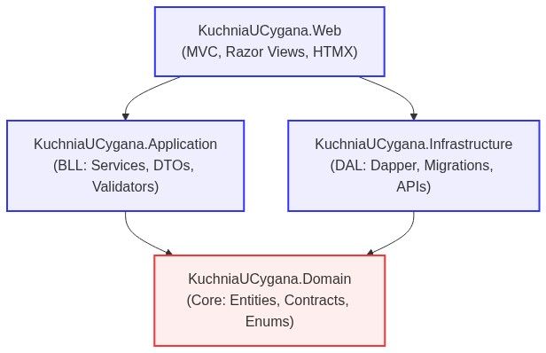
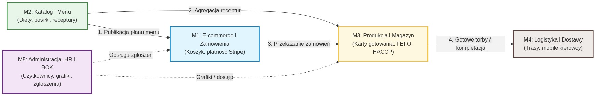

# Dokumentacja projektu Kuchnia u Cygana

**Projekt:** Kuchnia u Cygana – platforma cateringowa B2C + ERP  
**Wersja dokumentacji:** 1.0  
**Data opracowania:** 2026-06-09  
**Język dokumentu:** polski  
**Repozytorium:** https://github.com/lMamacl/Kuchnia-Cygana.git  
**Zakres:** opis projektu, architektury, zrealizowanych funkcjonalności, integracji, danych, testów, ograniczeń i dalszego rozwoju

---

## 1. Cel i charakter dokumentu oraz skład zespołu

Niniejszy dokument stanowi kompletną dokumentację projektową systemu "Kuchnia u Cygana". Opisuje on system informatyczny dla firmy cateringowej, który w spójny sposób łączy portal klienta B2C z zaawansowanym zapleczem operacyjnym klasy ERP. Dokumentacja została przygotowana na podstawie kodu źródłowego, migracji bazy danych, konfiguracji, testów oraz specyfikacji projektowej.

Dokument ma służyć jako pełne opracowanie architektoniczne i biznesowe dla osób oceniających, recenzentów technicznych oraz nowych członków zespołu. Z tego powodu zawiera zarówno opis biznesowy, jak i techniczne uzasadnienie architektury, modułów, przepływów danych, ról użytkowników, mechanizmów audytu, uruchomienia lokalnego oraz jakości kodu.

### Skład zespołu projektowego
Projekt został zrealizowany przez 5-osobowy zespół w podziale na następujące moduły:
1. **Dawid Janczyło** – Moduł E-commerce i Zamówień (M1)
2. **Gabriel Ostaszewski** – Moduł Katalogu Diet i Receptur (M2)
3. **Maciej Cyuńczyk** – Moduł Produkcji i Magazynu (M3)
4. **Tomasz Golonko** – Moduł Logistyki i Dostaw (M4)
5. **Paweł Trochimczyk** – Moduł Administracji, HR i Komunikacji (M5)

---

## 2. Repozytorium i snapshot projektu

Kod projektu jest przechowywany w repozytorium:
https://github.com/lMamacl/Kuchnia-Cygana.git

Dokumentacja opisuje stabilny stan wdrożeniowy systemu i odnosi się do następującej struktury solucji:

| Obszar | Lokalizacja / Projekt |
|---|---|
| Główna solucja | `KuchniaUCygana.sln` |
| Główny projekt web | `src/KuchniaUCygana.Web` |
| Warstwa aplikacyjna | `src/KuchniaUCygana.Application` |
| Warstwa domenowa | `src/KuchniaUCygana.Domain` |
| Warstwa infrastruktury | `src/KuchniaUCygana.Infrastructure` |
| Testy automatyczne | `tests/KuchniaUCygana.Tests` |

Wersja bazowa architektury (baseline) znajduje się na gałęzi `develop`, natomiast pełna implementacja modułów operacyjnych została skonsolidowana na potrzeby wydań wdrożeniowych.

---

## 3. Streszczenie projektu i korzyści biznesowe

"Kuchnia u Cygana" to kompleksowa platforma webowa dla cateringu dietetycznego (tzw. "diet pudełkowych"). System obsługuje cały łańcuch wartości: od publicznego katalogu diet i składania zamówień przez klienta detalicznego (B2C), przez płatności online, automatyczne planowanie produkcji, gospodarkę magazynową według reguły FEFO, rejestrację HACCP, kompletację zamówień, aż po logistykę tras kurierskich, administrację kadrową (HR) i obsługę reklamacji (BOK).

Projekt został zaprojektowany jako modułowy monolit w architekturze warstwowej, wdrożony jako spójna aplikacja ASP.NET MVC z bazą danych MS SQL Server.

### Kluczowe Korzyści Biznesowe
1. **Zwiększenie marż i minimalizacja strat (Zero Waste):** Automatyczne, precyzyjne generowanie planów produkcyjnych i list zapotrzebowania na surowce (Food Cost) ściśle zintegrowanych z aktywnymi zamówieniami eliminuje zjawisko nadprodukcji i marnowania żywności.
2. **Usprawnienie rotacji magazynowej (FEFO):** Zastosowanie wirtualnego magazynu z algorytmem FEFO (First Expired, First Out) gwarantuje zużywanie surowców o najkrótszym terminie przydatności w pierwszej kolejności, minimalizując straty przeterminowanych produktów.
3. **Redukcja kosztów operacyjnych:** Pełna automatyzacja procesów – od agregacji zamówień po wyznaczanie optymalnych tras i generowanie etykiet przewozowych – drastycznie skraca czas manualnej, podatnej na błędy pracy personelu (kucharzy, dyspozytorów, BOK).
4. **Wzrost zadowolenia i lojalności klientów:** Oddanie w ręce klienta elastycznego kalendarza dostaw (samodzielne zawieszanie dostaw na czas wyjazdu i przenoszenie na inne dni) drastycznie odciąża Biuro Obsługi Klienta (BOK) i znacząco poprawia User Experience (UX).
5. **Zgodność z normami i standaryzacja:** Śledzenie partii produkcyjnych (traceability) oraz scentralizowana cyfrowa baza receptur ułatwiają zachowanie wysokiej, powtarzalnej jakości posiłków oraz bezproblemowe spełnianie wymogów sanitarnych (HACCP) za pomocą automatycznych logów temperatur.

---

## 4. Zakres systemu

System jest podzielony na pięć głównych modułów funkcjonalnych:

| Moduł | Nazwa | Główna odpowiedzialność |
|---|---|---|
| M1 | E-commerce i zamówienia | Portal klienta, koszyk, checkout, adresy, płatności Stripe, kalendarz dostaw |
| M2 | Katalog diet i receptur | Diety, warianty kaloryczne, posiłki, składniki, alergeny, receptury, planowanie menu, integracja AI |
| M3 | Produkcja, magazyn i kompletacja | Plan produkcji, FEFO, HACCP, magazyn, karty gotowania, kompletacja, etykiety, manifest, załadunek |
| M4 | Logistyka i dostawy | Zarządzanie flotą i pojazdami, optymalizacja tras, geokodowanie, panel kierowcy |
| M5 | Administracja, HR i BOK | Użytkownicy i RBAC, grafiki pracy, urlopy, ticketing/helpdesk, logi audytowe, powiadomienia |

System obejmuje również warstwy wspólne: uwierzytelnianie cookie, autoryzację rolową, automatyczne migracje bazy danych, seeding danych testowych, konfigurację Docker oraz generowanie raportów i etykiet PDF (QuestPDF).

---

## 5. Stack technologiczny

| Obszar | Technologia |
|---|---|
| Backend web | ASP.NET Core MVC 8 |
| Widoki | Razor Views |
| Interakcje UI | HTMX 2.x, Alpine.js |
| Stylowanie | Bootstrap, Tabler, dedykowane CSS dla panelu staff |
| Baza danych | Microsoft SQL Server 2022 |
| Dostęp do danych | Dapper |
| Migracje | FluentMigrator |
| Walidacja | FluentValidation, jQuery Validation Unobtrusive |
| Uwierzytelnianie | Cookie Authentication, haszowanie haseł za pomocą BCrypt.Net |
| Logowanie aplikacyjne | Serilog (konsola i pliki) |
| Płatności | Stripe.net |
| Geokodowanie | OpenStreetMap Nominatim |
| AI opisy | OpenAI API / OpenAI adapter (obsługa generowania opisów diet) |
| PDF w aplikacji | QuestPDF (licencja Community) |
| PDF dokumentacji | ReportLab |
| Testy automatyczne | xUnit, FluentAssertions, Moq, Testcontainers.MsSql, coverlet |
| Konteneryzacja | Docker, docker compose |
| CI | GitHub Actions |

---

## 6. Architektura logiczna i wzorce projektowe

Projekt stosuje architekturę warstwową (N-Tier / Clean Architecture) z czterema głównymi projektami:

| Warstwa | Projekt | Odpowiedzialność |
|---|---|---|
| Web | `KuchniaUCygana.Web` | Kontrolery MVC, widoki Razor, modele widoków, filtry, bindowanie, statyczne zasoby, pliki konfiguracyjne |
| Application | `KuchniaUCygana.Application` | Serwisy aplikacyjne, DTO, walidatory, orkiestracja przypadków użycia |
| Domain | `KuchniaUCygana.Domain` | Encje domenowe, kontrakty repozytoriów, enumy, serwisy domenowe, logika rdzeniowa |
| Infrastructure | `KuchniaUCygana.Infrastructure` | Repozytoria Dapper, migracje bazy, seeding danych, integracje zewnętrzne (Stripe, OSM), PDF, cache |

Przepływ zależności (Dependency Flow):
```text
Web -> Application -> Domain
Web -> Infrastructure
Infrastructure -> Application (contracts)
Infrastructure -> Domain (contracts)
Domain jest niezależny od Web oraz Infrastructure
```

Wizualizacja zależności architektonicznych:


Warstwa Web wywołuje serwisy aplikacyjne i renderuje widoki. Warstwa Application zawiera przypadki użycia i współpracuje z repozytoriami przez interfejsy. Warstwa Domain zawiera model biznesowy, zasady i kontrakty. Warstwa Infrastructure implementuje szczegóły techniczne, takie jak SQL Server, Dapper, Stripe, OpenStreetMap, lokalne pliki i QuestPDF.

### Kluczowe Wzorce Projektowe i Mechanizmy
*   **Wzorzec Repository (Dapper):** Dostęp do danych odbywa się za pomocą jawnych zapytań SQL zoptymalizowanych pod kątem złączeń (JOIN), eliminując problem N+1 oraz ukryty stan (lazy loading) znany z tradycyjnych systemów ORM.
*   **Wzorzec Dual Response (Razor + HTMX):** Kontrolery potrafią obsłużyć standardowe żądania przeglądarki (zwracając pełną stronę Razor) oraz żądania HTMX (zwracając wyłącznie fragment HTML - Partial View) na podstawie nagłówka `HX-Request`.
*   **Zabezpieczenie CSRF w HTMX:** Globalny skrypt `htmx-config.js` automatycznie przechwytuje tokeny Antiforgery generowane przez silnik ASP.NET Core i dołącza je do każdego nagłówka zapytania asynchronicznego.

---

## 7. Architektura uruchomieniowa i limity zasobów

W środowisku lokalnym system uruchamiany jest w architekturze kontenerowej składającej się z:
1.  **`sqlserver`** – SQL Server 2022 Developer z wolumenem danych `mssql_data`. Port zewnętrzny: `1433`.
2.  **`sqlserver-init`** – Kontener inicjalizujący loginy bazodanowe (`admin`, `pracownik`, `klient`) oraz bazę danych zgodnie ze skryptem inicjalizacyjnym.
3.  **`web`** – Aplikacja webowa ASP.NET Core wystawiona na porcie 8080 z wolumenem uploadów `uploads_data`.

### Limity zasobów (Resource Constraints)
W celu zapobieżenia nadmiernemu zużyciu zasobów maszyny gospodarza (hosta), w pliku konfiguracyjnym `.env` zaimplementowano twarde limity pamięci RAM dla kontenerów Docker:
*   `MSSQL_MEMORY_LIMIT_MB=1536` – Wewnętrzny limit pamięci operacyjnej przydzielony dla silnika bazy danych MS SQL Server.
*   `MSSQL_CONTAINER_MEMORY_LIMIT=2g` – Twardy limit pamięci kontenera bazy danych w Dockerze.
*   `WEB_CONTAINER_MEMORY_LIMIT=768m` – Twardy limit pamięci kontenera aplikacji webowej w Dockerze.

Aplikacja przy starcie wykonuje migracje przez `MigrationRunner.RunMigrations`, a następnie warunkowo uruchamia seeding przez `DatabaseSeedingBootstrapper.TrySeedAsync`.

---

## 8. Główny przepływ biznesowy

Poniższy diagram przedstawia zintegrowany przepływ procesów biznesowych od zdefiniowania katalogu do dostarczenia zamówienia klientowi:



1.  **Konfiguracja Oferty (M2):** Dietetyk przygotowuje katalog diet, warianty kaloryczne, posiłki, składniki oraz plan menu.
2.  **Publikacja Planu (M2):** Zatwierdzenie planu generuje stabilny snapshot menu wykorzystywany przez portal e-commerce oraz produkcję.
3.  **Zamówienie (M1):** Klient przegląda ofertę, konfiguruje zamówienie (dni dostaw, adres), dokonuje płatności za pośrednictwem Stripe.
4.  **Planowanie Produkcji (M3):** System agreguje aktywne zamówienia i generuje plan produkcji na dany dzień na podstawie receptur.
5.  **Obsługa Magazynu (M3):** System oblicza zapotrzebowanie surowcowe, a surowce są wydawane i rozchodowane zgodnie z algorytmem FEFO.
6.  **Realizacja i Pakowanie (M3):** Kucharze realizują karty gotowania. Gotowe posiłki są pakowane do pudełek, oklejane etykietami z kodem kreskowym i grupowane w torby zbiorcze.
7.  **Logistyka i Trasy (M4):** System agreguje adresy dostaw, generuje optymalne trasy algorytmem nearest-neighbor i przypisuje kierowców oraz pojazdy.
8.  **Dostawa (M4):** Kierowca korzysta z panelu mobilnego, rejestrując dostawy u klientów lub raportując problemy.
9.  **Wsparcie i Administracja (M5):** Reklamacje i incydenty zgłaszane przez klientów trafiają do helpdesku (BOK).

---

## 9. Moduł M1 – E-commerce i zamówienia

### 9.1. Cel modułu
Moduł M1 odpowiada za warstwę klienta B2C: przeglądanie katalogu diet, koszyk, proces składania zamówienia (checkout), płatności online, zarządzanie adresami dostaw oraz interaktywny kalendarz dostaw (zarządzanie przerwami i przesunięciami).

### 9.2. Zrealizowane funkcjonalności
*   **Katalog diet:** Prezentacja aktywnych diet wraz z ich wariantami kalorycznymi i cenowymi.
*   **Koszyk zakupowy:** Zarządzanie wybranymi pozycjami przed przejściem do płatności.
*   **Kreator zamówienia (Checkout):** Wybór adresu, domyślnego okna dostawy, liczby dni oraz podsumowanie kosztów z obsługą kodów rabatowych.
*   **Płatności online:** Integracja z bramką Stripe (obsługa statusu płatności przez Stripe Webhook).
*   **Kalendarz dostaw:** Wizualizacja planowanych dostaw, umożliwiająca klientowi zawieszenie dostawy na dany dzień lub przesunięcie jej na inny termin.
*   **Książka adresowa:** Dodawanie, edycja i usuwanie adresów klienta z określeniem adresu domyślnego.

### 9.3. Najważniejsze elementy kodu
*   **Kontrolery:** `CartController.cs`, `CheckoutController.cs`, `OrderController.cs`, `AddressController.cs`
*   **Serwisy:** `CartService.cs`, `CheckoutService.cs`, `OrderService.cs`, `AddressService.cs`, `DiscountService.cs`, `DeliveryCalendarService.cs`
*   **Integracje zewnętrzne:** `StripePaymentService.cs` (komunikacja z API Stripe)

### 9.4. Dane i migracje
*   **Encje bazodanowe:** `Address`, `DiscountCode`, `DeliveryWindow`, `Order`, `OrderItem`, `DeliveryCalendar`, `Payment`, `CustomerProfile`
*   **Migracje (FluentMigrator):**
    *   `100_CreateAddressesTable`
    *   `101_CreateDiscountCodesTable`
    *   `102_CreateDeliveryWindowsTable`
    *   `103_CreateOrdersTable`
    *   `104_CreateOrderItemsTable`
    *   `105_CreateDeliveryCalendarTable`
    *   `106_CreatePaymentsTable`
    *   `107_CreateCustomerProfilesTable`
    *   `108_AddCustomerProfilePublicId`
    *   `509_AddM2ReferencesToOrderItems`
    *   `512_AddDeliveryDateToOrderItems`

---

## 10. Moduł M2 – Katalog diet i receptur

### 10.1. Cel modułu
Moduł M2 to merytoryczne serce systemu. Służy dietetykom i menedżerom do projektowania oferty: definiowania diet, wariantów kalorycznych, posiłków, składników, wartości odżywczych, receptur oraz generowania i publikacji planów menu.

### 10.2. Zrealizowane funkcjonalności
*   **Edytor katalogu diet:** CRUD diet, zarządzanie statusami oraz definiowanie wariantów kalorycznych.
*   **Zarządzanie posiłkami:** Baza dań wraz z przypisanymi makroskładnikami, zdjęciami (obsługa uploadu plików) oraz alergenami.
*   **Słownik składników i alergenów:** Baza surowców wraz z ich właściwościami odżywczymi i powiązanymi alergenami (automatyczna propagacja alergenów na posiłki).
*   **Kreator receptur:** Definiowanie wersji receptur i precyzyjnych gramatur składników (w relacji Many-to-Many).
*   **Planowanie menu:** Układanie jadłospisu na poszczególne dni, mechanizm kopiowania planu na kolejne tygodnie oraz blokada zmian po publikacji.
*   **Integracja z OpenAI:** Moduł zawiera adapter API OpenAI dedykowany do automatycznego opisów diet. W środowisku deweloperskim i testowym adapter ten może działać w trybie uproszczonym (stub).

### 10.3. Najważniejsze elementy kodu
*   **Kontrolery:** `MenuController.cs`, `DietEditorController.cs`, `DietMenuPlanController.cs`, `MealsController.cs`, `IngredientController.cs`, `AllergensController.cs`, `RecipeComponentsController.cs`
*   **Serwisy aplikacyjne:** `DietManagementService.cs`, `MealManagementService.cs`, `IngredientManagementService.cs`, `RecipeComponentManagementService.cs`, `DietMenuPlanManagementService.cs`, `MealVariantResultCalculator.cs`

### 10.4. Dane i migracje
*   **Encje bazodanowe:** `Diet`, `DietVariant`, `DietVariantMeal`, `DietMenuPlan`, `DietMenuPlanItem`, `Meal`, `MealVariant`, `Ingredient`, `Allergen`, `NutritionFact`, `RecipeComponent`, wersje i instrukcje komponentów receptur, wymagania opakowaniowe (`MealVariantPackagingRequirements`).
*   **Migracje (FluentMigrator):**
    *   `301_CreateMenuTables`
    *   `302_CreateRelationshipTables`
    *   `303_CreateNutritionAndImages`
    *   `304_CreateDietMenuPlans`
    *   `305_CreateVersionedRecipeComponents`
    *   `306_AddNutritionToRecipeComponentVersions`
    *   `508_AddM2CatalogArchitecture`
    *   `511_AddMealVariantPackagingRequirements`
    *   `517_AddMenuPlanningQueryIndexes`
    *   `518_AddM2PublishedPlanSnapshots`

---

## 11. Moduł M3 – Produkcja, magazyn i kompletacja

### 11.1. Cel modułu
Moduł M3 to rozbudowane zaplecze operacyjne (ERP). Przetwarza aktywne zamówienia oraz snapshoty menu na plany produkcyjne, zarządza surowcami w magazynie zgodnie z datami ważności (FEFO), kontroluje temperatury urządzeń (HACCP), wspiera kucharzy w realizacji dań, a pracowników kompletacji w pakowaniu i załadunku.

### 11.2. Zrealizowane funkcjonalności produkcyjne i HACCP
*   **Agregacja planu produkcji:** Automatyczne generowanie zbiorczego planu produkcji dań oraz zapotrzebowania na surowce (Food Cost) na dany dzień.
*   **Karty gotowania:** Rozpoczynanie procesów gotowania dań, odznaczanie kroków receptury i potwierdzanie zakończenia produkcji.
*   **Korekty produkcyjne:** Wnioskowanie o awaryjne zmiany w planie i ich akceptacja przez kierownika kuchni.
*   **Rejestr HACCP:** Definiowanie punktów pomiarowych, ręczny i automatyczny log temperatur, rejestracja przekroczeń (alerty) oraz raporty zbiorcze.
*   **Druk etykiet foliowych:** Generowanie etykiet z kodami kreskowymi i informacjami o alergenach do naklejenia na pudełka.

### 11.3. Zrealizowane funkcjonalności magazynowe i kompletacji
*   **Ewidencja partii (FEFO):** Przyjęcia towarów z określeniem numeru partii i daty przydatności. Automatyczne rozchodowanie składników z magazynu na podstawie wydań produkcyjnych w oparciu o regułę FEFO (najkrótsza data przydatności na pierwszym miejscu).
*   **Inwentaryzacja:** Rejestracja strat i odpadów produkcyjnych oraz ręczne korekty stanów magazynowych.
*   **Sesje pakowania:** Proces pakowania dań do pudełek i grupowania ich w fizyczne torby klientów (skanowanie kodów kreskowych, obsługa incydentów i uszkodzeń, rework).
*   **Etykiety transportowe i manifest:** Generowanie etykiet logistycznych na torby oraz zbiorczego manifestu załadunkowego zatwierdzanego przez kierowników zmian.
*   **Załadunek kurierski:** Skanowanie i przypisywanie toreb do odpowiednich tras i pojazdów kurierów.

### 11.4. Najważniejsze elementy kodu
*   **Kontrolery:** `ProductionController.cs`, `WarehouseController.cs`, `PackingController.cs`, `LoadingController.cs`, `ManifestController.cs`
*   **Serwisy aplikacyjne:** `ProductionService.cs`, `WarehouseService.cs`, `WarehouseDemandService.cs`, `TemperatureService.cs`, `PackingService.cs`, `LoadingService.cs`
*   **Serwisy domenowe:** `FefoService.cs` (logika wydań FEFO), `ProductionPlanGenerator.cs`, `SmartInventoryAnalyzer.cs`, `FoodCostCalculator.cs`

### 11.5. Dane i migracje
*   **Encje bazodanowe:**
    *   *Magazyn:* `StockItem`, `Batch`, `InventoryTransaction`, `TemperatureLog`, `HaccpLocation`, `HaccpTemperatureAlert`, `BatchExpiryChangeLog`
    *   *Produkcja:* `ProductionPlan`, `ProductionPlanItem`, `ProductionBatch`, `ProductionAdjustmentApproval`, `BoxLabel`
    *   *Kompletacja:* `PackingSession`, `PackingItem`, `PackingBag`, `PackingLabel`, `PackingManifest`, `PackingManifestIssue`, `PackingIncident`, `PackingStatusLog`
*   **Migracje (FluentMigrator):**
    *   `002_CreateWarehouseTables`
    *   `004_CreateProductionTables`
    *   `005_CreatePackingTables`
    *   `006_CreateInventoryAdjustments`
    *   `008_CreatePackingManifests`
    *   `011_CreateBatchExpiryChangeLogs`
    *   `012_CreatePackingStatusLogs`
    *   `018_AddWarehouseCategoriesHaccpLocationsAndNotifications`
    *   `019_AddFefoTrackingToProductionPlanItems`
    *   `020_AddPhysicalPackingBagsAndBoxLabels`
    *   `023_CreatePackingIncidents`
    *   `027_ExtendPackingManifestApprovalWorkflow`
    *   `028_HardenPackingQueryIndexes`
    *   `029_HardenWarehouseQueryIndexes`
    *   `030_AddM2SnapshotReferencesToProductionPlanItems`
    *   `031_OptimizeWarehouseQueryIndexes`
    *   `032_AddInventoryTransactionHistoryIndexes`
    *   `516_CreateProductionAdjustmentApprovals`

---

## 12. Moduł M4 – Logistyka i dostawy

### 12.1. Cel modułu
Moduł M4 odpowiada za optymalne dostarczenie gotowych toreb cateringowych do klientów. Obejmuje zarządzanie pojazdami, kurierami, geokodowanie adresów dostaw, planowanie tras oraz panel mobilny dla kierowcy.

### 12.2. Zrealizowane funkcjonalności
*   **Zarządzanie flotą:** CRUD pojazdów (ładowność, status techniczny) oraz kierowców (uprawnienia, status aktywności).
*   **Planowanie tras (Routing):** Pobieranie adresów z aktywnych zamówień na dany dzień, geokodowanie adresów za pomocą integracji z OpenStreetMap (worker tła `DailyGeocodingWorker`), oraz grupowanie ich w optymalne trasy.
*   **Optymalizacja tras:** Zaimplementowany algorytm *nearest-neighbor* (najbliższego sąsiada) automatycznie szeregujący punkty dostaw w trasie w celu skrócenia czasu przejazdu.
*   **Panel mobilny kierowcy (`DriverMobile`):** Responsywny panel dla kuriera (rola `Driver` / `Moderator/Kierowca`) umożliwiający obsługę trasy krok po kroku: nawigację, potwierdzanie dostawy lub zgłaszanie problemu (np. brak kodu do domofonu).

### 12.3. Najważniejsze elementy kodu
*   **Kontrolery:** `LogisticsController.cs`, `DriverMobileController.cs`
*   **Serwisy:** `RoutingService.cs`, `DriverService.cs`, `DriverMobileService.cs`, `VehicleService.cs`, `NearestNeighborRouteOptimizer.cs`
*   **Integracje zewnętrzne:** `OpenStreetMapService.cs` (geokodowanie), `DailyGeocodingWorker.cs` (procesy w tle)

### 12.4. Dane i migracje
*   **Encje bazodanowe:** `Vehicle`, `Driver`, `DriverVehicleAssignment`, `DeliveryRoute`, `DeliveryRouteStop`, `DeliveryIssue`, `ThermalBag`, `BagMovementLog`
*   **Migracje (FluentMigrator):**
    *   `400_CreateLogisticsTables`
    *   `401_AddLogisticsQueryIndexes`
    *   `402_CreateDriverVehicleAssignments`
    *   `403_AddLogisticsIntegrityIndexes`
    *   `404_CreateDeliveryIssues`

---

## 13. Moduł M5 – Administracja, HR i BOK

### 13.1. Cel modułu
Moduł M5 to warstwa zarządcza, integrująca działanie personelu oraz wsparcie klienta. Odpowiada za uprawnienia i bezpieczeństwo (RBAC), kadry (HR, urlopy, grafiki), obsługę reklamacji (BOK) oraz monitoring zdarzeń systemowych (audyt).

### 13.2. Zrealizowane funkcjonalności
*   **Zarządzanie użytkownikami (RBAC):** CRUD użytkowników, przypisywanie ról modułowych (np. `Kitchen`, `WarehouseManager`, `Logistics`). Kontrola dostępu do kontrolerów i widoków na podstawie uprawnień.
*   **Zasoby Ludzkie (HR):** Ewidencja pracowników w podziale na działy operacyjne, planowanie grafików pracy oraz workflow wniosków urlopowych (składanie, akceptacja, odrzucenie).
*   **Biuro Obsługi Klienta (BOK / Helpdesk):** System ticketów reklamacyjnych powiązanych z kontekstem zamówienia i dostawy, z możliwością przesyłania załączników (np. zdjęć uszkodzonej paczki).
*   **Audyt i logi systemowe:** Monitorowanie i zapis krytycznych zdarzeń biznesowych w tabeli `SystemLogs` z funkcją wyszukiwania, filtrowania oraz automatycznej archiwizacji starych logów (`usp_ArchiveSystemLogs`).
*   **Guard grafiku pracy:** Filtr `StaffShiftGuardFilter` uniemożliwiający pracownikom zalogowanie się do panelu operacyjnego poza zaplanowanymi godzinami ich zmian w grafiku.

### 13.3. Najważniejsze elementy kodu
*   **Kontrolery:** `AdminController.cs`, `HumanResourcesController.cs`, `CustomerSupportController.cs`, `StaffController.cs`
*   **Serwisy:** `UserService.cs`, `HumanResourcesService.cs`, `CustomerSupportService.cs`, `AuditLogService.cs`, `NotificationService.cs`, `StaffShiftAccessService.cs`

### 13.4. Dane i migracje
*   **Encje bazodanowe:** `User`, `Department`, `Employee`, `LeaveRequest`, `WorkSchedule`, `Ticket`, `TicketAttachment`, `SystemLog`, `Notification`, `UserNotification`
*   **Migracje (FluentMigrator):**
    *   `001_CreateUsersTable`
    *   `500_CreateTicketsTable`
    *   `501_CreateTicketAttachmentsTable`
    *   `502_CreateWorkSchedulesTable`
    *   `503_CreateDepartmentsTable`
    *   `504_CreateEmployeesTable`
    *   `505_CreateLeaveRequestsTable`
    *   `506_CreateSystemLogsTable`
    *   `507_AddSbdSqlObjectsAndIndexes`
    *   `510_AddBaseColumnsToModule5Tables`
    *   `513_HardenSystemLogQueryIndexes`
    *   `514_HardenWorkScheduleShiftAccessIndex`
    *   `515_AddTicketOrderDeliveryContext`

---

## 14. Uwierzytelnianie, role i autoryzacja

System rozróżnia role klienta i personelu. Role pracownicze są wykorzystywane w atrybutach `[Authorize(Roles = "...")]`, katalogu nawigacji staff oraz przekierowaniu po logowaniu.

Główne role pracownicze zdefiniowane w aplikacji (`AppRoles`):
*   `Admin` – pełny dostęp administracyjny do systemu i logów.
*   `Kitchen` / `KitchenManager` – pracownicy i kierownik produkcji (karty gotowania, zatwierdzanie planów).
*   `Warehouse` / `WarehouseManager` – obsługa stanów magazynowych, przyjęcia dostaw, raporty FEFO.
*   `Packing` / `PackingManager` – obsługa kompletacji, reprinty etykiet, manifesty załadunkowe.
*   `Dietitian` – edycja katalogu diet, receptur oraz planowanie menu.
*   `Logistics` / `LogisticsManager` – planowanie i optymalizacja tras, pojazdy.
*   `Driver` – kurierzy obsługujący panel mobilny.
*   `HR` / `HRManager` – obsługa kadr, urlopów i grafików.
*   `BOK` / `BOKManager` – obsługa klienta, reklamacje i tickety.

Logowanie korzysta z **Cookie Authentication**. Hasła są haszowane za pomocą algorytmu **BCrypt**. Sesja i pliki cookie są konfigurowane w `Program.cs` z włączonymi flagami bezpieczeństwa (`HttpOnly`, `SameSite=Lax`, szyfrowanie SSL, czas wygaśnięcia oraz sliding expiration).

---

## 15. Konta testowe i dane demo

Seeder automatycznie tworzy poniższe konta aplikacyjne w profilu deweloperskim i testowym w celu weryfikacji uprawnień i przepływów:

| Rola | Email | Hasło | Zastosowanie |
|---|---|---|---|
| **Admin** | `admin@kuchnia.local` | `Admin123!` | Administracja, pełny dostęp |
| **Kitchen** | `kitchen@kuchnia.local` | `Kitchen123!` | M3 produkcja, kucharz |
| **KitchenManager** | `kitchenm@kuchnia.local` | `Kitchen123!` | M3 kierownik produkcji, akceptacje |
| **Warehouse** | `warehouse@kuchnia.local` | `Warehouse123!` | M3 magazynier, przyjęcia |
| **WarehouseManager** | `warehousem@kuchnia.local` | `Warehouse123!` | M3 kierownik magazynu, korekty |
| **Packing** | `packing@kuchnia.local` | `Packing123!` | M3 pakowacz, etykiety |
| **PackingManager** | `packingm@kuchnia.local` | `Packing123!` | M3 kierownik kompletacji |
| **Dietitian** | `dietitian@kuchnia.local` | `Diet123!` | M2 dietetyk, katalog diet, receptury |
| **Logistics** | `logistics@kuchnia.local` | `Logistics123!` | M4 dyspozytor logistyki |
| **LogisticsManager** | `logisticsm@kuchnia.local` | `Logistics123!` | M4 kierownik logistyki |
| **Driver** | `driver@kuchnia.local` | `Driver123!` | M4 kierowca (mobilna trasa) |
| **HR / HRManager** | `hr@kuchnia.local` / `hrm@kuchnia.local` | `HR123!` | M5 kadry, urlopy, grafiki |
| **BOK / BOKManager** | `bok@kuchnia.local` / `bokm@kuchnia.local` | `BOK123!` | M5 helpdesk, obsługa zgłoszeń |

---

## 16. Baza danych, zakresy migracji i dostęp do danych

System korzysta z relacyjnej bazy danych **MS SQL Server 2022**. Narzędziem dostępu do danych w warstwie repozytoriów jest **Dapper** (zapewniający maksymalną wydajność i jawne zapytania SQL z optymalnymi złączeniami JOIN). 

Jedynym źródłem zmian w schemacie bazy danych (DDL) są migracje zaimplementowane przy użyciu **FluentMigrator**.

### Zakresy Numeracji Migracji (Konwencja Modułowa)
Dla zachowania porządku w zespole programistycznym, FluentMigrator stosuje spójne zakresy numeracji plików migracji:

| Zakres numerów | Powiązany Moduł / Cel |
|---|---|
| **`001–099`** | Fundament bazy danych, tabele użytkowników, M3 (magazyn, produkcja, pakowanie) |
| **`100–199`** | Moduł M1 – E-commerce, adresy, zamówienia, płatności Stripe, profile klientów |
| **`200–299`** | Moduł M2 – Katalog diet, receptury, wartości odżywcze, komponenty menu |
| **`400–499`** | Moduł M4 – Logistyka, pojazdy, kierowcy, optymalizacja tras i incydenty dostaw |
| **`500–599`** | Moduł M5 – Zgłoszenia (helpdesk), kadry, urlopy, logi audytowe oraz indeksy wydajnościowe |

### Podział Connection Stringów i Zasada Najmniejszych Uprawnień
Zgodnie z zasadami bezpieczeństwa SBD (Security by Design), połączenie z bazą danych zostało rozdzielone na dwa poziomy dostępu:
1.  **`DefaultConnection` (Użytkownik `pracownik`):** Używany przez aplikację w czasie działania (runtime). Posiada wyłącznie uprawnienia DML (`db_datareader`, `db_datawriter`). Nie ma uprawnień do zmiany schematu tabel (brak praw DDL), co zabezpiecza bazę przed atakami typu SQL Injection nakierowanymi na zmianę struktury.
2.  **`MigrationConnection` (Użytkownik `admin`):** Używany wyłącznie przez FluentMigrator podczas uruchamiania aplikacji w celu wdrożenia migracji struktury. Posiada rolę `db_owner` (prawa DDL).

---

## 17. Audyt, traceability i HACCP

Zapewnienie pełnej identyfikowalności (traceability) procesów operacyjnych i sanitarnych w cateringu opiera się na kilku dedykowanych rejestrach zmian:

| Mechanizm / Tabela | Cel śledzenia |
|---|---|
| `SystemLogs` | Dziennik działań systemowych i administracyjnych (logi audytowe) |
| `InventoryTransactions` | Historia wszystkich ruchów magazynowych (przyjęcia, wydania, straty) |
| `BatchExpiryChangeLogs` | Rejestr zmian dat ważności partii surowców z wymogiem podania przyczyny |
| `TemperatureLogs` | Dziennik odczytów temperatur HACCP w chłodniach i magazynach |
| `HaccpTemperatureAlerts` | Automatyczne alerty rejestrowane przy przekroczeniu norm sanitarnych |
| `PackingStatusLogs` | Cykl życia pakowania dań (rozpoczęcie, weryfikacja, błędy) |
| `PackingIncidents` | Zdarzenia uszkodzeń posiłków, braków i decyzji o reworku (ponownym gotowaniu) |
| `DeliveryIssues` | Problemy zgłoszone przez kurierów na trasie |

---

## 18. Docker i szybki start (uruchomienie lokalne)

Aby uruchomić aplikację w środowisku lokalnym, należy postępować zgodnie z poniższą procedurą:

### 1. Klonowanie i przygotowanie plików
Sklonuj repozytorium i skopiuj przykładowy plik zmiennych środowiskowych w głównym katalogu projektu:
```bash
git clone https://github.com/lMamacl/Kuchnia-Cygana.git
cd Kuchnia-Cygana
cp .env.example .env
```

### 2. Konfiguracja pliku `.env`
W pliku `.env` skonfiguruj hasła bazodanowe oraz przypisz limity zasobów dla kontenerów:
```text
MSSQL_SA_PASSWORD=YourStrong!Passw0rd123
MSSQL_DB_NAME=KuchniaUCygana
MSSQL_PORT=1433
MSSQL_MEMORY_LIMIT_MB=1536
MSSQL_CONTAINER_MEMORY_LIMIT=2g
WEB_CONTAINER_MEMORY_LIMIT=768m
```

### 3. Przywrócenie zależności NuGet
Przed budowaniem projektu należy przywrócić wszystkie pakiety zależności z poziomu głównego katalogu solucji:
```bash
dotnet restore KuchniaUCygana.sln
```

### 4. Uruchomienie kontenerów w Dockerze
Uruchom cały stos aplikacji i bazy danych za pomocą Docker Compose:
```bash
docker compose up --build
```
Aplikacja zostanie automatycznie skompilowana, baza danych zainicjalizowana loginami `admin`/`pracownik`/`klient`, zostaną wdrożone migracje oraz seed danych testowych. Portal będzie dostępny pod adresem: **`http://localhost:8080`**.

---

## 19. Jakość kodu i testy

Solucja posiada wdrożony zestaw analizatorów jakości kodu (StyleCop, Roslynator, SonarAnalyzer) wymuszany podczas kompilacji na poziomie pliku `Directory.Build.props`.

### Testy automatyczne
W katalogu `tests/` zaimplementowano testy automatyczne w podziale na:
*   **Testy jednostkowe (Unit Tests):** Weryfikacja serwisów aplikacyjnych, logiki kalkulatorów (np. `MealVariantResultCalculator`), profili AutoMappera i reguł FluentValidation.
*   **Testy integracyjne (Integration Tests):** Weryfikacja repozytoriów Dapper na rzeczywistej bazie danych SQL Server uruchamianej w kontenerach testowych (**Testcontainers.MsSql**).
*   **Testy logiki domenowej (Domain Tests):** Weryfikacja reguł biznesowych (np. algorytmu wydań FEFO).

Uruchomienie wszystkich testów z poziomu konsoli:
```bash
dotnet test KuchniaUCygana.sln
```

---

## 20. Kierunki dalszego rozwoju

W ramach przyszłych prac nad systemem rekomendowane są następujące kroki:
1.  **Dopracowanie integracji OpenAI:** Pełne przejście z trybu deweloperskiego (stub) na produkcyjne, asynchroniczne generowanie opisów dań z obsługą kolejkowania i limitów zapytań (rate limits).
2.  **Optymalizacje logistyczne:** Rozbudowa algorytmu optymalizacji tras o dodatkowe kryteria (okna czasowe dostaw, ładowność pojazdów) oraz integracja z zewnętrznym silnikiem mapowym (OSRM).
3.  **Wdrożenie produkcyjne (CI/CD):** Konfiguracja automatycznego wdrażania skonteneryzowanej aplikacji na wybraną chmurę publiczną (np. Azure App Services / Azure SQL) lub serwery dedykowane (np. SmarterASP) za pomocą GitHub Actions.
4.  **System kopii zapasowych:** Opracowanie i wdrożenie automatycznej strategii backupów bazy danych MS SQL Server oraz retencji starych logów audytowych w bezpiecznym magazynie zewnętrznym.
