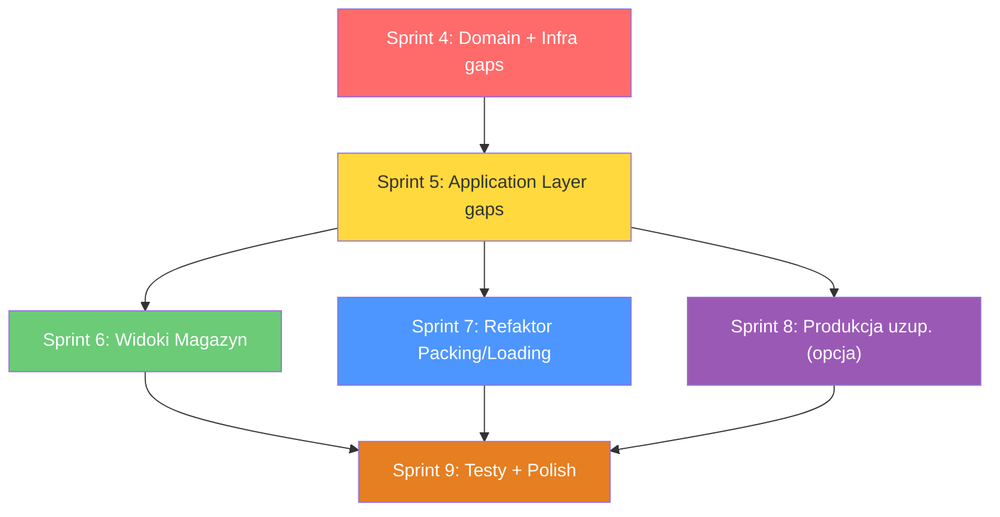

# PLAN SPRINTÓW — Moduł 3 (Produkcja + Magazyn + Kompletacja)
**KuchniaUCygana · Wersja 2.1 — rewizja granic modułów z 28.05.2026**
*Bazuje na: WIZJA_PRODUKCJA_v2.md (v3.0), WIZJA_MAGAZYN_v1.md (v1.1), WIZJA_KOMPLETACJA_v1.md (v1.1)*

> **ZASADA KLUCZOWA (v2.1):** M3 = Produkcja + Magazyn + Kompletacja toreb. Załadunek aut (Loading) to **granica M3** — M3 zarządza manifestem i etykietami, ale widok kierowcy i Logistyka należą do **M4**. Encje Menu/Diety należą do **M2**. Użytkownicy/HR do **M5**.

---

## 0. AUDYT STANU OBECNEGO — CO JUŻ JEST

> Poniższy audyt przeprowadzono na żywym kodzie. Każda pozycja oznaczona ✅ = istnieje i działa, ⚠️ = istnieje ale niekompletne, ❌ = brak.

### 0.1 Domain Layer

| Komponent | Status | Opis |
|-----------|--------|------|
| **Encje Produkcji** | ⚠️ | `ProductionPlan`, `ProductionPlanItem`, `ProductionBatch` — istnieją. **Brak**: `MealComponent`, `Recipe` (z wizji — inne niż istniejące `Menu/Recipe`), `RecipeIngredient`, `ChefDailyNote`, `BoxType`, `BoxLabel`, `ProductionIssue`, `CookingLog` |
| **Encje Magazynu** | ✅ | `StockItem`, `Batch`, `InventoryTransaction`, `InventoryAdjustment`, `TemperatureLog`, `UnitOfMeasure` — kompletne |
| **Encje Packing** | ✅ | `PackingSession`, `PackingItem`, `PackingLabel`, `PackingManifest` — istnieją z polami `RouteId`, `StopNumber`, `ClientName`, `LabelType` |
| **Enumy** | ⚠️ | `InventoryTransactionType` (4 wartości: Receipt/ProductionIssue/Adjustment/Waste — **brak** `ManualIssue`, `ExpiryDateChanged`). `PackingStatus` (7 wartości, **zawiera** `Delivered`/`DeliveryFailed` — wizja sugeruje usunięcie). `PackingItemStatus` (5 wartości — OK). `ProductionItemStatus` (4 wartości — OK). `ProductionPlanStatus` (5 wartości — OK) |
| **Domain Services** | ✅ | `FefoService`, `FoodCostCalculator`, `ProductionPlanGenerator`, `SmartInventoryAnalyzer` — istnieją |
| **Interfaces Domain** | ⚠️ | Warehouse: `IBatchRepository`, `IInventoryTransactionRepository`, `IStockItemRepository`, `ITemperatureLogRepository` — OK. Production: `IProductionPlanRepository` — OK. Packing: `IPackingSessionRepository` — OK. **Brak**: `ICurrentUserService` (wizja wymaga) |
| **External Interfaces** | ✅ | `IOrderDataProvider`, `IDietDataProvider`, `IDeliveryManifestProvider` — istnieją |

### 0.2 Application Layer

| Komponent | Status | Opis |
|-----------|--------|------|
| **DTOs Produkcji** | ⚠️ | `ProductionPlanDto`, `ProductionPlanItemDto`, `CookingCardDto`, `CreateProductionPlanRequest`, `FoodCostReportDto` — istnieją. **Brak**: `RecipeDto`, `FoilPrintDto`, `ProductionIssueDto`, `CookingLogDto`. **W katalogu Production** leżą też DTOs Packingu: `PackingBoardDto`, `PackingItemDto`, `PackingSessionDto`, `PackingLabelDto`, `PackingManifestDto` — **nie przeniesione do osobnego katalogu** |
| **DTOs Magazynu** | ✅ | `StockItemDto`, `BatchDto`, `ReceiveDeliveryRequest`, `RegisterWasteRequest`, `StockItemAdjustment`, `LogTemperatureRequest`, `TemperatureLogDto`, `HaccpReportDto`, `InventoryAlertDto` — kompletne dla obecnych widoków. **Brak**: `ManualIssueRequest`, `EditBatchExpiryRequest`, `FefoReportItemDto`, `TransactionHistoryDto`, `TemperatureChartDataDto`, `BatchDetailsDto` |
| **DTOs Packing** | ⚠️ | Istnieją w `DTOs/Production/` (nie w osobnym folderze). `PackingBoardDto` zawiera `PackingRouteDto`, `PackingBagDto`. **Brak DTOs**: `ScanBoxRequest/Response`, `ScanBagRequest/Response`, `TransportLabelDto` (oddzielny od `PackingLabelDto`), `BulkPrintRequest`, `ManifestPreviewDto`, `DriverManifestDto`, `LoadingRouteDto`, `DispatchRequest` |
| **AutoMapper Profiles** | ⚠️ | `ProductionProfile` (38 linii), `WarehouseProfile` (21 linii), `OrderProfile`, `UserProfile` — istnieją. **Brak**: `PackingProfile` (mapowania pakowania schowane w `ProductionProfile`?), `LoadingProfile` |
| **Validators** | ⚠️ | `CreateProductionPlanValidator`, `ReceiveDeliveryValidator`, `RegisterWasteValidator`, `LogTemperatureValidator` + ordery. **Brak**: `ManualIssueValidator`, `EditBatchExpiryValidator`, `ScanBoxValidator`, `ScanBagValidator`, `PrintLabelValidator`, `BulkPrintValidator`, `DispatchValidator` |
| **IProductionService** | ⚠️ | 6 metod (Generate, GetByDate, GetById, GetCookingCard, ApproveCooking, ProduceSemiFinished). **Brak**: Issues (Report/Resolve), Recipe view, Chef notes |
| **IWarehouseService** | ⚠️ | 5 metod (ReceiveDelivery, RegisterWaste, PerformInventory, GetSmartAlerts, GetStockOverview). **Brak**: `IssueManualAsync`, `EditBatchExpiryAsync`, `GetBatchDetailsAsync`, `GetFefoReportAsync`, `GetTransactionHistoryAsync`, `ExportHaccpCsv`, `ExportHaccpPdf`, `GetTemperatureChartDataAsync` |
| **IPackingService** | ✅ | **Bardzo rozbudowany** — 18 metod, w tym `PackBoxByCodeAsync`, `LoadBagByCodeAsync`, `GeneratePackingManifestAsync`, `VerifyPackingManifestAsync`, `DispatchDeliveryAsync`, `PrintFoilLabelAsync`, `GenerateTransportLabelsAsync`. Wyraźnie dalej niż wizja zakładała |
| **ITemperatureService** | ✅ | `LogTemperatureAsync`, `GetHaccpReportAsync`, `GetRecentLogsAsync` — osobny serwis |
| **DI Registration** | ⚠️ | Application `DependencyInjection.cs` **nie rejestruje** M3 serwisów (Production, Warehouse, Packing, Temperature) — są zarejestrowane w `Infrastructure/DependencyInjection.cs` bezpośrednio. To działa, ale jest niekonwencjonalne (naruszenie warstw) |
| **PackingService.cs** | ⚠️ | **41.6 KB / ~1100 linii** — God Service, zawiera zarówno pakowanie, loading, manifesty, etykiety, foil labeling. Wizja mówi o rozdzieleniu na `PackingService` i `LoadingService` |

### 0.3 Infrastructure Layer

| Komponent | Status | Opis |
|-----------|--------|------|
| **Migracje** | ✅ | 001-009 (M3 core: users, warehouse, production, packing, manifests), 100-107 (M1 orders), 301-303 (M2 menu). **Brak**: migracji 307+ (wizja: StockItemId w InventoryTransactions, BatchExpiryChangeLogs, PackingStatusLogs) |
| **Repositories** | ✅ | Warehouse: 4 repo (Batch, InventoryTransaction, StockItem, TemperatureLog). Production: 1 repo. Packing: 1 repo (duży). BaseRepository<T> generyczny |
| **Mocks** | ✅ | `MockOrderDataProvider`, `MockDeliveryManifestProvider` |
| **PDF** | ✅ | `QuestPdfGenerator` (IPdfGenerator) |
| **DI** | ✅ | Pełna rejestracja wszystkiego w `Infrastructure/DependencyInjection.cs` |

### 0.4 Web Layer (Controllers + Views)

| Komponent | Status | Opis |
|-----------|--------|------|
| **ProductionController** | ✅ | 273 linii. Akcje: Index, Generate (GET+POST), Plan, CookingCards, CookingCard, ApproveCooking, ProduceSemiFinished, FoilPrinting, FoilLabel, FoilLabelsBulk. **Brak**: Issues, Recipe widok (szczegółowy z instrukcją Markdown) |
| **WarehouseController** | ✅ | 213 linii. Akcje: Index, Alerts, Receive (GET+POST), Waste (GET+POST), Inventory (GET+POST), Temperatures (GET+POST), HaccpReport. **Brak**: BatchDetails, Issue (ręczne wydanie), FefoReport, TransactionHistory, EditBatchExpiry, eksport CSV/PDF, endpoint temperature-chart-data |
| **PackingController** | ✅ | 321 linii. **Zawiera zarówno pakowanie jak i załadunek** — Loading, Delivery, ScanBag, LoadBag, GenerateManifest, VerifyManifest, DispatchDelivery. Plus: Session, ScanBox, PackBag, Labels. Wizja wymaga refaktoru: wydzielenia `LoadingController` |
| **DriverMobileController** | 🚫 M4 | Istnieje jako placeholder (52 linie, widoki 88B) — **NALEŻY DO M4 (Logistyka)**. M3 nie implementuje widoków kierowcy. |
| **LogisticsController** | 🚫 M4 | Istnieje jako placeholder — **NALEŻY DO M4 (Logistyka)**. M3 nie implementuje dashboardu logistycznego. |
| **Views Produkcji** | ✅ | 8 widoków: Index (16KB), Plan (8KB), CookingCards (7KB), CookingCard (6KB), FoilPrinting (9KB), FoilLabel (4.5KB), FoilLabelsBulk (5KB), Generate (4.6KB). **Brak**: Recipe (szczegółowy), Issues, Boxing |
| **Views Magazynu** | ✅ | 7 widoków: Index (11KB), Receive (6KB), Waste (5.7KB), Inventory (5.6KB), Temperatures (7.6KB), HaccpReport (12.8KB), _AlertsPartial (49B — prawie pusty). **Brak**: BatchDetails, Issue, FefoReport, TransactionHistory |
| **Views Packingu** | ✅ | 6 widoków: Index (6KB), Session (12KB), Loading (3.6KB), Delivery (10.9KB), Labels (5.4KB), LabelsIndex (1.4KB). Dość rozbudowane, ale brak wydzielenia Loading/* |
| **Views DriverMobile** | 🚫 M4 | 5 plików po 88 bajtów = same placeholdery — **implementacja należy do M4**. M3 tylko dostarcza dane manifestu przez `IDeliveryManifestProvider`. |
| **Sidebar** | ✅ | `StaffNavigationCatalog.cs` ma sekcje: kitchen, warehouse, packing (z "Załadunek aut" pod Packing). `_SidebarPartial.cshtml` OK |

### 0.5 Testy

| Komponent | Status | Opis |
|-----------|--------|------|
| **Unit** | ⚠️ | `DependencyInjectionTests`, `ForbiddenPersistenceUsageTests`, `UserServiceTests`, `BatchRepositoryTests`. **Brak testów**: serwisów M3, walidatorów, mappingów |
| **Integration** | ⚠️ | `SqlServerMigrationAndSeedingTests`, `WarehouseRepositoriesSqlServerTests` + seeder. **Brak**: testów dla PackingService, ProductionService |
| **TestData** | ✅ | `WarehouseDataSeeder` — seeder danych testowych |

---

## 0.6 KLUCZOWE ROZBIEŻNOŚCI KOD vs WIZJA

### 🔴 Krytyczne (blokery funkcjonalności)

| # | Rozbieżność | Wizja mówi | Kod ma | Impakt |
|---|-------------|-----------|--------|--------|
| K1 | **Brak encji Produkcji wyższego poziomu** | `MealComponent`, `Recipe` (z `RecipeIngredient`), `BoxType`, `BoxLabel`, `ChefDailyNote`, `ProductionIssue`, `CookingLog` | Tylko `ProductionPlan`, `ProductionPlanItem`, `ProductionBatch`. Dane posiłków brane z Mocka/M2 | Karta gotowania i etykiety foliowe działają na danych mockowanych. Aby mieć prawdziwą recepturę i składniki do FEFO, trzeba encje dodać lub połączyć z M2 |
| K2 | **`InventoryTransaction` bez `StockItemId`** | Denormalizacja `StockItemId` (migracja 307) | Tylko `BatchId` | BatchDetails i TransactionHistory będą wymagać JOIN-ów zamiast prostych zapytań |
| K3 | **Brak `ICurrentUserService`** | Interfejs w Domain, impl w Infrastructure | Kontrolery używają `User.Identity?.Name` bezpośrednio | Serwisy nie wiedzą kto wykonuje operację — problematyczne dla auditingu |
| K4 | **PackingService = God Service (41.6 KB)** | Osobne `PackingService` + `LoadingService` | Jeden plik ze wszystkim | Trudność utrzymania, naruszenie SRP |
| K5 | **DTOs Packingu w katalogu Production/** | Osobny katalog `DTOs/Packing/` + `DTOs/Loading/` | `PackingBoardDto` itd. leżą w `Application/DTOs/Production/` | Zdezorientowany developer |

### 🟡 Ważne (brakujące funkcje z wizji)

| # | Rozbieżność | Szczegóły |
|---|-------------|-----------|
| W1 | Brak nowych widoków magazynu | `BatchDetails`, `Issue`, `FefoReport`, `TransactionHistory` — nie istnieją |
| W2 | Brak wydzielonego `LoadingController` | Wszystko w `PackingController`, wizja wymaga osobnego kontrolera |
| W3 | Widoki DriverMobile to placeholdery | Brak integracji z manifestami, brak danych |
| W4 | Brak filtów HTMX w Warehouse/Index | Wizja: filtrowanie/sortowanie/paginacja 25/stronę. Obecny kod: statyczna tabela |
| W5 | Brak kolorowania 3-stanowego | Wizja: table-danger/table-warning/domyślny. Brak w kodzie |
| W6 | Brak Chart.js w Temperatures/HACCP | Wizja: wykres 7 dni. Kod: tylko tabela odczytów |
| W7 | Brak eksportu CSV/PDF raportu HACCP | Wizja: QuestPDF + CsvHelper. Kod: tylko widok HTML |
| W8 | Enum `PackingStatus` zawiera `Delivered`/`DeliveryFailed` | Wizja: nie w zakresie kompletacji (osobny moduł dostawy). Można zostawić |
| W9 | `_AlertsPartial.cshtml` prawie pusty (49B) | Powinien wyświetlać alerty magazynowe |
| W10 | Brak `PackingStatusLog` (log zmian statusu torby) | Wizja: tabela + encja + migracja |

### 🟢 Zachować (kod lepszy niż wizja)

| # | Co kod ma lepszego | Decyzja |
|---|-------------------|---------|
| Z1 | `PackingService` z `PrintFoilLabelAsync` — etykiety foliowe działają end-to-end | Zachować, nie przepisywać |
| Z2 | `PackingBoardDto` z `Routes` i `Bags` — złożona projekcja | Zachować strukturę |
| Z3 | `PackingController.ScanBox` i `ScanBag` — skanowanie QR już działa | Zachować, uzupełnić o weryfikację z wizji |
| Z4 | `PackingLabel` z `LabelType` (Product/Shipping) — elastyczne | Zachować |
| Z5 | `StaffNavigationCatalog` — dynamiczna nawigacja sidebar | Zachować, rozszerzyć o nowe sekcje |

---

## 0.7 GRANICE ODPOWIEDZIALNOŚCI — M3 vs ZEWNĘTRZNE MODUŁY

> Ta sekcja precyzuje co **M3 buduje**, co **dostaje z zewnątrz** (jako kontrakty/interfejsy), i co **implementuje inny moduł**.

### ✅ M3 buduje i jest właścicielem

| Obszar | Zakres |
|--------|--------|
| **Produkcja** | `ProductionPlan`, `ProductionBatch`, `ProductionPlanItem`, karty gotowania, etykiety foliowe, (opcjonalnie: `ProductionIssue`, `CookingLog`, `ChefDailyNote`) |
| **Magazyn** | `StockItem`, `Batch`, `InventoryTransaction`, `BatchExpiryChangeLog`, FEFO, HACCP, temperatury, alerty |
| **Kompletacja (Packing)** | `PackingSession`, `PackingItem`, `PackingLabel`, `PackingManifest`, `PackingStatusLog`, skanowanie QR, etykiety transportowe |
| **Załadunek (Loading)** | `LoadingController` — widok załadunku aut, generowanie/weryfikacja manifestu, druk etykiet załadunku. **M3 jest właścicielem manifestu, nie kierowcy.** |
| **Interfejsy integracyjne** | `IOrderDataProvider`, `IDietDataProvider`, `IDeliveryManifestProvider` — M3 definiuje kontrakt, implementacje dostarczają M1/M4 |

### 📦 M3 otrzymuje z zewnętrznych modułów (jako gotowe dane/interfejsy)

| Moduł źródłowy | Co M3 dostaje | Jak M3 to konsumuje |
|----------------|--------------|---------------------|
| **M1 (Zamówienia)** | `IOrderDataProvider` impl, dane zamówień klientów, migracje 100-107 | `ProductionPlanGenerator`, `PackingController` — tylko czyta dane zamówień |
| **M2 (Menu/Diety)** | `IDietDataProvider` impl, encje `Menu/Recipe` (istniejące), składniki posiłków, migracje 301-303 | Karty gotowania, dane do FEFO, foliowe etykiety. M3 **nie tworzy** `MealComponent`/`RecipeIngredient` — korzysta z tego co M2 udostępni |
| **M4 (Logistyka)** | `IDeliveryManifestProvider` impl, zarządzanie kierowcami, widoki DriverMobile, LogisticsController, trasy dostaw | M3 generuje manifest → przekazuje przez interfejs → M4 wyświetla kierowcy. M3 **nie implementuje** widoku kierowcy. |
| **M5 (HR/Admin)** | Zarządzanie użytkownikami, role, `AspNetUsers`, migracje 500-506 | `ICurrentUserService` — M3 pobiera dane zalogowanego user tylko przez ten interfejs |

### 🚫 M3 NIE buduje (explicite poza zakresem)

| Komponent | Dlaczego poza zakresem | Właściciel |
|-----------|------------------------|------------|
| `DriverMobileController` + widoki `/DriverMobile/*` | Widok kierowcy = domena logistyki dostawy | **M4 (Logistyka)** |
| `LogisticsController` + widoki `/Logistics/*` | Dashboard logistyczny = domena logistyki | **M4 (Logistyka)** |
| `DriverManifestDto` (pełne dane dla kierowcy) | DTO dla widoku kierowcy, M4 go konsumuje | **M4 (Logistyka)** |
| Encje `MealComponent`, `RecipeIngredient` (z wizji produkcji) | Należą do domeny Menu | **M2 (Menu)** |
| Zarządzanie zamówieniami klientów | Domena zamówień | **M1 (Zamówienia)** |
| Trasy i planowanie dostaw | Domena logistyki | **M4 (Logistyka)** |

---

## 1. STRATEGIA: DOSTOSOWANIE, NIE PRZEPISYWANIE

> **Zasada:** Kod jest zaawansowany i działa. Plan skupia się na **uzupełnieniu brakujących elementów** i **refaktorze tam, gdzie to konieczne** — bez niepotrzebnego kasowania działających rzeczy.

Priorytety:
1. **Migracje i Domain** — dodanie brakujących encji/pól/enumów (fundament)
2. **Application gaps** — brakujące DTOs, walidatory, metody serwisów
3. **Widoki Magazynu** — 4 nowe widoki + modyfikacja istniejących (HTMX, filtrowanie, Chart.js)
4. **Refaktor Packing/Loading** — wydzielenie LoadingController (M3 = manifest + załadunek, **nie** widok kierowcy)
5. **Produkcja — uzupełnienia** — Issues, CookingLog, ChefNotes (niezależne od M2). Recipe szczegółowy — **dopiero gdy M2 dostarczy API**.
6. **Testy** — pokrycie serwisów i walidatorów

---

## SPRINT 4 — DOMAIN + INFRASTRUCTURE GAPS
**Cel:** Uzupełnienie brakujących fundamentów bez łamania istniejącego kodu.
**Czas:** 1.5 tygodnia

### Sprint 4.1 — Migracje bazy danych
| # | Zadanie | Pliki (MOD/NEW) | Priorytet |
|---|---------|-----------------|-----------|
| 4.1.1 | Migracja 010: Dodać `StockItemId` (int, nullable) do `InventoryTransactions` + backfill: `UPDATE IT SET StockItemId = B.StockItemId FROM InventoryTransactions IT JOIN Batches B ON B.Id = IT.BatchId` + indeks | NEW `Infrastructure/Persistence/Migrations/010_AddStockItemIdToInventoryTransactions.cs` | 🔴 |
| 4.1.2 | Migracja 011: Tabela `BatchExpiryChangeLogs` (Id, BatchId FK, OldExpiryDate, NewExpiryDate, Reason, ChangedByUserId, ChangedAt) | NEW `011_CreateBatchExpiryChangeLogs.cs` | 🟡 |
| 4.1.3 | Migracja 012: Tabela `PackingStatusLogs` (Id, PackingSessionId FK, OldStatus, NewStatus, ChangedByUserId, ChangedAt, Notes) | NEW `012_CreatePackingStatusLogs.cs` | 🟡 |
| 4.1.4 | Migracja 013: Dodać do `PackingManifests`: `VerifiedByUserId` (int?), `DriverUserId` (int?) | NEW `013_ExtendPackingManifestsForDriver.cs` | 🟡 |
| 4.1.5 | Migracja 014: Dodać do `PackingLabels`: `MealsList` (nvarchar(max)?), `ReprintReason` (nvarchar(250)?) | NEW `014_ExtendPackingLabelsForReprint.cs` | 🟡 |

> **Uwaga:** Numeracja migracji kontynuuje 010+ (nie 307+), ponieważ istniejące migracje M3 to 001-009, a wizja pisała o numerach 307-313 — ale to sprzeczne z aktualnym schematem numeracji. Używamy kolejnego numeru.

**Punkt kontrolny:** `dotnet build` + `dotnet test` → ✅

### Sprint 4.2 — Domain Layer — brakujące encje i enumy
| # | Zadanie | Pliki | Priorytet |
|---|---------|-------|-----------|
| 4.2.1 | Dodać `ManualIssue = 5`, `ExpiryDateChanged = 6` do `InventoryTransactionType` enum | MOD `Domain/Enums/InventoryTransactionType.cs` | 🔴 |
| 4.2.2 | Dodać `StockItemId` (int?) do encji `InventoryTransaction` | MOD `Domain/Entities/Warehouse/InventoryTransaction.cs` | 🔴 |
| 4.2.3 | Encja `BatchExpiryChangeLog` | NEW `Domain/Entities/Warehouse/BatchExpiryChangeLog.cs` | 🟡 |
| 4.2.4 | Encja `PackingStatusLog` | NEW `Domain/Entities/Packing/PackingStatusLog.cs` | 🟡 |
| 4.2.5 | Interfejs `ICurrentUserService` (GetUserId, GetUserName) | NEW `Domain/Interfaces/ICurrentUserService.cs` | 🟡 |
| 4.2.6 | Impl `CurrentUserService` (IHttpContextAccessor) | NEW `Infrastructure/Auth/CurrentUserService.cs` | 🟡 |
| 4.2.7 | Rejestracja DI `ICurrentUserService` | MOD `Infrastructure/DependencyInjection.cs` | 🟡 |

**Punkt kontrolny:** `dotnet build` → ✅. Zapytać o kontynuację.

### Sprint 4.3 — Interfejsy repozytoriów i implementacje
| # | Zadanie | Pliki | Priorytet |
|---|---------|-------|-----------|
| 4.3.1 | `IBatchExpiryChangeLogRepository` + impl (CRUD + GetByBatchId) | NEW Domain + Infrastructure | 🟡 |
| 4.3.2 | `IPackingStatusLogRepository` + impl (CRUD + GetBySessionId) | NEW Domain + Infrastructure | 🟡 |
| 4.3.3 | Rozszerzyć `IStockItemRepository` o `GetWithBatchesAsync(int id)` i `GetPagedAsync(filter)` | MOD Domain + Infrastructure | 🟡 |
| 4.3.4 | Rozszerzyć `IInventoryTransactionRepository` o `GetByStockItemIdAsync(int, filter)` | MOD Domain + Infrastructure | 🟡 |
| 4.3.5 | DI rejestracja nowych repozytoriów | MOD `Infrastructure/DependencyInjection.cs` | 🟡 |

**Punkt kontrolny:** `dotnet build` + `dotnet test` → ✅

---

## SPRINT 5 — APPLICATION LAYER: MAGAZYN + KOMPLETACJA GAPS
**Cel:** Brakujące DTOs, walidatory, metody serwisów. Nie ruszamy istniejących metod.
**Czas:** 1.5 tygodnia

### Sprint 5.1 — DTOs i organizacja
| # | Zadanie | Pliki | Priorytet |
|---|---------|-------|-----------|
| 5.1.1 | Przenieść Packing DTOs z `DTOs/Production/` do `DTOs/Packing/` (Packing*Dto, PackingBoardDto) | MOD ścieżki + `using` statements | 🟡 |
| 5.1.2 | Nowe DTOs magazynu: `ManualIssueRequest`, `EditBatchExpiryRequest`, `BatchDetailsDto`, `FefoReportItemDto`, `TransactionHistoryDto`, `TransactionHistoryFilterDto`, `TemperatureChartDataDto`, `StockTableFilterDto` | NEW `DTOs/Warehouse/` | 🔴 |
| 5.1.3 | Nowe DTOs kompletacji/loading: `ScanBoxResponse`, `ScanBagResponse`, `BulkPrintRequest`, `ManifestPreviewDto` | NEW `DTOs/Packing/` | 🟡 |
| ~~5.1.4~~ | ~~`DriverManifestDto`~~ | 🚫 **Należy do M4** — M3 dostarcza `PackingManifest`, M4 tworzy własne DTO dla widoku kierowcy | — |

**Punkt kontrolny:** `dotnet build` → ✅

### Sprint 5.2 — Walidatory (brakujące)
| # | Zadanie | Pliki | Priorytet |
|---|---------|-------|-----------|
| 5.2.1 | `ManualIssueValidator` (StockItemId>0, Quantity>0, Reason not empty, IssuedTo not empty) | NEW `Validators/ManualIssueValidator.cs` | 🔴 |
| 5.2.2 | `EditBatchExpiryValidator` (BatchId>0, NewExpiryDate≥dziś, Reason min 5 znaków) | NEW `Validators/EditBatchExpiryValidator.cs` | 🔴 |
| 5.2.3 | `BulkPrintValidator` (SessionIds not empty, max 50) | NEW `Validators/BulkPrintValidator.cs` | 🟡 |

**Punkt kontrolny:** `dotnet build` → ✅

### Sprint 5.3 — Rozszerzenie IWarehouseService + WarehouseService
| # | Zadanie | Pliki | Priorytet |
|---|---------|-------|-----------|
| 5.3.1 | Dodać metody do `IWarehouseService`: `IssueManualAsync`, `EditBatchExpiryAsync`, `GetBatchDetailsAsync`, `GetFefoReportAsync`, `GetTransactionHistoryAsync`, `GetStockTableAsync(filter)` | MOD `Application/Interfaces/IWarehouseService.cs` | 🔴 |
| 5.3.2 | Implementacje w `WarehouseService` (9.6KB → ~15KB) | MOD `Application/Services/WarehouseService.cs` | 🔴 |
| 5.3.3 | Rozszerzyć `ITemperatureService` o `GetChartDataAsync(device, days)`, `ExportHaccpCsvAsync(from, to)` | MOD `Application/Interfaces/ITemperatureService.cs` | 🟡 |
| 5.3.4 | Implementacje w `TemperatureService` | MOD `Application/Services/TemperatureService.cs` | 🟡 |
| 5.3.5 | Aktualizacja `WarehouseProfile` (AutoMapper) — dodanie mapowań nowych DTOs | MOD `Application/Mappings/WarehouseProfile.cs` | 🟡 |

**Punkt kontrolny:** `dotnet build` + `dotnet test` → ✅. Zapytać o kontynuację.

### Sprint 5.4 — Refaktor PackingService → wydzielenie LoadingService

> **Zakres LoadingService:** Odpowiada za załadunek aut i manifesty — **po stronie M3** (kompletacja → załadunek). Widok kierowcy i DriverManifest są poza zakresem M3 (→ M4).

| # | Zadanie | Pliki | Priorytet |
|---|---------|-------|-----------|
| 5.4.1 | Stworzyć `ILoadingService` z metodami: `LoadBagByCodeAsync`, `LoadOrderBagAsync`, `GenerateManifestAsync`, `GetManifestAsync`, `VerifyManifestAsync`, `DispatchAsync`, `GetRouteDetailsAsync` (bez `GetDriverManifestAsync` — to M4) | NEW `Application/Interfaces/ILoadingService.cs` | 🔴 |
| 5.4.2 | Stworzyć `LoadingService` — wyciągnąć logikę z `PackingService` (nie duplikować, przenieść) | NEW `Application/Services/LoadingService.cs` | 🔴 |
| 5.4.3 | Usunąć przeniesione metody z `PackingService` i `IPackingService` | MOD oba pliki | 🔴 |
| 5.4.4 | DI rejestracja `ILoadingService` | MOD `Infrastructure/DependencyInjection.cs` | 🔴 |
| 5.4.5 | `PackingProfile` AutoMapper (wydzielić z `ProductionProfile` jeśli tam są mapowania packing) | MOD/NEW `Application/Mappings/PackingProfile.cs` | 🟡 |

> ⚠️ **RYZYKO:** Ten refaktor dotknie wielu plików. Trzeba uruchomić Docker i przetestować wizualnie.

**Punkt kontrolny:** `dotnet build` + `dotnet test` + Docker → ✅

---

## SPRINT 6 — WIDOKI MAGAZYN (4 nowe + modyfikacje istniejących)
**Cel:** Kompletne widoki magazynu zgodne z wizją.
**Czas:** 2 tygodnie

### Sprint 6.1 — Warehouse/Index — filtrowanie, paginacja, kolorowanie
| # | Zadanie | Pliki | Priorytet |
|---|---------|-------|-----------|
| 6.1.1 | Nowy endpoint HTMX: `GET /warehouse/stock-table` → partial z filtrowaniem, sortowaniem, paginacją 25/stronę | MOD `WarehouseController.cs` | 🔴 |
| 6.1.2 | Refaktor `Warehouse/Index.cshtml`: KPI nagłówkowe, wyszukiwarka + filtr kategorii, kolorowanie 3-stanowe (table-danger/table-warning/domyślny), nowe przyciski (Wydanie ręczne, Raport FEFO, Historia) | MOD `Views/Warehouse/Index.cshtml` | 🔴 |
| 6.1.3 | Uzupełnić `_AlertsPartial.cshtml` (obecnie 49B — pusty) o wyświetlanie alertów SmartInventoryAnalyzer | MOD `Views/Warehouse/_AlertsPartial.cshtml` | 🟡 |

**Punkt kontrolny:** Docker → wizualna weryfikacja filtru + kolorowania → ✅

### Sprint 6.2 — Nowy widok BatchDetails + EditBatchExpiry
| # | Zadanie | Pliki | Priorytet |
|---|---------|-------|-----------|
| 6.2.1 | Nowa akcja `BatchDetails(int stockItemId)` w WarehouseController | MOD `WarehouseController.cs` | 🔴 |
| 6.2.2 | Widok `Warehouse/BatchDetails.cshtml` — partie, historia transakcji (lazy HTMX), log zmian dat | NEW `Views/Warehouse/BatchDetails.cshtml` | 🔴 |
| 6.2.3 | Modal HTMX edycji daty ważności: `GET /warehouse/edit-batch-expiry/{batchId}` → partial, `POST` → zapis | MOD `WarehouseController.cs` | 🟡 |
| 6.2.4 | Partial `_EditBatchExpiryModal.cshtml` | NEW `Views/Warehouse/_EditBatchExpiryModal.cshtml` | 🟡 |

**Punkt kontrolny:** Docker → wizualna weryfikacja → ✅

### Sprint 6.3 — Nowe widoki Issue + FefoReport + TransactionHistory
| # | Zadanie | Pliki | Priorytet |
|---|---------|-------|-----------|
| 6.3.1 | Nowa akcja `Issue` (GET+POST) w WarehouseController | MOD `WarehouseController.cs` | 🟡 |
| 6.3.2 | Widok `Warehouse/Issue.cshtml` — formularz ręcznego wydania z dropdownami | NEW `Views/Warehouse/Issue.cshtml` | 🟡 |
| 6.3.3 | Nowa akcja `FefoReport` w WarehouseController + HTMX filtry | MOD `WarehouseController.cs` | 🟡 |
| 6.3.4 | Widok `Warehouse/FefoReport.cshtml` — tabela FEFO posortowana wg daty, filtry, druk A4 | NEW `Views/Warehouse/FefoReport.cshtml` | 🟡 |
| 6.3.5 | Nowa akcja `TransactionHistory` w WarehouseController | MOD `WarehouseController.cs` | 🟡 |
| 6.3.6 | Widok `Warehouse/TransactionHistory.cshtml` — filtry, paginacja 25/stronę | NEW `Views/Warehouse/TransactionHistory.cshtml` | 🟡 |

**Punkt kontrolny:** Docker → pełny flow magazynowy → ✅. Zapytać o kontynuację.

### Sprint 6.4 — Modyfikacja Receive + Waste + Inventory + Temp + HACCP
| # | Zadanie | Pliki | Priorytet |
|---|---------|-------|-----------|
| 6.4.1 | `Warehouse/Receive.cshtml` — "Przyjmij i dodaj kolejną", HTMX auto-info po wyborze składnika | MOD `Views/Warehouse/Receive.cshtml` | 🟡 |
| 6.4.2 | `Warehouse/Waste.cshtml` — dropdown partii HTMX, preview odpisu | MOD `Views/Warehouse/Waste.cshtml` | 🟡 |
| 6.4.3 | `Warehouse/Inventory.cshtml` — filtr kategorii, kolorowanie różnic (JS on-input), podsumowanie Alpine.js | MOD `Views/Warehouse/Inventory.cshtml` | 🟡 |
| 6.4.4 | `Warehouse/Temperatures.cshtml` — wykres Chart.js 7 dni per urządzenie, "Zapisz i dodaj kolejny" | MOD `Views/Warehouse/Temperatures.cshtml` | 🟡 |
| 6.4.5 | `Warehouse/HaccpReport.cshtml` — wykres Chart.js, eksport CSV endpoint, eksport PDF (QuestPDF A4 8pt) | MOD `Views/Warehouse/HaccpReport.cshtml` + endpointy w WarehouseController | 🟡 |

**Punkt kontrolny:** Docker → pełny flow magazynu end-to-end → ✅

### Sprint 6.5 — Nawigacja Sidebar — nowe linki
| # | Zadanie | Pliki | Priorytet |
|---|---------|-------|-----------|
| 6.5.1 | Dodać do sekcji "warehouse" w `StaffNavigationCatalog.cs`: "Szczegóły partii", "Wydanie ręczne", "Raport FEFO", "Historia transakcji" | MOD `Web/Models/StaffNavigationCatalog.cs` | 🟡 |

---

## SPRINT 7 — REFAKTOR KOMPLETACJA: WYDZIELENIE LOADING
**Cel:** PackingController → PackingController (torby) + LoadingController (auta). DriverMobile → dane z manifestu.
**Czas:** 2 tygodnie

### Sprint 7.1 — LoadingController + przeniesienie akcji
| # | Zadanie | Pliki | Priorytet |
|---|---------|-------|-----------|
| 7.1.1 | Stworzyć `LoadingController` z `[Route("loading")]` — przenieść: Loading, Delivery, ScanBag, LoadBag, GenerateManifest, VerifyManifest, ManifestJson, DeliveryLabels, DispatchDelivery | NEW `Controllers/LoadingController.cs` | 🔴 |
| 7.1.2 | Usunąć przeniesione akcje z `PackingController` (linie 31-38, 40-59, 116-163, 240-318) | MOD `Controllers/PackingController.cs` | 🔴 |
| 7.1.3 | Przenieść widoki: `Packing/Loading.cshtml` → `Loading/Index.cshtml`, `Packing/Delivery.cshtml` → `Loading/Route.cshtml` (lub `Delivery.cshtml`) | MOD/MOVE pliki widoków | 🔴 |
| 7.1.4 | Stworzyć folder `Views/Loading/` + przenieść widoki | NEW folder + MOVE pliki | 🔴 |
| 7.1.5 | Zaktualizować `StaffNavigationCatalog.cs` — osobna sekcja "loading" lub zmienić Items w "packing" na nowe kontrolery | MOD `Web/Models/StaffNavigationCatalog.cs` | 🔴 |

> ⚠️ **WYSOKIE RYZYKO** — ten refaktor zmienia routing. Wszystkie URL z `/packing/loading/...` zmienią się na `/loading/...`. Trzeba weryfikować w Docker.

**Punkt kontrolny:** `dotnet build` + Docker → wszystkie linki działają → ✅. Zapytać o kontynuację.

### Sprint 7.2 — Ulepszenie widoków Packing
| # | Zadanie | Pliki | Priorytet |
|---|---------|-------|-----------|
| 7.2.1 | `Packing/Index.cshtml` — dodać kolumnę PublicId, filtrowanie HTMX (status, trasa, szukaj), przycisk "Hurtowy druk etykiet" | MOD `Views/Packing/Index.cshtml` | 🟡 |
| 7.2.2 | `Packing/Session.cshtml` — ulepszenie skanera QR: panel wyników weryfikacji (dopuszczone/odrzucone), SortOrder posiłków, nawigacja "← Wróć do listy toreb" | MOD `Views/Packing/Session.cshtml` | 🟡 |
| 7.2.3 | `Packing/Labels.cshtml` → refaktor na `TransportLabel.cshtml` — redruk z powodem → nowy rekord PackingLabel | MOD/RENAME widok | 🟡 |
| 7.2.4 | Nowy widok `Packing/BulkLabels.cshtml` — hurtowy druk etykiet (zaznaczanie checkboxami) | NEW `Views/Packing/BulkLabels.cshtml` | 🟡 |

**Punkt kontrolny:** Docker → flow pakowania torby end-to-end → ✅

### Sprint 7.3 — Ulepszenie widoków Loading
| # | Zadanie | Pliki | Priorytet |
|---|---------|-------|-----------|
| 7.3.1 | `Loading/Index.cshtml` — karty tras (nie tabela), KPI, postęp załadunku | MOD `Views/Loading/Index.cshtml` | 🟡 |
| 7.3.2 | `Loading/Route.cshtml` — skanowanie QR toreb z weryfikacją trasy, panel operacji (generuj/weryfikuj/drukuj/wyślij) | MOD `Views/Loading/Route.cshtml` | 🟡 |
| 7.3.3 | Nowy widok `Loading/ManifestPreview.cshtml` — podgląd manifestu (druk A4 backup) + akcja w LoadingController | NEW `Views/Loading/ManifestPreview.cshtml` | 🟡 |
| ~~7.3.4~~ | ~~DriverMobileController + widoki DriverMobile~~ | 🚫 **POZA ZAKRESEM M3** — należy do M4. M3 jedynie generuje `PackingManifest` z danymi; M4 wyświetla je kierowcy. | — |

**Punkt kontrolny:** Docker → pełny flow załadunku end-to-end (skan → manifest → kierowca widzi) → ✅

---

## SPRINT 8 — PRODUKCJA: UZUPEŁNIENIA (częściowo zależny od M2)
**Cel:** Uzupełnienie produkcji o wewnętrzne encje M3 + integracja z tym co dostarczy M2.
**Czas:** 1–2 tygodnie

> ⚠️ **DEPENDENCY M2:** Encje `MealComponent`, `RecipeIngredient` **należą do M2 (Menu)** — M3 ich nie tworzy. M3 jedynie integruje przez `IDietDataProvider` i może je odczytać jeśli M2 udostępni je w bazie. Istniejące `Menu/Recipe` w Domain M3 to **inna, uproszczona encja** — decyzja czy ją rozbudować czy tylko linkować do M2 jest zadaniem M2 + M3 razem.
>
> ✅ **Niezależne od M2:** `ProductionIssue`, `CookingLog`, `ChefDailyNote`, `BoxLabel` — są **encjami M3** i można je budować bez M2.

### Sprint 8.1 — Widoki produkcji (niezależne od M2)
| # | Zadanie | Pliki | Priorytet |
|---|---------|-------|-----------|
| 8.1.1 | `Production/Index.cshtml` — ulepszenie: baner cross-contamination (alergeny), alerty magazynowe (SmartInventoryAnalyzer) | MOD `Views/Production/Index.cshtml` | 🟡 |
| 8.1.2 | `Production/CookingCard.cshtml` — pole temperatury rdzenia w formularzu zatwierdzenia (warunkowe: RequiresCoreTemperatureCheck) | MOD `Views/Production/CookingCard.cshtml` | 🟡 |

### Sprint 8.2 — Wewnętrzne encje produkcji M3 (niezależne od M2)
| # | Zadanie | Pliki | Priorytet |
|---|---------|-------|-----------|
| 8.2.1 | Migracja 015: Tabela `BoxLabels` (Id, PackingItemId, PrintedAt, PrintedByUserId, ReprintCount, ReprintReason, ExpiryDate, SimulatedWeightGrams, LabelDataJson) | NEW migracja | 🟡 |
| 8.2.2 | Migracja 016: Tabela `ProductionIssues` (Id, ProductionBatchId, ReportedByUserId, ReportedAt, Description, Resolution, ResolvedByUserId, ResolvedAt, Status) | NEW migracja | 🟢 |
| 8.2.3 | Migracja 017: Tabela `CookingLogs` (Id, ProductionBatchId, CookedByUserId, CookedAt, CoreTempCelsius, Notes) | NEW migracja | 🟢 |
| 8.2.4 | Migracja 018: Tabela `ChefDailyNotes` (Id, Date, AuthorUserId, Content, CreatedAt) | NEW migracja | 🟢 |
| 8.2.5 | Encje Domain: `BoxLabel`, `ProductionIssue`, `CookingLog`, `ChefDailyNote` + enumy | NEW `Domain/Entities/Production/` | 🟡 |
| 8.2.6 | Widok `Production/Issues.cshtml` — lista zgłoszeń, formularz, rozwiązywanie | NEW `Views/Production/Issues.cshtml` | 🟢 |
| 8.2.7 | Rozszerzenie `IProductionService` o `ReportIssueAsync`, `ResolveIssueAsync`, `GetIssuesAsync` | MOD interfejs + serwis | 🟢 |

### Sprint 8.3 — Integracja z M2 (ZALEŻNA od gotowości M2) ⏳
| # | Zadanie | Pliki | Priorytet |
|---|---------|-------|-----------|
| 8.3.1 | Widok `Production/RecipeDetails.cshtml` — szczegóły receptury z M2 przez `IDietDataProvider` | NEW widok | 🟢 |
| 8.3.2 | Uzupełnienie kart gotowania o składniki z M2 (kiedy M2 udostępni endpoint) | MOD `IProductionService` + `ProductionService` | 🟢 |

> 📌 **Status: WSTRZYMANE** — czekamy na API M2. Mockowy `IDietDataProvider` pozostaje aktywny do czasu integracji.

---

## SPRINT 9 — TESTY + POLISH
**Cel:** Pokrycie testowe brakujących obszarów, CSS print, drobne poprawki.
**Czas:** 1 tydzień

### Sprint 9.1 — Testy jednostkowe
| # | Zadanie | Pliki | Priorytet |
|---|---------|-------|-----------|
| 9.1.1 | `WarehouseServiceTests` — IssueManual (FEFO + wskazana partia), EditBatchExpiry (log + transakcja), GetFefoReport (NULL na końcu) | NEW `Tests/Unit/Warehouse/WarehouseServiceTests.cs` | 🟡 |
| 9.1.2 | `ManualIssueValidatorTests` — pola wymagane, ujemna ilość, przekroczenie stanu | NEW `Tests/Unit/Warehouse/ManualIssueValidatorTests.cs` | 🟡 |
| 9.1.3 | `EditBatchExpiryValidatorTests` — data przeszła, krótki powód | NEW `Tests/Unit/Warehouse/EditBatchExpiryValidatorTests.cs` | 🟡 |
| 9.1.4 | `PackingServiceTests` — ScanBox weryfikacja (OK vs odrzucone), PackBag status change | NEW `Tests/Unit/Packing/PackingServiceTests.cs` | 🟡 |
| 9.1.5 | `LoadingServiceTests` — ScanBag weryfikacja (OK vs odrzucone), VerifyManifest | NEW `Tests/Unit/Loading/LoadingServiceTests.cs` | 🟡 |

### Sprint 9.2 — Testy integracyjne + migracje
| # | Zadanie | Pliki | Priorytet |
|---|---------|-------|-----------|
| 9.2.1 | Test migracji 010-018 (Up + Down) | NEW `Tests/Integration/Infrastructure/MigrationsTests.cs` | 🟡 |
| 9.2.2 | Test: ScanBox — pudełko z innego zamówienia → odrzucenie | NEW `Tests/Integration/` | 🟡 |
| 9.2.3 | Test: GenerateManifest → manifest zawiera wszystkie torby trasy | NEW `Tests/Integration/` | 🟡 |
| ~~9.2.4~~ | ~~Test: VerifyManifest → kierowca widzi manifest~~ | 🚫 **M4** — test widoku kierowcy należy do M4 | — |

### Sprint 9.3 — CSS Print + polish
| # | Zadanie | Pliki | Priorytet |
|---|---------|-------|-----------|
| 9.3.1 | `@media print` reguły: A4, 8pt czcionka tabel, brak kolorów tła, marginesy 15mm | NEW/MOD `wwwroot/css/print.css` + linkowanie w Layout | 🟡 |
| 9.3.2 | PDF eksport HACCP (QuestPDF): A4, 8pt, bez logo, nagłówek z datami | MOD `Infrastructure/Pdf/QuestPdfGenerator.cs` lub nowy plik | 🟡 |
| 9.3.3 | CSV eksport HACCP (CsvHelper) — endpoint + generowanie | MOD `WarehouseController.cs` + serwis | 🟡 |

---

## PODSUMOWANIE TIMELINE

```
Sprint 4 ──── Domain + Infrastructure gaps ────────── 1.5 tyg
         │
Sprint 5 ──── Application Layer gaps ─────────────── 1.5 tyg
         │
Sprint 6 ──── Widoki Magazyn (4 nowe + mody) ──────── 2 tyg
         │
Sprint 7 ──── Refaktor Packing/Loading + widoki ───── 2 tyg
         │
Sprint 8 ──── Produkcja uzupełnienia (opcjonalny) ── 1–2 tyg
         │
Sprint 9 ──── Testy + polish ──────────────────────── 1 tyg
         │
         ▼
      MODUŁ 3 KOMPLETNY (~9.5–10.5 tygodni)
```

---

## ZALEŻNOŚCI MIĘDZY SPRINTAMI



**Blokery:**
- Sprint 5 **wymaga** Sprint 4 (encje + migracje)
- Sprint 6 i 7 **wymagają** Sprint 5 (serwisy + DTOs)
- Sprint 6 i 7 mogą iść **równolegle** (niezależne moduły)
- Sprint 8 **zależy od gotowości M2** (encje Menu) — może być odroczony
- Sprint 9 może się zacząć **równolegle** z końcem Sprint 6/7

---

## RYZYKA I MITYGACJA

| Ryzyko | Prawd. | Impact | Mitygacja |
|--------|--------|--------|-----------|
| Refaktor PackingController/PackingService (S5.4 + S7.1) — regresje routingu | 🔴 Wys. | 🔴 | Osobny PR. Docker test. Zachować stare URL jako redirecty tymczasowo |
| God Service PackingService (41KB) — trudny do podzielenia | 🟡 Śr. | 🟡 | Wyciągnąć metody loading 1:1, nie refaktorować logiki wewnętrznej |
| M2 (Menu) nie dostarcza API dla receptur → S8.3 zablokowany | 🟡 Śr. | 🟢 | S8.3 jest opcjonalny. `IDietDataProvider` Mock pozostaje aktywny |
| M4 (Logistyka) nie dostarcza `IDeliveryManifestProvider` → Mock pozostaje | 🟡 Śr. | 🟢 | `MockDeliveryManifestProvider` istnieje. M3 nie blokuje się na M4 |
| Niejasna granica M3/M4 w kwestii załadunku | 🟡 Śr. | 🟡 | M3 = manifest + załadunek aut. M4 = widok kierowcy + logistyka dostawy. Udokumentowane w sekcji 0.7 |
| Numeracja migracji (wizja: 307+, kod: 010+) | 🟢 Nis. | 🟢 | Używamy kolejnych numerów (010+). Wizja ma inne numery — ignorujemy |
| Backfill `StockItemId` w migracji 010 na pustej bazie dev | 🟢 Nis. | 🟢 | Backfill SQL z IF EXISTS. Na dev bazie to kilka rekordów |
| Chart.js + HTMX w jednym widoku — konflikty JavaScript | 🟡 Śr. | 🟡 | Chart.js ładowany lazy, Alpine.js mediator |

---

## METRYKI PROJEKTU

| Metryka | Przed planem | Po planie (cel) | Uwaga |
|---------|-------------|-----------------|-------|
| Widoki Produkcji | 8 | 9–10 (+Issues, +ChefNotes) | Recipe szczegółowy → zależy od M2 (S8.3) |
| Widoki Magazynu | 7 (1 pusty partial) | 11 (+BatchDetails, +Issue, +FefoReport, +TransactionHistory) | — |
| Widoki Packing | 6 | 7 (+BulkLabels) | — |
| Widoki Loading | 0 (w Packing) | 3 (Index, Route, ManifestPreview) | — |
| Widoki DriverMobile | 5 placeholderów | 🚫 **POZA M3** | Implementacja → M4 |
| Widoki Logistics | placeholder | 🚫 **POZA M3** | Implementacja → M4 |
| Kontrolery M3 | 3 (Production, Warehouse, Packing) | 4 (+LoadingController) | DriverMobileController → M4 |
| Migracje M3 | 009 | 014–018 | Migracje M1(100+), M2(301+), M5(500+) → nie nasze |
| Testy jednostkowe M3 | 1 (BatchRepo) | ~10+ | — |
| Application Services | 4 (Production, Warehouse, Packing, Temperature) | 5 (+LoadingService) | — |
| PackingService.cs | 41.6 KB (God Service) | ~25 KB + LoadingService ~15 KB | — |
