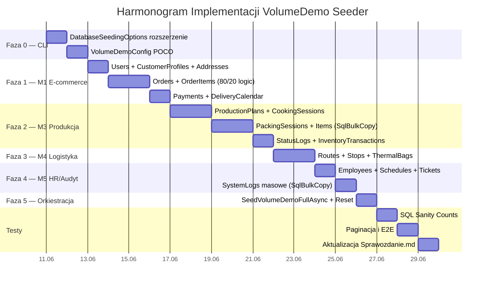

# Plan Implementacji Seedera `VolumeDemo`
**Projekt:** Kuchnia u Cygana — System Zarządzania Platformą Cateringową  
**Dokument:** Plan implementacji na podstawie [prompt.md](file:///c:/Users/cyunc/source/repos/Projekt%20Platforma%20Cateringowa/Kuchnia%20Cygana/docs/prompt.md)  
**Plik docelowy:** [DatabaseSeeder.cs](file:///c:/Users/cyunc/source/repos/Projekt%20Platforma%20Cateringowa/Kuchnia%20Cygana/src/KuchniaUCygana.Infrastructure/Persistence/Seeding/DatabaseSeeder.cs)

---

## Stan Obecny (Baseline)

Obecna implementacja `VolumeDemo` w [DatabaseSeeder.cs](file:///c:/Users/cyunc/source/repos/Projekt%20Platforma%20Cateringowa/Kuchnia%20Cygana/src/KuchniaUCygana.Infrastructure/Persistence/Seeding/DatabaseSeeder.cs#L58-L62) pokrywa **wyłącznie Moduł 2 (Katalog)** — metodą [SeedM2VolumeDemoAsync](file:///c:/Users/cyunc/source/repos/Projekt%20Platforma%20Cateringowa/Kuchnia%20Cygana/src/KuchniaUCygana.Infrastructure/Persistence/Seeding/DatabaseSeeder.cs#L768):

| Obszar | Status | Opis |
|:---|:---|:---|
| M2: Ingredients (1000 szt.) | ✅ Gotowe | Prefix `VOL-M2-ING-` |
| M2: NutritionFacts | ✅ Gotowe | Przypisane do ingredientów i meals |
| M2: StockItems + Batches | ✅ Gotowe | Spożywcze + opakowania, FEFO dates |
| M2: RecipeComponents + Versions | ✅ Gotowe | 150 RC z wersjami Published |
| M2: Meals (60 szt.) + MealVariants | ✅ Gotowe | 2-3 warianty na danie |
| M2: Diets (5 szt.) + DietVariants | ✅ Gotowe | 5 kaloryczności na dietę |
| M2: DietMenuPlans (14 dni) | ✅ Gotowe | Status Published, ~350 DietMenuPlanItems |
| M2: Snapshoty JSON (Backfill) | ✅ Gotowe | `BackfillPublishedDietMenuSnapshotsAsync` |
| **M1: Klienci, Zamówienia, Płatności** | ❌ Brak | Zero danych e-commerce |
| **M3: Produkcja, Kompletacja, HACCP** | ❌ Brak | Zero planów produkcji, sesji gotowania |
| **M4: Logistyka, Trasy, Torby** | ❌ Brak | Zero tras, kierowców, toreb |
| **M5: HR masowy, Logi, Tickety** | ❌ Brak | Tylko MinimalRealistic (16 users) |
| **CLI --dry-run / --seed / --days** | ❌ Brak | Brak parametryzacji |

> [!IMPORTANT]
> **Specyfikacja z [prompt.md](file:///c:/Users/cyunc/source/repos/Projekt%20Platforma%20Cateringowa/Kuchnia%20Cygana/docs/prompt.md) wymaga pełnego pokrycia 5 modułów.**
> Obecne `SeedM2VolumeDemoAsync` to dopiero ~25% wymaganego wolumenu.

---

## Architektura Rozwiązania

### Strategia organizacji kodu

Obecny plik [DatabaseSeeder.cs](file:///c:/Users/cyunc/source/repos/Projekt%20Platforma%20Cateringowa/Kuchnia%20Cygana/src/KuchniaUCygana.Infrastructure/Persistence/Seeding/DatabaseSeeder.cs) ma **6892 linie** i jest już na granicy zarządzalności. Zamiast dodawać kolejne tysiące linii, rozszerzamy profil `VolumeDemo` w spójny sposób:

```
DatabaseSeeder.cs                     — istniejący plik, switch(profile) dispatcher
  └─ SeedVolumeDemoFullAsync()        — NOWA metoda-orkiestrator
       ├─ SeedMinimalRealisticAsync() — reuse (już istnieje)
       ├─ SeedM2VolumeDemoAsync()     — reuse (już istnieje, Moduł 2 Katalog)
       ├─ SeedVolM1EcommerceAsync()   — NOWY: Klienci + Zamówienia + Płatności
       ├─ SeedVolM3ProductionAsync()  — NOWY: Plany produkcyjne + Gotowanie + Kompletacja
       ├─ SeedVolM4LogisticsAsync()   — NOWY: Trasy + Torby + Manifesty
       ├─ SeedVolM5HrAuditAsync()     — NOWY: Grafiki + Tickety + SystemLogs
       └─ BackfillPublishedDietMenuSnapshotsAsync() — reuse
```

### Prefix i identyfikowalność danych

Wszystkie dane VolumeDemo oznaczone prefiksem **`VOL-`** (zgodnie z istniejącą konwencją `VOL-M2-`):

| Moduł | Prefix | Przykłady |
|:---|:---|:---|
| M1 | `VOL-M1-` | `VOL-M1-ORD-0001`, `VOL-M1-PAY-0001` |
| M2 | `VOL-M2-` | Już zaimplementowane |
| M3 | `VOL-M3-` | `VOL-M3-PP-0001`, `VOL-M3-COOK-0001` |
| M4 | `VOL-M4-` | `VOL-M4-ROUTE-01`, `VOL-M4-BAG-0001` |
| M5 | `VOL-M5-` | `VOL-M5-WS-0001`, `VOL-M5-LOG-0001` |

### Podział Czasowy Seedowania (Zasady Biznesowe)

Aby umożliwić deweloperom i użytkownikom testowanie rzeczywistych procesów biznesowych (takich jak optymalizacja tras czy kompletowanie paczek) bezpośrednio w aplikacji, dane są dzielone czasowo wg poniższej tabeli:

| Moduł / Obszar danych | Przeszłość (`date < today`) | Dzień dzisiejszy i Przyszłość (`date >= today`) | Rationale / Uzasadnienie |
|:---|:---|:---|:---|
| **M2 Dietetyk (Plany Menu)** | **TAK** (Historia) | **TAK (do 14 dni w przód)** | Jadłospis musi być zaplanowany i opublikowany w przód, aby klienci mogli kupować diety. |
| **M3 Kuchnia (Plany Produkcji & Gotowanie)** | **TAK** (Historia) | **TAK (do 14 dni w przód)** | Produkcja jest planowana na bazie zamówień i gotowana w przód. Kucharze chcą widzieć zaplanowane sesje. |
| **M1 E-commerce (Zamówienia & Płatności)** | **TAK** (Historia) | **TAK (aktywne subskrypcje)** | Klient kupuje dietę na np. 30 dni, więc zamówienia i ich kalendarz dostaw (`DeliveryCalendar`) trwają w przyszłość. |
| **M3 Kompletacja (PackingSessions, Items, Bags, Etykiety)** | **TAK** (Historia) | **NIE** | Kompletacja (pakowanie) toreb i pudełek odbywa się dynamicznie na stanowisku pakowania. Zaseedowanie przyszłości uniemożliwiłoby testowanie skanowania QR. |
| **M4 Logistyka (Trasy, Przystanki, Manifesty)** | **TAK** (Historia) | **NIE** | Trasy i manifesty kurierskie są generowane dynamicznie przez spedytora. Przyszłe trasy zablokowałyby możliwość przetestowania algorytmu routingu. |
| **M4 Logistyka (Ruchy toreb termicznych)** | **TAK** (Historia) | **NIE** | Ruchy toreb (BagMovementLogs) to fizyczne skany QR przy załadunku/odbiorze. Mogą istnieć tylko w przeszłości/czasie rzeczywistym. |
| **M3 Magazyn (InventoryTransactions - rozchody FEFO)** | **TAK** (Historia) | **NIE** | Surowce są ściągane z partii (`Batches`) w momencie gotowania. Dla przyszłych planów surowce są tylko zablokowane, a nie zużyte. |
| **M5 HR (Grafiki pracy WorkSchedules)** | **TAK** (Historia) | **TAK (do 14 dni w przód)** | Grafiki pracy pracowników są planowane z wyprzedzeniem. |
| **Logi i Reklamacje (SystemLogs, Telemetria, Tickets)** | **TAK** (Historia) | **NIE** | Logi audytowe, telemetria lodówek i skargi klientów to dane reaktywne, nie występują w przyszłości. |

---

## Fazy Implementacji

### Faza 0: Infrastruktura CLI i Parametryzacja
**Cel:** Dodanie wsparcia dla parametrów seedera z prompt.md §3.1

#### Zadania:
- [ ] **0.1** Rozszerzenie [DatabaseSeedingOptions.cs](file:///c:/Users/cyunc/source/repos/Projekt%20Platforma%20Cateringowa/Kuchnia%20Cygana/src/KuchniaUCygana.Infrastructure/Persistence/Seeding/DatabaseSeedingOptions.cs) o pola:
  ```csharp
  public bool DryRun { get; set; }           // --dry-run
  public bool ResetVolumeDemo { get; set; }  // --reset-volume-demo
  public int Days { get; set; } = 14;         // --days
  public int ActiveCustomers { get; set; } = 300;  // --active-customers
  public int PeakOrders { get; set; } = 500;       // --peak-orders
  public int Seed { get; set; } = 20260608;         // --seed (losowość)
  ```
- [ ] **0.2** Dodanie klasy `VolumeDemoConfig` jako POCO przekazywanego do metod:
  ```csharp
  public record VolumeDemoConfig(
      int Days, int ActiveCustomers, int PeakOrders,
      int Seed, bool DryRun, bool ResetVolumeDemo);
  ```
- [ ] **0.3** Modyfikacja [DatabaseSeedingBootstrapper.cs](file:///c:/Users/cyunc/source/repos/Projekt%20Platforma%20Cateringowa/Kuchnia%20Cygana/src/KuchniaUCygana.Infrastructure/Persistence/Seeding/DatabaseSeedingBootstrapper.cs) — parsowanie opcji i przekazanie do seedera
- [ ] **0.4** Modyfikacja `IDatabaseSeeder.SeedAsync()` — dodanie opcjonalnego parametru `VolumeDemoConfig?`

> [!NOTE]
> Interfejs CLI może być obsłużony przez `IConfiguration` (environment variables / appsettings.json) lub dedykowany command w `Program.cs`, zależnie od istniejącej konwencji aplikacji.

---

### Faza 1: Moduł 1 — E-commerce (Klienci, Zamówienia, Płatności)
**Cel:** 1200 użytkowników, 200-500 aktywnych klientów, zamówienia z pokryciem 80/20 planu

#### Tabele docelowe:
| Tabela | Szacowana liczba wierszy | Technika zapisu |
|:---|:---|:---|
| `Users` | 1200 (1150 klientów + 50 pracowników) | Dapper batch INSERT |
| `CustomerProfiles` | 1150 | Dapper batch INSERT |
| `Addresses` | 1500-2300 (1-2 adresy na klienta) | Dapper batch INSERT |
| `Orders` | 2000-4500 (zależnie od `--days`) | Dapper batch INSERT |
| `OrderItems` | 4000-9000 | SqlBulkCopy |
| `DeliveryCalendar` | 3000-7000 | SqlBulkCopy |
| `Payments` | 2000-4500 | Dapper batch INSERT |
| `DeliveryWindows` | 4-6 (jeśli brak) | IF NOT EXISTS |

#### Zadania:
- [ ] **1.1** Metoda `SeedVolM1UsersAsync()` — generowanie 1150 klientów z polskimi imionami i nazwiskami
  - Email: `vol-klient-{NNNN}@kuchnia.local`
  - Hasło: `VolumeDemo123!` (hashowane BCrypt, **jednorazowo** i cache'owane!)
  - Imiona/nazwiska z predefiniowanej tablicy polskich imion (50+ kobiecych + 50+ męskich) i 100+ nazwisk
- [ ] **1.2** Metoda `SeedVolM1CustomersAsync()` — `CustomerProfiles` + `Addresses`
  - 1150 profili klientów z losowymi notatkami dietetycznymi po polsku
  - 1-2 adresy na klienta (dom, praca), koordynaty GPS w obrębie Białegostoku
- [ ] **1.3** Metoda `SeedVolM1OrdersAsync()` — zamówienia i pozycje
  - **80-90% zamówień** musi odwoływać się do `DietMenuPlanItemId`, `MealId`, `MealVariantId` z opublikowanego planu menu (M2 VolumeDemo)
  - **10-20% zamówień** to losowe dania z katalogu
  - **~5% zamówień** ze statusem `Cancelled` lub `Rejected`
  - Numer zamówienia: `VOL-M1-ORD-{NNNNNN}`
  - Daty zamówień rozłożone na `--days` dni wstecz i przód
- [ ] **1.4** Metoda `SeedVolM1PaymentsAsync()` — płatności Stripe (symulowane)
  - `StripePaymentIntentId`: `VOL-M1-PI-{UUID}` (generowane deterministycznie z seeda)
  - Statusy: 90% `Succeeded`, 5% `Pending`, 3% `Failed`, 2% `Refunded`
- [ ] **1.5** Metoda `SeedVolM1DeliveryCalendarAsync()` — kalendarz dostaw
  - Wpisy dla aktywnych zamówień na dni realizacji
  - Weekendy pomijane (`IsSkipped = 1, SkipReason = 'Weekend'`)
  - Losowe zawieszenia (~3% dni: `IsSkipped = 1, SkipReason = 'Zawieszenie dostawy przez klienta'`)

> [!WARNING]
> **Optymalizacja BCrypt**: Hash jednego hasła zajmuje ~200ms z kosztem 11. Dla 1200 użytkowników to 4 minuty samego hashowania.  
> **Rozwiązanie**: Wygenerować hash `VolumeDemo123!` raz i przypisać do wszystkich klientów VOL.

---

### Faza 2: Moduł 3 — Produkcja, Kompletacja, HACCP
**Cel:** Plany produkcyjne, sesje gotowania, kompletacja pudełek, logi HACCP

#### Tabele docelowe:
| Tabela | Szacowana liczba wierszy | Technika zapisu |
|:---|:---|:---|
| `ProductionPlans` | 14 (1 na dzień) | Dapper |
| `ProductionPlanItems` | 700-3500 | Dapper batch INSERT |
| `CookingSessions` | 50-200 | Dapper |
| `CookingSessionSteps` | 150-600 | Dapper |
| `CookingSessionStepChecks` | 300-1200 | Dapper batch INSERT |
| `PackingSessions` | 2000-7000 | SqlBulkCopy |
| `PackingBags` | 2000-7000 | SqlBulkCopy |
| `PackingItems` | 4000-15 000 | **SqlBulkCopy** (krytyczne!) |
| `BoxLabels` | 4000-15 000 | **SqlBulkCopy** (krytyczne!) |
| `PackingLabels` | 2000-7000 | SqlBulkCopy |
| `PackingStatusLogs` | 12 000-45 000 | **SqlBulkCopy** (krytyczne!) |
| `TemperatureLogs` | 1500-5000 | SqlBulkCopy |
| `HaccpTemperatureAlerts` | 20-50 | Dapper |
| `InventoryTransactions` | 3000-10 000 | SqlBulkCopy |

#### Zadania:
- [ ] **2.1** Metoda `SeedVolM3ProductionPlansAsync()` — plany produkcyjne
  - **Założenie**: W odróżnieniu od kompletacji i dostaw, plany produkcyjne i sesje gotowania dla kuchni i dietetyków MOGĄ i POWINNY być seedowane na 14 dni w przód (od `today` do `today + 13 days`), aby użytkownicy nie musieli klikać ręcznego tworzenia podczas testowania.
  - 1 plan na dzień (14 dni w przód i wstecz), status `Approved` (przyszłość) lub `Completed` (przeszłość)
  - `ProductionPlanItems` powiązane z `RecipeComponentVersionId` z M2 VolumeDemo
  - Obliczone `PlannedQuantity` na podstawie liczby zamówień z M1 na dany dzień
- [ ] **2.2** Metoda `SeedVolM3CookingSessionsAsync()` — sesje gotowania
  - Generuj sesje gotowania i kroki CCP na 14 dni w przód (statusy `Scheduled` / `InProgress` dla przyszłości, `Completed` dla przeszłości)
  - Powiązane z `ProductionPlanItemId`
  - `CookingSessionSteps` z odniesieniami do `RecipeComponentInstructionStep`
  - `CookingSessionStepChecks` z wartościami pomiarowymi (temperatura CCP = 72-75°C)
- [ ] **2.3** Metoda `SeedVolM3PackingAsync()` — kompletacja z SqlBulkCopy
  - **Krytyczne ograniczenie czasowe**: Generuj sesje pakowania i etykiety wyłącznie dla dni PRZESZŁYCH (tzn. przed dniem dzisiejszym: `date < today`). Dzień dzisiejszy i przyszłość pozostają wolne, aby użytkownicy mogli wygenerować kompletację dynamicznie w aplikacji.
  - `PackingSessions`: 1 sesja na klienta-dzień (powiązana z `OrderId` i `DeliveryCalendarId` w przeszłości)
  - `PackingBags`: 1 torba na sesję
  - `PackingItems`: pudełka w torbach (5 pudełek na torbę = 5 posiłków)
  - `BoxLabels`: etykieta JSON na każde pudełko (`LabelDataJson` z nazwą dania, alergeny, QR)
  - **SqlBulkCopy z batchem 2000 wierszy** dla PackingItems i BoxLabels
- [ ] **2.4** Metoda `SeedVolM3PackingStatusLogsAsync()` — historia statusów
  - Generuj logi statusów wyłącznie dla przeszłych spakowanych pudełek (`date < today`).
  - 3 wpisy na pudełko: `Generated` → `Packed` → `Loaded`
  - **SqlBulkCopy** (potencjalnie 45 000 wierszy)
- [ ] **2.5** Metoda `SeedVolM3InventoryAsync()` — transakcje magazynowe FEFO
  - Rozchody surowców powiązane z `BatchId` (FEFO — najkrótsza data ważności)
  - Typy transakcji: `Consumption`, `Waste`, `Correction`
  - Aktualizacja `Batches.CurrentQuantity` i `IsDepleted`
- [ ] **2.6** Metoda `SeedVolM3HaccpAsync()` — logi temperatur
  - `TemperatureLogs`: pomiary co 15 min, 24h/dzień, 14 dni = ~1350 wierszy na lokalizację
  - ~5 alertów HACCP (`HaccpTemperatureAlerts`) na przekroczenie normy

> [!CAUTION]
> `PackingItems`, `BoxLabels` i `PackingStatusLogs` to tabele o **największym wolumenie** w tej fazie. 
> Obowiązkowe użycie `SqlBulkCopy` z `DataTable` i batching 1000-2000 wierszy.

---

### Faza 3: Moduł 4 — Logistyka i Dostawy
**Cel:** Trasy kurierskie, przystanki, torby termiczne, manifesty

#### Tabele docelowe:
| Tabela | Szacowana liczba wierszy | Technika zapisu |
|:---|:---|:---|
| `Vehicles` | 5-10 | IF NOT EXISTS |
| `DeliveryRoutes` | 40-100 (2-7 tras/dzień) | Dapper |
| `DeliveryRouteStops` | 2000-7000 | SqlBulkCopy |
| `DeliveryManifests` | 40-100 | Dapper |
| `ThermalBags` | 200-500 | Dapper |
| `BagMovementLogs` | 3000-10 000 | SqlBulkCopy |

#### Zadania:
- [ ] **3.1** Metoda `SeedVolM4VehiclesAsync()` — pojazdy i kierowcy
  - 5-10 samochodów dostawczych z polskimi rejestracjami (`VOL-M4-BI12345`)
  - Przypisanie kierowców z Users (rola `Driver` / `DriverManager`)
- [ ] **3.2** Metoda `SeedVolM4RoutesAsync()` — trasy dostaw
  - **Krytyczne ograniczenie czasowe**: Trasy, przystanki i manifesty mogą być generowane wyłącznie dla dni PRZESZŁYCH (tzn. przed dniem dzisiejszym: `date < today`). Dzisiejszy dzień i przyszłość pozostają wolne, aby użytkownicy mogli przetestować system optymalizacji tras i routing w aplikacji.
  - Generowanie tras: grupowanie adresów klientów po kodzie pocztowym / strefie (dla dni przeszłych)
  - `DeliveryRouteStops` powiązane z `DeliveryCalendarId` z M1
  - Sekwencja przystanków na trasie (StopOrder)
- [ ] **3.3** Metoda `SeedVolM4ThermalBagsAsync()` — ewidencja toreb
  - 200-500 toreb termicznych z kodami: `VOL-M4-BAG-{NNNN}`
  - `BagMovementLogs`: cykl życia torby (Wydana → U klienta → Odebrana → Na magazynie)
  - 4-6 wpisów na torbę na cykl dostawy

---

### Faza 4: Moduł 5 — HR, Audyt, Tickety (masowy)
**Cel:** 50 pracowników, grafiki, urlopy, logi audytowe, tickety

#### Tabele docelowe:
| Tabela | Szacowana liczba wierszy | Technika zapisu |
|:---|:---|:---|
| `Employees` (rozszerzenie) | 50 (vs 16 z MinimalRealistic) | Dapper |
| `WorkSchedules` | 700 (50 prac. × 14 dni) | Dapper batch INSERT |
| `LeaveRequests` | 15-30 | Dapper |
| `Tickets` | 50-100 | Dapper |
| `TicketAttachments` | 20-50 | Dapper |
| `Notifications` + `UserNotifications` | 500-1000 | SqlBulkCopy |
| `SystemLogs` | 5000-20 000 | **SqlBulkCopy** (krytyczne!) |

#### Zadania:
- [ ] **4.1** Metoda `SeedVolM5EmployeesAsync()` — pracownicy
  - 50 pracowników rozłożonych na działy: Kuchnia (15), Magazyn (8), Kompletacja (10), Logistyka (7), Biuro (10)
  - Polskie imiona i nazwiska, daty zatrudnienia 1-3 lata wstecz
- [ ] **4.2** Metoda `SeedVolM5SchedulesAsync()` — grafik pracy
  - `WorkSchedules` na 14 dni, 1-2 zmiany na pracownika na dzień
  - `RoleAtShift` zgodne z działem pracownika
- [ ] **4.3** Metoda `SeedVolM5LeavesAsync()` — wnioski urlopowe
  - 15-30 wniosków: 60% zatwierdzonych, 20% oczekujących, 20% odrzuconych
- [ ] **4.4** Metoda `SeedVolM5TicketsAsync()` — reklamacje BOK
  - 50-100 ticketów od klientów VOL-M1
  - Polskie tytuły (np. "Uszkodzone pudełko", "Brak dania w torbie", "Opóźniona dostawa")
  - Statusy: 40% Closed, 30% InProgress, 20% Open, 10% Escalated
- [ ] **4.5** Metoda `SeedVolM5SystemLogsAsync()` — logi audytowe masowe
  - **5000-20 000 wierszy** z realistycznymi JSON-ami `OldValue` / `NewValue`
  - Obowiązkowy **SqlBulkCopy** z `DataTable`, batch 2000
  - Wpisy rozłożone na 14 dni, powiązane z UserId z pracowników VOL

---

### Faza 5: Orkiestracja i Reset
**Cel:** Scalenie faz, reset danych VOL, dry-run

#### Zadania:
- [ ] **5.1** Nowa metoda `SeedVolumeDemoFullAsync(VolumeDemoConfig config)` — orkiestrator:
  ```csharp
  private async Task SeedVolumeDemoFullAsync(VolumeDemoConfig config, CancellationToken ct)
  {
      var rng = new Random(config.Seed);  // deterministyczna losowość
      
      if (config.ResetVolumeDemo)
          await ResetVolumeDemoDataAsync(ct);
      
      await SeedMinimalRealisticAsync(ct);
      await SeedM2VolumeDemoAsync(ct);                  // istniejące M2
      await SeedVolM1EcommerceAsync(config, rng, ct);    // nowe M1
      await SeedVolM3ProductionAsync(config, rng, ct);   // nowe M3
      await SeedVolM4LogisticsAsync(config, rng, ct);    // nowe M4
      await SeedVolM5HrAuditAsync(config, rng, ct);      // nowe M5
      await BackfillPublishedDietMenuSnapshotsAsync(ct); // istniejące
      
      if (config.DryRun)
      {
          // transaction.Rollback() — dane nie zostają zapisane
          logger.LogWarning("VolumeDemo --dry-run: rolling back all changes.");
      }
  }
  ```
- [ ] **5.2** Metoda `ResetVolumeDemoDataAsync()` — usuwanie danych VOL:
  - Kasowanie wierszy z prefiksem `VOL-` we wszystkich powiązanych tabelach
  - Kolejność: logi → kompletacja → zamówienia → użytkownicy → katalog
  - Wzorowana na istniejącej [ResetDemoDataAsync()](file:///c:/Users/cyunc/source/repos/Projekt%20Platforma%20Cateringowa/Kuchnia%20Cygana/src/KuchniaUCygana.Infrastructure/Persistence/Seeding/DatabaseSeeder.cs#L1609)
- [ ] **5.3** Aktualizacja switch w [SeedAsync()](file:///c:/Users/cyunc/source/repos/Projekt%20Platforma%20Cateringowa/Kuchnia%20Cygana/src/KuchniaUCygana.Infrastructure/Persistence/Seeding/DatabaseSeeder.cs#L38-L66):
  ```csharp
  case DatabaseSeedingProfile.VolumeDemo:
      await SeedVolumeDemoFullAsync(config, cancellationToken);
      return;
  ```

---

## Podsumowanie Wolumenu Danych

| Moduł | Encja | Min wierszy | Max wierszy | Technika |
|:---|:---|:---|:---|:---|
| M1 | Users + CustomerProfiles | 1200 | 1200 | Dapper batch |
| M1 | Addresses | 1500 | 2300 | Dapper batch |
| M1 | Orders + OrderItems | 6000 | 13 500 | Dapper + SqlBulkCopy |
| M1 | DeliveryCalendar | 3000 | 7000 | SqlBulkCopy |
| M1 | Payments | 2000 | 4500 | Dapper batch |
| M2 | (istniejące) Ingredients + RC + Meals | ~3000 | ~3000 | SQL set-based |
| M3 | ProductionPlans + Items | 714 | 3514 | Dapper |
| M3 | CookingSessions + Steps + Checks | 500 | 2000 | Dapper batch |
| M3 | PackingSessions + Bags + Items | 8000 | 29 000 | **SqlBulkCopy** |
| M3 | BoxLabels + PackingLabels | 6000 | 22 000 | **SqlBulkCopy** |
| M3 | PackingStatusLogs | 12 000 | 45 000 | **SqlBulkCopy** |
| M3 | InventoryTransactions | 3000 | 10 000 | SqlBulkCopy |
| M3 | TemperatureLogs | 1500 | 5000 | SqlBulkCopy |
| M4 | DeliveryRoutes + Stops | 2040 | 7100 | SqlBulkCopy |
| M4 | ThermalBags + BagMovementLogs | 3200 | 10 500 | SqlBulkCopy |
| M5 | Employees + WorkSchedules | 750 | 750 | Dapper |
| M5 | Tickets + Attachments | 70 | 150 | Dapper |
| M5 | SystemLogs | 5000 | 20 000 | **SqlBulkCopy** |
| M5 | Notifications + UserNotifications | 500 | 1000 | SqlBulkCopy |
| **SUMA** | | **~55 000** | **~185 000** | |

---

## Plan Testów Wydajnościowych

Na podstawie prompt.md §4 — **po zakończeniu seedowania**:

### Test 1: SQL Sanity Counts
Skrypt SQL porównujący liczbę wierszy z oczekiwaniami:

```sql
-- Weryfikacja kluczowych tabel VolumeDemo
SELECT 'Users' AS Tabela, COUNT(*) AS Wiersze FROM Users WHERE Email LIKE 'vol-%'
UNION ALL
SELECT 'Orders', COUNT(*) FROM Orders WHERE OrderNumber LIKE 'VOL-M1-%'
UNION ALL
SELECT 'OrderItems', COUNT(*) FROM OrderItems oi 
    INNER JOIN Orders o ON o.Id = oi.OrderId WHERE o.OrderNumber LIKE 'VOL-M1-%'
UNION ALL
SELECT 'PackingItems', COUNT(*) FROM PackingItems WHERE CreatedBy = 'VolumeDemoSeeder'
UNION ALL
SELECT 'SystemLogs', COUNT(*) FROM SystemLogs WHERE IPAddress = 'VOL-SEED'
UNION ALL
SELECT 'DeliveryRouteStops', COUNT(*) FROM DeliveryRouteStops 
    WHERE CreatedBy = 'VolumeDemoSeeder'
UNION ALL
SELECT 'TemperatureLogs', COUNT(*) FROM TemperatureLogs 
    WHERE CreatedBy = 'VolumeDemoSeeder';
```

### Test 2: Paginacja i Lazy Loading (< 1.5s)
Weryfikacja manualna lub automatyczna (Playwright / integracyjna):

| Widok | URL / Endpoint | Cel: < 1.5s |
|:---|:---|:---|
| Plan produkcji | `/production` | Lista planów z łączną liczbą zamówień |
| Kompletacja | `/packing` | Dashboard z postępem pakowania |
| Załadunek | `/loading` | Lista tras i manifestów |
| Posiłki | `/meals` | Katalog dań z wariantami |
| Składniki | `/ingredients` | Lista składników z nutricją |
| Edytor receptur | `/diet-editor/recipes` | Drzewo receptur |

### Test 3: Traceability E2E (Smoke Test)
Przepływ end-to-end w jednym teście integracyjnym:
1. ✅ Opublikowane menu (M2) — weryfikacja `DietMenuPlans.Status = 'Published'`
2. ✅ Zamówienia klientów (M1) — weryfikacja `Orders.Status` i `OrderItems` z `DietMenuPlanItemId`
3. ✅ Plan produkcji (M3) — weryfikacja powiązań `ProductionPlanItems → RecipeComponentVersionId`
4. ✅ Wydania FEFO (M3) — weryfikacja `InventoryTransactions` z `BatchId`
5. ✅ CCP gotowania (M3) — weryfikacja `CookingSessionStepChecks`
6. ✅ Etykiety (M3) — weryfikacja `BoxLabels` z `LabelDataJson` NOT NULL
7. ✅ Kompletacja (M3) — weryfikacja `PackingItems → PackingBags → PackingSessions`
8. ✅ Routing (M4) — weryfikacja `DeliveryRouteStops → DeliveryCalendarId`

### Test dodatkowy: Brak deadlocków
- Uruchomienie seedera dwukrotnie (idempotentność) — drugie uruchomienie nie powinno duplikować danych ani wywoływać deadlocków
- Weryfikacja przez `SELECT @@TRANCOUNT` i logowanie czasu wykonania poszczególnych faz

---

## Aktualizacja Sprawozdanie Bazy Danych.md

Po pomyślnym zakończeniu testów, dokument [Sprawozdanie Bazy Danych.md](file:///c:/Users/cyunc/source/repos/Projekt%20Platforma%20Cateringowa/Kuchnia%20Cygana/docs/Sprawozdanie%20Bazy%20Danych.md) zostanie uzupełniony o nową sekcję (np. jako §7.4 lub osobny punkt):

### Proponowana sekcja:

```markdown
### 7.4. Profil Seedowania `VolumeDemo` — Wyniki Testów Objętościowych

W celu weryfikacji wydajności bazy danych przy obciążeniu odpowiadającym rocznemu 
wolumenowi produkcyjnemu (500 aktywnych klientów), zaimplementowano profil seedowania 
`VolumeDemo` w klasie `DatabaseSeeder`. Profil ten generuje dane testowe obejmujące 
wszystkie 5 modułów systemu z zachowaniem pełnej integralności relacyjnej.

**Parametry seedowania:**
- Aktywni klienci: {activeCustomers}
- Okres planu: {days} dni
- Ziarno losowości: {seed}
- Czas wykonania: {duration}

**Wyniki SQL Sanity Counts:**

| Tabela | Oczekiwano (min) | Wygenerowano | Status |
|:---|:---|:---|:---|
| Users (VOL) | 1200 | {actual} | ✅ |
| Orders (VOL) | 2000 | {actual} | ✅ |
| PackingItems (VOL) | 4000 | {actual} | ✅ |
| SystemLogs (VOL) | 5000 | {actual} | ✅ |
| ... | ... | ... | ... |

**Rozmiar bazy po seedowaniu VolumeDemo:**
- Plik danych (.mdf): {size} MB
- Plik logów (.ldf): {size} MB
- Łącznie: {total} MB

**Wnioski:**
- Czas ładowania paginowanych widoków: < 1.5s ✅/❌
- Deadlocki: 0 ✅/❌
- Idempotentność: TAK ✅
```

---

## Kolejność Wykonania (Priorytetyzacja)



> [!TIP]
> **Szacowany łączny czas implementacji:** 12-15 dni roboczych.
> Poszczególne fazy mogą być częściowo zrównoleglone (np. M4 i M5 są niezależne od siebie).

---

## Wymagania Zasobowe

| Parametr | Wartość |
|:---|:---|
| Docker RAM (minimalny) | 10 GB (zalecane 12 GB) |
| Timeout SQL na seedowanie | 180s (obecny) → **300s** (nowy) |
| Batch size SqlBulkCopy | 2000 wierszy |
| Szacowany czas seedowania | 3-8 minut (w zależności od zasobów) |
| Szacowany rozmiar bazy po seeding | 350-500 MB (.mdf + .ldf) |
